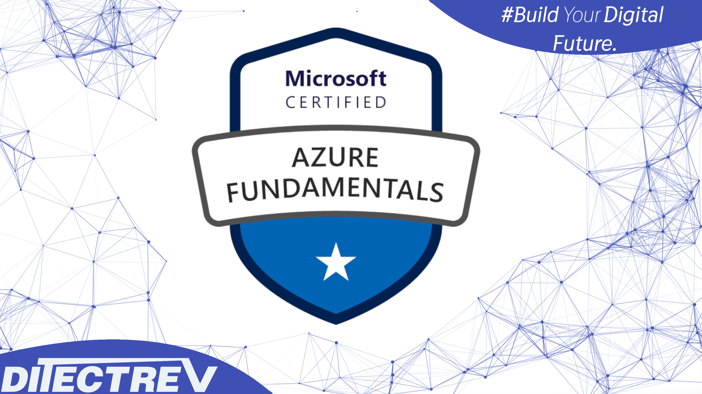

# ⬆️ Microsoft Azure AZ-900 (Microsoft Azure Fundamentals) Practice Tests Exams Questions & Answers

## Udemy & Etsy

❣️ Please support us by purchasing this course on Udemy in an interactive version with the [discounted link](https://www.udemy.com/course/microsoft-azure-fundamentals-az-900-practice-tests-exams/?referralCode=C4B47B7C9ABC33DAF4C3). If you're working for a company, you could most probably easily claim this expense during preparation for your exam. For us, it's to be, or not to be, in the game.

🛍️ Alternatively, you can buy the PDF with those questions on [Etsy](https://ditectrev.etsy.com/listing/1343709791).

## ✨ This course is unlike any Microsoft Azure AZ-900 (Microsoft Azure Fundamentals) course you will find online.

✋ Join a live online community and a course taught by industry experts and pass the Microsoft Azure AZ-900 (Microsoft Azure Fundamentals) confidently. We aim to build an ecosystem of Information Technology (IT) certifications and online courses in cooperation with the technology industry. We believe it will give our students 100% confidence in the pacing market in an open-source environment. We are just at the beginning of our way, so it's even better for you to join now!

## ⌛️ Short and to the point; why should you take the course:

1. Always happy to answer your questions on Udemy's Q&A's and outside :)
2. Failed? Please submit a screenshot of your exam result and request a refund (via our upcoming platform, not possible on Udemy); we'll always accept it.
3. Learn about topics, such as:
   - Access Control;
   - Authentication & Authorization;
   - Availability Zones;
   - Azure Active Directory (Azure AD);
   - Azure AD Identity Protection;
   - Azure Advanced Threat Protection (ATP);
   - Azure Advisor;
   - Azure Analysis Services;
   - Azure Command Line Interface (Azure CLI);
   - Azure Cosmos DB;
   - Azure Event Hubs;
   - Azure Functions;
   - Azure Log Analytics;
   - Azure Marketplace;
   - Azure Monitor;
   - Azure Multi-Factor Authentication (MFA);
   - Azure Pay-as-You-Go Subscription;
   - Azure Policies;
   - Azure Portal;
   - Azure Regions;
   - Azure Resources;
   - Azure Security Center;
   - Azure Service Health;
   - Azure Services;
   - Azure SQL Databases;
   - Azure Storage;
   - Azure Web Apps;
   - Capital Expenditure (CapEx) & Operational Expenditure (OpEx);
   - Cloud Concepts;
   - Compliancy, Governance, Identity & Privacy;
   - General Data Protection Regulation (GDPR) & Azure;
   - Inbound Data Traffic & Outbound Data Traffic;
   - Infrastructure as a Service (laaS);
   - Microsoft Trust Center;
   - Network Security Group (NSG);
   - Platform as a Service (PaaS);
   - PowerShell;
   - Public & Private Cloud;
   - Public & Private Preview;
   - Resource Groups;
   - Serverless;
   - Service Level Agreement (SLA);
   - Software as a Service (SaaS);
   - Virtual Machines;
   - Windows Virtual Desktop;
   - **Much More!**
4. Questions are similar to the actual exam, without duplications (like in other courses ;-)).
5. The Practice Tests Exams simulate the actual exam's content, timing, and percentage required to pass the exam.
6. This course is **not** a Microsoft Azure AZ-900 (Microsoft Azure Fundamentals) Exam Dump. Some people use brain dumps or exam dumps, but that's absurd, which we don't practice.
7. 484 **unique** questions.

## ☝️ Course Updates

**[v1.0.0](../../releases/tag/v1.0.0): October 4, 2022.**

- Launch of the course.

**[v1.0.1](../../releases/tag/v1.0.1): January 8, 2023.**

- Fix answers for 2 questions.

**[v1.1.0](../../releases/tag/v1.1.0): June 13, 2023.**

- Fix answers for 2 questions, delete 1 repeated question, and minor typos improvements.

**[v1.1.1](../../releases/tag/v1.1.1): July 28, 2023.**

- Fix correct answer for 1 question and duplicated answer for another question.

**[v1.1.2](../../releases/tag/v1.1.2): September 28, 2023.**

- Fix all remaining typos with support of automated proofreading software.

**[v1.1.3](../../releases/tag/v1.1.3): October 28, 2023.**

- Delete 2 duplicated questions.

**[v1.1.4](../../releases/tag/v1.1.4): November 27, 2023.**

- Fix 1 question with wrong answer.

## 🙋‍♀️ & 🙋‍♂️ Contribution

We are so thankful for every contribution, which makes sure we can deliver top-notch content. Whenever you find a missing resource, broken link in a [Table of Contents](../..#table-of-contents), the wrong answer, please submit an [issue](../../issues). Even better would be a [Pull Request (PR)](../../pulls).

## Who this course is for:

- 👨‍🎓 Students preparing for the Microsoft Azure Fundamentals (AZ-900) Exam;
- 👨‍🎓 AWS Engineers;
- 👨‍🎓 Azure Engineers;
- 👨‍🎓 Cloud Architects;
- 👨‍🎓 Cloud Engineers;
- 👨‍🎓 DevOps Engineers;
- 👨‍🎓 Enterprise Architects;
- 👨‍🎓 Google Cloud Platform (GCP) Engineers;
- 👨‍🎓 Infrastructure Engineers;
- 👨‍🎓 IT Professionals;
- 👨‍🎓 Lead Engineers;
- 👨‍🎓 Product Architects;
- 👨‍🎓 Product Managers;
- 👨‍🎓 Product Owners;
- 👨‍🎓 Project Managers;
- 👨‍🎓 Scrum Masters;
- 👨‍🎓 Security Engineers;
- 👨‍🎓 Site Reliability Engineers;
- 👨‍🎓 Software Developers/Engineers;
- 👨‍🎓 Software Testers;
- 👨‍🎓 Solution Architects;
- 👨‍🎓 Team Leaders.

## Requirements

- 🤩 Excitement to learn!
- 0️⃣ Prior knowledge is required;
- ✅ You can pass the Microsoft Azure Fundamentals (AZ-900) Exam solely based on our Practice Tests Exams.

## Table of Contents

| No. | Questions |
| --- | --------- |
|1 | [If you plan to web application in the Azure platform as a service solution of Azure Web Apps, then the platform will have the ability to scale automatically?](#if-you-plan-to-web-application-in-the-azure-platform-as-a-service-solution-of-azure-web-apps-then-the-platform-will-have-the-ability-to-scale-automatically)|
|2 | [You decide to create 2 Virtual machines. Each virtual machine is of the size D2s v3. Would these machines always generate the same monthly cost?](#you-decide-to-create-2-virtual-machines-each-virtual-machine-is-of-the-size-D2s-v3-would-these-machines-always-generate-the-same-monthly-cost)|
|3 | [Your team needs to have a tool that provides a digital online assistant that can provide speech support. Which of the following service can be used for this purpose?](#your-team-needs-to-have-a-tool-that-provides-a-digital-online-assistant-that-can-provide-speech-support-which-of-the-following-service-can-be-used-for-this-purpose)|
|4 | [Your team needs to have a tool that can use past trainings to provide predictions of very high probability. Which of the following service can be used for this purpose?](#your-team-needs-to-have-a-tool-that-can-use-past-trainings-to-provide-predictions-of-very-high-probability-which-of-the-following-service-can-be-used-for-this-purpose)|
|5 | [Your team needs to have a tool that can provide serverless computing capabilities. Which of the following service can be used for this purpose?](#your-team-needs-to-have-a-tool-that-can-provide-serverless-computing-capabilities-which-of-the-following-service-can-be-used-for-this-purpose)|
|6 | [Your team needs to have a tool that can be used to process data from millions of sensors. Which of the following service can be used for this purpose?](#your-team-needs-to-have-a-tool-that-can-be-used-to-process-data-from-millions-of-sensors-which-of-the-following-service-can-be-used-for-this-purpose)|
|7 | [A company needs to deploy a set of resources to Azure. Below are the key requirements for the deployment: The need to be deployed across several departments. The resources that need to be deployed are all of the same type. You need to recommend a solution to automate the deployment of the Azure resources. Which of the following would you use for this requirement?](#a-company-needs-to-deploy-a-set-of-resources-to-Azure-Below-are-the-key-requirements-for-the-deployment-the-need-to-be-deployed-across-several-departments-the-resources-that-need-to-be-deployed-are-all-of-the-same-type-you-need-to-recommend-a-solution-to-automate-the-deployment-of-the-azure-resources-which-of-the-following-would-you-use-for-this-requirement)|
|8 | [Your company needs to deploy an application to virtual machines hosted in Azure. The solution must ensure an SLA of 99.99%. What is the minimum number of virtual machines and availability zones that you need to recommend for the deployment?](#your-company-needs-to-deploy-an-application-to-virtual-machines-hosted-in-azure-the-solution-must-ensure-an-sla-of-9999-what-is-the-minimum-number-of-virtual-machines-and-availability-zones-that-you-need-to-recommend-for-the-deployment)|
|9 | [Your team needs a tool that can be used to correlate events from multiple resources into a central repository. Which of the following can be used for this purpose?](#your-team-needs-a-tool-that-can-be-used-to-correlate-events-from-multiple-resources-into-a-central-repository-which-of-the-following-can-be-used-for-this-purpose)|
|10 | [A company is planning on hosting an application on an Azure Virtual Machine. It needs to be ensured that the application hosted on the virtual machine is accessible from the Internet over HTTPS. You decide to implement a DDOS protection plan. Would this satisfy the requirement?](#a-company-is-planning-on-hosting-an-application-on-an-azure-virtual-machine-it-needs-to-be-ensured-that-the-application-hosted-on-the-virtual-machine-is-accessible-from-the-internet-over-HTTPS-you-decide-to-implement-a-DDOS-protection-plan-would-this-satisfy-the-requirement)|
|11 | [A company is planning on hosting an application on an Azure Virtual Machine. It needs to be ensured that the application hosted on the virtual machine is accessible from the Internet over HTTPS. You decide to implement an Azure Traffic Manager profile. Would this satisfy the requirement?](#a-company-is-planning-on-hosting-an-application-on-an-azure-virtual-machine-it-needs-to-be-ensured-that-the-application-hosted-on-the-virtual-machine-is-accessible-from-the-internet-over-HTTPS-you-decide-to-implement-an-azure-traffic-manager-profile-would-this-satisfy-the-requirement)|
|12 | [Which of the following customers are eligible to use Azure Government to develop a cloud solution? Choose 2 answers from the options given below.](#which-of-the-following-customers-are-eligible-to-use-azure-government-to-develop-a-cloud-solution-choose-2-answers-from-the-options-given-below)|
|13 | [A team is currently planning on using Azure for hosting resources. They are going to create users which would have access to the Azure resources. The want to implement Multi-Factor authentication for the users. Is it required to deploy a federated solution to implement Multi-Factor authentication?](#a-team-is-currently-planning-on-using-azure-for-hosting-resources-they-are-going-to-create-users-which-would-have-access-to-the-azure-resources-the-want-to-implement-multi-factor-authentication-for-the-users-is-it-required-to-deploy-a-federated-solution-to-implement-multi-factor-authentication)|
|14 | [A team is currently planning on using Azure for hosting resources. They are going to create users which would have access to the Azure resources. The want to implement Multi-Factor authentication for the users. Are two valid methods for Azure Multi-Factor authentication picture identification and entering a passport number.](#a-team-is-currently-planning-on-using-azure-for-hosting-resources-they-are-going-to-create-users-which-would-have-access-to-the-azure-resources-the-want-to-implement-multi-factor-authentication-for-the-users-are-two-valid-methods-for-azure-multi-factor-authentication-picture-identification-and-entering-a-passport-number)|
|15 | [Which of the following support plan gives you access to best practice information, health status and notifications, and 24/7 access to billing information at the lowest possible cost.](#which-of-the-following-support-plan-gives-you-access-to-best-practice-information-health-status-and-notifications-and-247-access-to-billing-information-at-the-lowest-possible-cost)|
|16 | [If you plan to host a web application in the Azure platform as a service solution of Azure Web Apps, then you will have complete control over the underlying operating system.](#if-you-plan-to-host-a-web-application-in-the-azure-platform-as-a-service-solution-of-azure-web-apps-then-you-will-have-complete-control-over-the-underlying-operating-system)|
|17 | [You decide to create a virtual machine which is of the size D2s_v3. If you plan to stop the virtual machine, will you incur any costs for the storage associated with the virtual machine.](#you-decide-to-create-a-virtual-machine-which-is-of-the-size-D2s_v3-If-you-plan-to-stop-the-virtual-machine-will-you-incur-any-costs-for-the-storage-associated-with-the-virtual-machine)|
|18 | [Your company is planning on using Azure for hosting Infrastructure level resources such as Azure Virtual Machines. When planning for the costing aspect for these resources, is there a flexibility offered when it comes to Capital and Operational Expenditure.](#your-company-is-planning-on-using-azure-for-hosting-infrastructure-level-resources-such-as-azure-virtual-machines-when-planning-for-the-costing-aspect-for-these-resources-is-there-a-flexibility-offered-when-it-comes-to-capital-and-operational-expenditure)|
|19 | [You are looking at using a Software as a Solution service in Azure. Which of the following would you be responsible for?](#you-are-looking-at-using-a-software-as-a-solution-service-in-Azure-Which-of-the-following-would-you-be-responsible-for)|
|20 | [A company is planning on migrating all of their on-premise servers to Azure. Their business continuity department has advised that they need to ensure that servers hosted in Azure are available even if an Azure Data Center were to go down. Which of the following is a concept that would be involved in the design stage for this requirement.](#a-company-is-planning-on-migrating-all-of-their-on-premise-servers-to-azure-their-business-continuity-department-has-advised-that-they-need-to-ensure-that-servers-hosted-in-azure-are-available-even-if-an-azure-data-center-were-to-go-down-which-of-the-following-is-a-concept-that-would-be-involved-in-the-design-stage-for-this-requirement)|
|21 | [Under which of the following circumstances could a company look at decommissioning its data center?](#under-which-of-the-following-circumstances-could-a-company-look-at-decommissioning-its-data-center)|
|22 | [A company is planning on migrating a web site to Azure. This is a public web site that is used by users on the Internet. Which of the following must the company plan for if they are planning to migrate the web site to Azure?](#a-company-is-planning-on-migrating-a-web-site-to-azure-this-is-a-public-web-site-that-is-used-by-users-on-the-internet-which-of-the-following-must-the-company-plan-for-if-they-are-planning-to-migrate-the-web-site-to-azure)|
|23 | [An administrator needs to run a script written in PowerShell. This script is going to create a virtual machine in Azure. Would the script run on a computer that runs Linux and has the Azure CLI tools installed?](#an-administrator-needs-to-run-a-script-written-in-powershell-this-script-is-going-to-create-a-virtual-machine-in-azure-would-the-script-run-on-a-computer-that-runs-linux-and-has-the-azure-CLI-tools-installed)|
|24 | [An administrator needs to run a script written in PowerShell. This script is going to create a virtual machine in Azure. Would you be able to run the script on a machine that has Chrome OS installed and uses Azure Cloud Shell?](#an-administrator-needs-to-run-a-script-written-in-powershell-this-script-is-going-to-create-a-virtual-machine-in-azure-would-the-script-run-on-a-computer-that-runs-linux-and-has-the-azure-CLI-tools-installed)|
|25 | [An administrator needs to run a script written in PowerShell. This script is going to create a virtual machine in Azure. Would you be able to run the script on a machine that has macOS and PowerShell core installed?](#an-administrator-needs-to-run-a-script-written-in-powershell-this-script-is-going-to-create-a-virtual-machine-in-azure-would-you-be-able-to-run-the-script-on-a-machine-that-has-macOS-and-powershell-core-installed)|
|26 | [An Administrator needs to view the list of planned maintenance events that could potentially affect the availability of the resources hosted in an Azure subscription. Which of the following blade in the Azure portal should the administrator consider for this requirement?](#an-administrator-needs-to-view-the-list-of-planned-maintenance-events-that-could-potentially-affect-the-availability-of-the-resources-hosted-in-an-azure-subscription-which-of-the-following-blade-in-the-azure-portal-should-the-administrator-consider-for-this-requirement)|
|27 | [Your team needs to have an integrated solution in place that can be used for the deployment of code. Which of the following service can be used for this purpose?](#your-team-needs-to-have-an-integrated-solution-in-place-that-can-be-used-for-the-deployment-of-code-which-of-the-following-service-can-be-used-for-this-purpose)|
|28 | [Your team needs a tool that can provide guidance and recommendations that can be used to improve an Azure environment. Which of the following service can be used for this purpose?](#your-team-needs-a-tool-that-can-provide-guidance-and-recommendations-that-can-be-used-to-improve-an-azure-environment-which-of-the-following-service-can-be-used-for-this-purpose)|
|29 | [Your team needs to use a tool that can be used to build intelligent Artificial Intelligence based applications. Which of the following service can be used for this purpose?](#your-team-needs-to-use-a-tool-that-can-be-used-to-build-intelligent-artificial-intelligence-based-applications-which-of-the-following-service-can-be-used-for-this-purpose)|
|30 | [Your team needs to have a tool that can be used to monitor web applications deployed to Azure. Which of the following service can be used for this purpose?](#your-team-needs-to-have-a-tool-that-can-be-used-to-monitor-web-applications-deployed-to-azure-which-of-the-following-service-can-be-used-for-this-purpose)|
|31 | [A team currently has several computers in their on-premise environment that runs on Windows 10. They need to share files by enabling mapped drives from the computers. Which of the following would be an ideal storage solution for this requirement?](#a-team-currently-has-several-computers-in-their-on-premise-environment-that-runs-on-windows-10-they-need-to-share-files-by-enabling-mapped-drives-from-the-computers-which-of-the-following-would-be-an-ideal-storage-solution-for-this-requirement)|
|32 | [A company wants to have a data store hosted in Azure. Below are the key requirements for the data store: The data store must be able to store JSON documents. The data store must be able to handle data writes from multiple regions. Which of the following would be the ideal data store for this requirement?](#a-company-wants-to-have-a-data-store-hosted-in-azure-below-are-the-key-requirements-for-the-data-store-the-data-store-must-be-able-to-store-json-documents-the-data-store-must-be-able-to-handle-data-writes-from-multiple-regions-which-of-the-following-would-be-the-ideal-data-store-for-this-requirement)|
|33 | [A team is planning on deploying Azure Virtual Machines to a resource group named demogroup. The group has been created in the US Central region. Do the virtual machines deployed to the resource group also need to be deployed to the US Central region only?](#a-team-is-planning-on-deploying-azure-virtual-machines-to-a-resource-group-named-demogroup-the-group-has-been-created-in-the-us-central-region-do-the-virtual-machines-deployed-to-the-resource-group-also-need-to-be-deployed-to-the-us-central-region-only)|
|34 | [A team is planning on assigning tags to a resource group. Would the tag be inherited by resources in the resource group?](#a-team-is-planning-on-assigning-tags-to-a-resource-group-would-the-tag-be-inherited-by-resources-in-the-resource-group)|
|35 | [A set of IAM permissions have been assigned to a resource group. Would the resources in the resource group automatically inherit the IAM permissions assigned to the resource group?](#a-set-of-iam-permissions-have-been-assigned-to-a-resource-group-would-the-resources-in-the-resource-group-automatically-inherit-the-iam-permissions-assigned-to-the-resource-group)|
|36 | [Which of the following service can be used to build, test and deploy a predictive analytics solution that could subsequently be used to deploy an Artificial Intelligence solution to Azure?](#which-of-the-following-service-can-be-used-to-build-test-and-deploy-a-predictive-analytics-solution-that-could-subsequently-be-used-to-deploy-an-artificial-intelligence-solution-to-azure)|
|37 | [Your team is planning on using the Azure Advisor tool. Would the Azure Advisor tool give recommendations on how to configure network settings for Azure virtual machines?](#your-team-is-planning-on-using-the-azure-advisor-tool-would-the-azure-advisor-tool-give-recommendations-on-how-to-configure-network-settings-for-azure-virtual-machines)|
|38 | [Your team is planning on using the Azure Advisor tool. Would the Azure Advisor tool give recommendations on how to save costs when it comes to hosting virtual machines in Azure?](#your-team-is-planning-on-using-the-azure-advisor-tool-would-the-azure-advisor-tool-give-recommendations-on-how-to-save-costs-when-it-comes-to-hosting-virtual-machines-in-azure)|
|39 | [Your team is planning on using the Azure Advisor tool. Would the Azure Advisor tool give recommendations on how to improve the security for Azure Active Directory?](#your-team-is-planning-on-using-the-azure-advisor-tool-would-the-azure-advisor-tool-give-recommendations-on-how-to-improve-the-security-for-azure-active-directory)|
|40 | [A support engineer currently has a computer that runs Ubuntu. Which of the following Azure Management tools could be run from this computer?](#a-support-engineer-currently-has-a-computer-that-runs-ubuntu-which-of-the-following-azure-management-tools-could-be-run-from-this-computer)|
|41 | [Your company has just setup an Azure account and Azure Active Directory. They need to ensure that when users connect to Azure AD from the Internet from an Anonymous IP address, they are prompted to change their password automatically. Which of the following Azure service can help them achieve this requirement?](#your-company-has-just-setup-an-azure-account-and-azure-active-directory-they-need-to-ensure-that-when-users-connect-to-azure-ad-from-the-internet-from-an-anonymous-ip-address-they-are-prompted-to-change-their-password-automatically-which-of-the-following-azure-service-can-help-them-achieve-this-requirement)|
|42 | [A company is planning on creating several virtual machines that will be used to host web and database servers. You need to limit the type of connections from the web and database servers. Which of the following can be used to fulfil this requirement?](#a-company-is-planning-on-creating-several-virtual-machines-that-will-be-used-to-host-web-and-database-servers-you-need-to-limit-the-type-of-connections-from-the-web-and-database-servers-which-of-the-following-can-be-used-to-fulfil-this-requirement)|
|43 | [Which of the following can be used to allow an organization to manage the compliance of resources across multiple subscriptions?](#which-of-the-following-can-be-used-to-allow-an-organization-to-manage-the-compliance-of-resources-across-multiple-subscriptions)|
|44 | [Your company is planning on setting an Azure environment by setting up a subscription and Azure AD. They need to purchase a low-cost option support plan. The support plan needs to ensure 24*7 access to support engineers by phone or email. You suggest opting for the Basic Support plan. Does this support the requirement?](#your-company-is-planning-on-setting-an-azure-environment-by-setting-up-a-subscription-and-azure-ad-they-need-to-purchase-a-low-cost-option-support-plan-the-support-plan-needs-to-ensure-247-access-to-support-engineers-by-phone-or-email-you-suggest-opting-for-the-basic-support-plan-does-this-support-the-requirement)|
|45 | [Your company is planning on setting an Azure environment by setting up a subscription and Azure AD. They need to purchase a low-cost option support plan. The support plan needs to ensure 24*7 access to support engineers by phone or email. You suggest opting for the Standard Support plan. Does this support the requirement?](#your-company-is-planning-on-setting-an-azure-environment-by-setting-up-a-subscription-and-azure-ad-they-need-to-purchase-a-low-cost-option-support-plan-the-support-plan-needs-to-ensure-247-access-to-support-engineers-by-phone-or-email-you-suggest-opting-for-the-standard-support-plan-does-this-support-the-requirement)|
|46 | [Does Microsoft release most of the Azure services in private preview before being introduced in public preview?](#does-microsoft-release-most-of-the-azure-services-in-private-preview-before-being-introduced-in-public-preview)|
|47 | [Is it true that Azure services released in public preview can only be managed via the Azure command line interface?](#is-it-true-that-azure-services-released-in-public-preview-can-only-be-managed-via-the-azure-command-line-interface)|
|48 | [Is it true that an Azure service that is released in private preview is made available to all Azure customers?](#is-it-true-that-an-azure-service-that-is-released-in-private-preview-is-made-available-to-all-azure-customers)|
|49 | [Is it true that an Azure service that is released in public preview is made available to all Azure customers?](#is-it-true-that-an-azure-service-that-is-released-in-public-preview-is-made-available-to-all-azure-customers)|
|50 | [Is it true that an Azure service that is released as generally available is made available to all Azure customers?](#is-it-true-that-an-azure-service-that-is-released-as-generally-available-is-made-available-to-all-azure-customers)|
|51 | [Can a single Microsoft Account be used to manage multiple Azure subscriptions?](#can-a-single-microsoft-account-be-used-to-manage-multiple-azure-subscriptions)|
|52 | [Is it possible to merge subscriptions into a single subscription?](#is-it-possible-to-merge-subscriptions-into-a-single-subscription)|
|53 | [A company has just started using Azure. They have setup a subscription and started deploying resources to Azure. Would they be guaranteed a service level agreement of at least 99.9% for paid Azure services?](#a-company-has-just-started-using-azure-they-have-setup-a-subscription-and-started-deploying-resources-to-azure-would-they-be-guaranteed-a-service-level-agreement-of-at-least-999-for-paid-azure-services)|
|54 | [A company has just started using Azure. They have setup a subscription and started deploying resources to Azure. Could the company increase the SLA for their resources by deploying resources across multiple regions?](#a-company-has-just-started-using-azure-they-have-setup-a-subscription-and-started-deploying-resources-to-azure-could-the-company-increase-the-sla-for-their-resources-by-deploying-resources-across-multiple-regions)|
|55 | [A company has just started using Azure. They have setup a subscription and started deploying resources to Azure. Could the company increase the SLA for their resources by purchasing multiple subscriptions?](#a-company-has-just-started-using-azure-they-have-setup-a-subscription-and-started-deploying-resources-to-azure-could-the-company-increase-the-sla-for-their-resources-by-purchasing-multiple-subscriptions)|
|56 | [A set of virtual machines have been created in a subscription. You have now paid for a new subscription. Is it possible to move the virtual machines to the new subscription?](#a-set-of-virtual-machines-have-been-created-in-a-subscription-you-have-now-paid-for-a-new-subscription-is-it-possible-to-move-the-virtual-machines-to-the-new-subscription)|
|57 | [A company has defined the following resources in Azure: 10 Public IP addresses. 20 users in Azure AD. 5 user groups in Azure AD. They now want to reduce the costs associated with the Azure account. Would the removal of the users from the account help reduce the cost?](#a-company-has-defined-the-following-resources-in-azure-10-public-ip-addresses-20-users-in-azure-ad-5-user-groups-in-azure-ad-they-now-want-to-reduce-the-costs-associated-with-the-azure-account-would-the-removal-of-the-users-from-the-account-help-reduce-the-cost)|
|58 | [A company has defined the following resources in Azure: 10 Public IP addresses. 20 users in Azure AD. 5 user groups in Azure AD. They now want to reduce the costs associated with the Azure account. Would the removal of the user groups from the account help reduce the cost?](#a-company-has-defined-the-following-resources-in-azure-10-public-ip-addresses-20-users-in-azure-ad-5-user-groups-in-azure-ad-they-now-want-to-reduce-the-costs-associated-with-the-azure-account-would-the-removal-of-the-user-groups-from-the-account-help-reduce-the-cost)|
|59 | [A company has defined the following resources in Azure: 10 Public IP addresses. 20 users in Azure AD. 5 user groups in Azure AD. They now want to reduce the costs associated with the Azure account. Would the removal of the public IP addresses from the account help reduce the cost?](#a-company-has-defined-the-following-resources-in-azure-10-public-ip-addresses-20-users-in-azure-ad-5-user-groups-in-azure-ad-they-now-want-to-reduce-the-costs-associated-with-the-azure-account-would-the-removal-of-the-public-ip-addresses-from-the-account-help-reduce-the-cost)|
|60 | [A team member currently has a laptop that is based on the Android OS. The team member wants to create a virtual machine in Azure. The team member decides to use the Azure portal to create the virtual machine. Would this suit the purpose?](#a-team-member-currently-has-a-laptop-that-is-based-on-the-android-os-the-team-member-wants-to-create-a-virtual-machine-in-azure-the-team-member-decides-to-use-the-azure-portal-to-create-the-virtual-machine-would-this-suit-the-purpose)|
|61 | [A team member currently has a laptop that is based on the Android OS. The team member wants to create a virtual machine in Azure. The team member decides to use the PowerApps portal to create the virtual machine. Would this suit the purpose?](#a-team-member-currently-has-a-laptop-that-is-based-on-the-android-os-the-team-member-wants-to-create-a-virtual-machine-in-azure-the-team-member-decides-to-use-the-powerapps-portal-to-create-the-virtual-machine-would-this-suit-the-purpose)|
|62 | [Which of the following URL is used to manage the creation of Azure resources?](#which-of-the-following-url-is-used-to-manage-the-creation-of-azure-resources)|
|63 | [You need to create a virtual machine in Azure. Which of the following storage account service is used to store the data disks for the virtual machine?](#you-need-to-create-a-virtual-machine-in-azure-which-of-the-following-storage-account-service-is-used-to-store-the-data-disks-for-the-virtual-machine)|
|64 | [Your company needs to have a data store in Azure. Below are the key requirements for the data store: The data store should be capable of storing 10TB of data. The data would be accessed infrequently. The data would need to be visualised using PowerBI. Which of the following services could you use for this requirement? Choose 2 answers from the options given below.](#your-company-needs-to-have-a-data-store-in-azure-below-are-the-key-requirements-for-the-data-store-the-data-store-should-be-capable-of-storing-10tb-of-data-the-data-would-be-accessed-infrequently-the-data-would-need-to-be-visualised-using-powerbi-which-of-the-following-services-could-you-use-for-this-requirement-choose-2-answers-from-the-options-given-below)|
|65 | [You need to deploy several virtual machines to Azure. You need to ensure that you can assign permissions to the virtual machines simultaneously. Which of the following can be implemented to fulfil this requirement?](#you-need-to-deploy-several-virtual-machines-to-azure-you-need-to-ensure-that-you-can-assign-permissions-to-the-virtual-machines-simultaneously-which-of-the-following-can-be-implemented-to-fulfil-this-requirement)|
|66 | [Which of the following is a benefit of moving on-premise servers to the Azure cloud environment?](#which-of-the-following-is-a-benefit-of-moving-on-premise-servers-to-the-azure-cloud-environment)|
|67 | [What are two characteristics of the public cloud? Each correct answer presents a complete solution.](#what-are-two-characteristics-of-the-public-cloud-each-correct-answer-presents-a-complete-solution)|
|68 | [Your company plans to migrate all its data and resources to Azure. The company migration plan states that only Platform as a Service (PaaS) solutions must be used in Azure. You need to deploy an Azure environment that meets the company migration plan. Solution: You create an Azure App Service and Azure SQL databases. Does this meet the goal?](#your-company-plans-to-migrate-all-its-data-and-resources-to-azure-the-company-migration-plan-states-that-only-platform-as-a-service-paas-solutions-must-be-used-in-azure-you-need-to-deploy-an-azure-environment-that-meets-the-company-migration-plan-solution-you-create-an-azure-app-service-and-azure-sql-databases-does-this-meet-the-goal)|
|69 | [You plan to migrate a web application to Azure. The web application is accessed by external users. You need to recommend a cloud deployment solution to minimize the amount of administrative effort used to manage the web application. What should you include in the recommendation?](#you-plan-to-migrate-a-web-application-to-azure-the-web-application-is-accessed-by-external-users-you-need-to-recommend-a-cloud-deployment-solution-to-minimize-the-amount-of-administrative-effort-used-to-manage-the-web-application-what-should-you-include-in-the-recommendation)|
|70 | [You have an on-premises network that contains 100 servers. You need to recommend a solution that provides additional resources to your users. The solution must minimize capital and operational expenditure costs. What should you include in the recommendation?](#you-have-an-on-premises-network-that-contains-100-servers-you-need-to-recommend-a-solution-that-provides-additional-resources-to-your-users-the-solution-must-minimize-capital-and-operational-expenditure-costs-what-should-you-include-in-the-recommendation)|
|71 | [You plan to migrate several servers from an on-premises network to Azure. What is an advantage of using a public cloud service for the servers over an on-premises network?](#you-plan-to-migrate-several-servers-from-an-on-premises-network-to-azure-what-is-an-advantage-of-using-a-public-cloud-service-for-the-servers-over-an-on-premises-network)|
|72 | [You have 1,000 virtual machines hosted on the Hyper-V hosts in a data center. You plan to migrate all the virtual machines to an Azure pay-as-you-go subscription. You need to identify which expenditure model to use for the planned Azure solution. Which expenditure model should you identify?](#you-have-1000-virtual-machines-hosted-on-the-hyper-v-hosts-in-a-data-center-you-plan-to-migrate-all-the-virtual-machines-to-an-azure-pay-as-you-go-subscription-you-need-to-identify-which-expenditure-model-to-use-for-the-planned-azure-solution-which-expenditure-model-should-you-identify)|
|73 | [You plan to provision Infrastructure as a Service (laaS) resources in Azure. Which resource is an example of laaS?](#you-plan-to-provision-infrastructure-as-a-service-laas-resources-in-azure-which-resource-is-an-example-of-laas)|
|74 | [A team of developers at your company plans to deploy, and then remove, 50 virtual machines each week. All the virtual machines are configured by using Azure Resource Manager templates. You need to recommend which Azure service will minimize the administrative effort required to deploy and remove the virtual machines. What should you recommend?](#a-team-of-developers-at-your-company-plans-to-deploy-and-then-remove-50-virtual-machines-each-week-all-the-virtual-machines-are-configured-by-using-azure-resource-manager-templates-you-need-to-recommend-which-azure-service-will-minimize-the-administrative-effort-required-to-deploy-and-remove-the-virtual-machines-what-should-you-recommend)|
|75 | [Your company plans to migrate all its data and resources to Azure. The company migration plan states that only Platform as a Service (PaaS) solutions must be used in Azure. You need to deploy an Azure environment that meets the company migration plan. Solution: You create an Azure virtual machines, Azure SQL databases, and Azure Storage accounts. Does this meet the goal?](#your-company-plans-to-migrate-all-its-data-and-resources-to-azure-the-company-migration-plan-states-that-only-platform-as-a-service-paas-solutions-must-be-used-in-azure-you-need-to-deploy-an-azure-environment-that-meets-the-company-migration-plan-solution-you-create-an-azure-virtual-machines-azure-sql-databases-and-azure-storage-accounts-does-this-meet-the-goal)|
|76 | [Your company plans to deploy several custom applications to Azure. The applications will provide invoicing services to the customers of the company. Each application will have several prerequisite applications and services installed. You need to recommend a cloud deployment solution for all the applications. What should you recommend?](#your-company-plans-to-deploy-several-custom-applications-to-azure-the-applications-will-provide-invoicing-services-to-the-customers-of-the-company-each-application-will-have-several-prerequisite-applications-and-services-installed-you-need-to-recommend-a-cloud-deployment-solution-for-all-the-applications-what-should-you-recommend)|
|77 | [[An Azure region] contains one or more data centers that are connected by using a low-latency network.](#an-azure-region-contains-one-or-more-data-centers-that-are-connected-by-using-a-low-latency-network)|
|78 | [A support engineer plans to perform several Azure management tasks by using the Azure CLI. You install the CLI on a computer. You need to tell the support engineer which tools to use to run the CLI. Which two tools should you instruct the support engineer to use? Each correct answer presents a complete solution.](#a-support-engineer-plans-to-perform-several-azure-management-tasks-by-using-the-azure-cli-you-install-the-cli-on-a-computer-you-need-to-tell-the-support-engineer-which-tools-to-use-to-run-the-cli-which-two-tools-should-you-instruct-the-support-engineer-to-use-each-correct-answer-presents-a-complete-solution)|
|79 | [You plan to store 20 TB of data in Azure. The data will be accessed infrequently and visualized by using Microsoft Power BI. You need to recommend a storage solution for the data Which two solutions should you recommend? Each correct answer presents a complete solution.](#you-plan-to-store-20-tb-of-data-in-azure-the-data-will-be-accessed-infrequently-and-visualized-by-using-microsoft-power-bi-you-need-to-recommend-a-storage-solution-for-the-data-which-two-solutions-should-you-recommend-each-correct-answer-presents-a-complete-solution)|
|80 | [You need to identify the type of failure for which an Azure Availability Zone can be used to protect access to Azure services. What should you identify?](#you-need-to-identify-the-type-of-failure-for-which-an-azure-availability-zone-can-be-used-to-protect-access-to-azure-services-what-should-you-identify)|
|81 | [You have a virtual machine named VM1 that runs Windows Server 2016. VM1 is in the East US Azure region. Which Azure service should you use from the Azure portal to view service failure notifications that can affect the availability of VM1?](#you-have-a-virtual-machine-named-vm1-that-runs-windows-server-2016-vm1-is-in-the-east-us-azure-region-which-azure-service-should-you-use-from-the-azure-portal-to-view-service-failure-notifications-that-can-affect-the-availability-of-vm1)|
|82 | [An Azure administrator plans to run a PowerShell script that creates Azure resources. You need to recommend which computer configuration to use to run the script. Solution: Run the script from a computer that runs Linux and has the Azure CLI tools installed. Does this meet the goal?](#an-azure-administrator-plans-to-run-a-powershell-script-that-creates-azure-resources-you-need-to-recommend-which-computer-configuration-to-use-to-run-the-script-solution-run-the-script-from-a-computer-that-runs-linux-and-has-the-azure-cli-tools-installed-does-this-meet-the-goal)|
|83 | [An Azure administrator plans to run a PowerShell script that creates Azure resources. You need to recommend which computer configuration to use to run the script. Solution: Run the script from a computer that runs Chrome OS and uses Azure Cloud Shell Does this meet the goal?](#an-azure-administrator-plans-to-run-a-powershell-script-that-creates-azure-resources-you-need-to-recommend-which-computer-configuration-to-use-to-run-the-script-solution-run-the-script-from-a-computer-that-runs-chrome-os-and-uses-azure-cloud-shell-does-this-meet-the-goal)|
|84 | [You have an Azure environment that contains 10 virtual networks and 100 virtual machines You need to limit the amount of inbound traffic to all the Azure virtual network. What should you create?](#you-have-an-azure-environment-that-contains-10-virtual-networks-and-100-virtual-machines-you-need-to-limit-the-amount-of-inbound-traffic-to-all-the-azure-virtual-network-what-should-you-create)|
|85 | [You have an Azure environment that contains multiple Azure virtual machines. You plan to implement a solution that enables the client computers on your on-premises network to communicate to the Azure virtual machines. You need to recommend which Azure resources must be created for the planned solution. Which two Azure resources should you include in the recommendation?](#you-have-an-azure-environment-that-contains-multiple-azure-virtual-machines-you-plan-to-implement-a-solution-that-enables-the-client-computers-on-your-on-premises-network-to-communicate-to-the-azure-virtual-machines-you-need-to-recommend-which-azure-resources-must-be-created-for-the-planned-solution-which-two-azure-resources-should-you-include-in-the-recommendation)|
|86 | [You have an Azure environment. You need to create a new Azure virtual machine from a tablet that runs the Android operating system. Solution: You use Bash in Azure Cloud Shell. Does this meet the goal?](#you-have-an-azure-environment-you-need-to-create-a-new-azure-virtual-machine-from-a-tablet-that-runs-the-android-operating-system-solution-you-use-bash-in-azure-cloud-shell-does-this-meet-the-goal)|
|87 | [Your company plans to move several servers to Azure. The company compliance policy states that a server named FinServer must be on a separate network segment. You are evaluating which Azure services can be used to meet the compliance policy requirements. Which Azure solution should you recommend?](#your-company-plans-to-move-several-servers-to-azure-the-company-compliance-policy-states-that-a-server-named-finserver-must-be-on-a-separate-network-segment-you-are-evaluating-which-azure-services-can-be-used-to-meet-the-compliance-policy-requirements-which-azure-solution-should-you-recommend)|
|88 | [You plan to map a network drive from several computers that run Windows 10 to Azure Storage. You need to create a storage solution in Azure for the planned mapped drive. What should you create?](#you-plan-to-map-a-network-drive-from-several-computers-that-run-windows-10-to-azure-storage-you-need-to-create-a-storage-solution-in-azure-for-the-planned-mapped-drive-what-should-you-create)|
|89 | [Your company plans to migrate all its network resources to Azure. You need to start the planning process by exploring Azure. What should you create first?](#your-company-plans-to-migrate-all-its-network-resources-to-azure-you-need-to-start-the-planning-process-by-exploring-azure-what-should-you-create-first)|
|90 | [You have an on-premises application that sends email notifications automatically based on a rule, You plan to migrate the application to Azure. You need to recommend a serverless computing solution for the application. What should you include in the recommendation?](#you-have-an-on-premises-application-that-sends-email-notifications-automatically-based-on-a-rule-you-plan-to-migrate-the-application-to-azure-you-need-to-recommend-a-serverless-computing-solution-for-the-application-what-should-you-include-in-the-recommendation)|
|91 | [You plan to deploy a website to Azure. The website will be accessed by users worldwide and will host large video files. You need to recommend which Azure feature must be used to provide the best video playback experience. What should you recommend?](#you-plan-to-deploy-a-website-to-azure-the-website-will-be-accessed-by-users-worldwide-and-will-host-large-video-files-you-need-to-recommend-which-azure-feature-must-be-used-to-provide-the-best-video-playback-experience-what-should-you-recommend)|
|92 | [Your company plans to deploy several million sensors that will upload data to Azure. You need to identify which Azure resources must be created to support the planned solution. Which two Azure resources should you identify? Each correct answer presents part of the solution.](#your-company-plans-to-deploy-several-million-sensors-that-will-upload-data-to-azure-you-need-to-identify-which-azure-resources-must-be-created-to-support-the-planned-solution-which-two-azure-resources-should-you-identify-each-correct-answer-presents-part-of-the-solution)|
|93 | [You have an Azure web app. You need to manage the settings of the web app from an iPhone. What are two Azure management tools that you can use? Each correct answer presents a complete solution.](#you-have-an-azure-web-app-you-need-to-manage-the-settings-of-the-web-app-from-an-iphone-what-are-two-azure-management-tools-that-you-can-use-each-correct-answer-presents-a-complete-solution)|
|94 | [Company plans to deploy an Artificial Intelligence (AI) solution in Azure. What should the company use to build, test, and deploy predictive analytics solutions?](#company-plans-to-deploy-an-artificial-intelligence-ai-solution-in-azure-what-should-the-company-use-to-build-test-and-deploy-predictive-analytics-solutions)|
|95 | [You have an Azure subscription named Subscription1. You sign in to the Azure portal and create a resource group named RG1. From Azure documentation, you have the following command that creates a virtual machine named VM1. az vm create --resource-group RG1 --name VM1 --image UbuntuLTS --generate-ssh-keys You need to create VM1 in Subscription1 by using the command. Solution: From the Azure portal, launch Azure Cloud Shell and select PowerShell. Run the command in Cloud Shell. Does this meet the goal?](#you-have-an-azure-subscription-named-subscription1-you-sign-in-to-the-azure-portal-and-create-a-resource-group-named-rg1-from-azure-documentation-you-have-the-following-command-that-creates-a-virtual-machine-named-vm1-az-vm-create---resource-group-rg1---name-vm1---image-ubuntults---generate-ssh-keys-you-need-to-create-vm1-in-subscription1-by-using-the-command-solution-from-the-azure-portal-launch-azure-cloud-shell-and-select-powershell-run-the-command-in-cloud-shell-does-this-meet-the-goal)|
|96 | [An Azure administrator plans to run a PowerShell script that creates Azure resources. You need to recommend which computer configuration to use to run the script. Solution: Run the script from a computer that runs Windows 10 and has the Azure PowerShell module installed. Does this meet the goal?](#an-azure-administrator-plans-to-run-a-powershell-script-that-creates-azure-resources-you-need-to-recommend-which-computer-configuration-to-use-to-run-the-script-solution-run-the-script-from-a-computer-that-runs-windows-10-and-has-the-azure-powershell-module-installed-does-this-meet-the-goal)|
|97 | [Which service provides serverless computing in Azure?](#which-service-provides-serverless-computing-in-azure)|
|98 | [You have an Azure subscription named Subscription1. You sign in to the Azure portal and create a resource group named RG1. From Azure documentation, you have the following command that creates a virtual machine named VM1. az vm create --resource-group RG1 --name VM1 --image UbuntuLTS --generate-ssh-keys You need to create VM1 in Subscription1 by using the command. Solution: From the Azure portal, launch Azure Cloud Shell and select Bash. Run the command in Cloud Shell. Does this meet the goal?](#you-have-an-azure-subscription-named-subscription1-you-sign-in-to-the-azure-portal-and-create-a-resource-group-named-rg1-from-azure-documentation-you-have-the-following-command-that-creates-a-virtual-machine-named-vm1-az-vm-create---resource-group-rg1---name-vm1---image-ubuntults---generate-ssh-keys-you-need-to-create-vm1-in-subscription1-by-using-the-command-solution-from-the-azure-portal-launch-azure-cloud-shell-and-select-bash-run-the-command-in-cloud-shell-does-this-meet-the-goal)|
|99 | [Your company has several business units. Each business unit requires 20 different Azure resources for daily operation. All the business units require the same type of Azure resources. You need to recommend a solution to automate the creation of the Azure resources. What should you include in the recommendations?](#your-company-has-several-business-units-each-business-unit-requires-20-different-azure-resources-for-daily-operation-all-the-business-units-require-the-same-type-of-azure-resources-you-need-to-recommend-a-solution-to-automate-the-creation-of-the-azure-resources-what-should-you-include-in-the-recommendations)|
|100 | [Which Azure service should you use to collect events from multiple resources into a centralized repository?](#which-azure-service-should-you-use-to-collect-events-from-multiple-resources-into-a-centralized-repository)|
|101 | [You have an Azure environment. You need to create a new Azure virtual machine from a tablet that runs the Android operating system. Solution: You use the PowerApps portal. Does this meet the goal?](#you-have-an-azure-environment-you-need-to-create-a-new-azure-virtual-machine-from-a-tablet-that-runs-the-android-operating-system-solution-you-use-the-powerapps-portal-does-this-meet-the-goal)|
|102 | [You have an Azure environment. You need to create a new Azure virtual machine from a tablet that runs the Android operating system. Solution: You use the Azure portal. Does this meet the goal?](#you-have-an-azure-environment-you-need-to-create-a-new-azure-virtual-machine-from-a-tablet-that-runs-the-android-operating-system-solution-you-use-the-azure-portal-does-this-meet-the-goal)|
|103 | [Which Azure service provides a set of version control tools to manage code?](#which-azure-service-provides-a-set-of-version-control-tools-to-manage-code)|
|104 | [Your company plans to automate the deployment of servers to Azure. Your manager is concerned that you may expose administrative credentials during the deployment. You need to recommend an Azure solution that encrypts the administrative credentials during the deployment. What should you include in the recommendation?](#your-company-plans-to-automate-the-deployment-of-servers-to-azure-your-manager-is-concerned-that-you-may-expose-administrative-credentials-during-the-deployment-you-need-to-recommend-an-azure-solution-that-encrypts-the-administrative-credentials-during-the-deployment-what-should-you-include-in-the-recommendation)|
|105 | [You plan to deploy several Azure virtual machines. You need to control the ports that devices on the Internet can use to access the virtual machines. What should you use?](#you-plan-to-deploy-several-azure-virtual-machines-you-need-to-control-the-ports-that-devices-on-the-internet-can-use-to-access-the-virtual-machines-what-should-you-use)|
|106 | [Azure Germany can be used by legal residents of Germany only.](#azure-germany-can-be-used-by-legal-residents-of-germany-only)|
|107 | [Your Azure environment contains multiple Azure virtual machines. You need to ensure that a virtual machine named VM1 is accessible from the Internet over HTTP. Solution. You modify a Network Security Group (NSG). Does this meet the goal?](#your-azure-environment-contains-multiple-azure-virtual-machines-you-need-to-ensure-that-a-virtual-machine-named-vm1-is-accessible-from-the-internet-over-http-solution-you-modify-a-network-security-group-nsg-does-this-meet-the-goal)|
|108 | [Your Azure environment contains multiple Azure virtual machines. You need to ensure that a virtual machine named VM1 is accessible from the Internet over HTTP. Solution: You modify an Azure firewall. Does this meet the goal?](#your-azure-environment-contains-multiple-azure-virtual-machines-you-need-to-ensure-that-a-virtual-machine-named-vm1-is-accessible-from-the-internet-over-http-solution-you-modify-an-azure-firewall-does-this-meet-the-goal)|
|109 | [Your Azure environment contains multiple Azure virtual machines. You need to ensure that a virtual machine named VM1 is accessible from the Internet over HTTP. Solution: You modify an Azure Traffic Manager profile. Does this meet the goal?](#your-azure-environment-contains-multiple-azure-virtual-machines-you-need-to-ensure-that-a-virtual-machine-named-vm1-is-accessible-from-the-internet-over-http-solution-you-modify-an-azure-traffic-manager-profile-does-this-meet-the-goal)|
|110 | [Which two types of customers are eligible to use Azure Government to develop a cloud solution?](#which-two-types-of-customers-are-eligible-to-use-azure-government-to-develop-a-cloud-solution)|
|111 | [You need to ensure that when Azure Active Directory (Azure AD) users connect to Azure AD from the Internet by using an anonymous IP address, the users are prompted automatically to change their password. Which Azure service should you use?](#you-need-to-ensure-that-when-azure-active-directory-azure-ad-users-connect-to-azure-ad-from-the-internet-by-using-an-anonymous-ip-address-the-users-are-prompted-automatically-to-change-their-password-which-azure-service-should-you-use)|
|112 | [Your company plans to deploy several web servers and several database servers to Azure. You need to recommend an Azure solution to limit the types of connections from the web servers to the database servers. What should you include in the recommendation?](#your-company-plans-to-deploy-several-web-servers-and-several-database-servers-to-azure-you-need-to-recommend-an-azure-solution-to-limit-the-types-of-connections-from-the-web-servers-to-the-database-servers-what-should-you-include-in-the-recommendation)|
|113 | [To what should an application connect to retrieve security tokens?](#to-what-should-an-application-connect-to-retrieve-security-tokens)|
|114 | [Which service provides network traffic filtering across multiple Azure subscriptions and virtual networks?](#which-service-provides-network-traffic-filtering-across-multiple-azure-subscriptions-and-virtual-networks)|
|115 | [Which Azure service should you use to store certificates?](#which-azure-service-should-you-use-to-store-certificates)|
|116 | [You have a resource group named RG1. You plan to create virtual networks and app services in RG1. You need to prevent the creation of virtual machines only in RG1. What should you use?](#you-have-a-resource-group-named-rg1-you-plan-to-create-virtual-networks-and-app-services-in-rg1-you-need-to-prevent-the-creation-of-virtual-machines-only-in-rg1-what-should-you-use)|
|117 | [What can Azure Information Protection encrypt?](#what-can-azure-information-protection-encrypt)|
|118 | [From [Azure Monitor], you can view which user turned off a specific virtual machine during the last 14 days.](#from-azure-monitor-you-can-view-which-user-turned-off-a-specific-virtual-machine-during-the-last-14-days)|
|119 | [ Your company has an Azure subscription that contains resources In several regions. A company policy states that administrators must only be allowed to create additional Azure resources in a region in the country where their office is located. You need to create the Azure resource that must be used to meet the policy requirement. What should you create?](#your-company-has-an-azure-subscription-that-contains-resources-in-several-regions-a-company-policy-states-that-administrators-must-only-be-allowed-to-create-additional-azure-resources-in-a-region-in-the-country-where-their-office-is-located-you-need-to-create-the-azure-resource-that-must-be-used-to-meet-the-policy-requirement-what-should-you-create)|
|120 | [From [Azure Cloud Shell], you can track your company regulatory standards and regulations, such as ISO 27001.](#from-azure-cloud-shell-you-can-track-your-company-regulatory-standards-and-regulations-such-as-iso-27001)|
|121 | [You need to configure an Azure solution that meets the following requirements: Secures websites from attacks. Generates reports that contain details of attempted attacks. What should you include in the solution?](#you-need-to-configure-an-azure-solution-that-meets-the-following-requirements-secures-websites-from-attacks-generates-reports-that-contain-details-of-attempted-attacks-what-should-you-include-in-the-solution)|
|122 | [You attempt to create several managed Microsoft SQL Server instances in an Azure environment and receive a message that you must increase your Azure subscription limits. What should you do to increase the limits?](#you-attempt-to-create-several-managed-microsoft-sql-server-instances-in-an-azure-environment-and-receive-a-message-that-you-must-increase-your-azure-subscription-limits-what-should-you-do-to-increase-the-limits)|
|123 | [Your company has 10 offices. You plan to generate several billing reports from the Azure portal. Each report will contain the Azure resource utilization of each office. Which Azure Resource Manager feature should you use before you generate the reports?](#your-company-has-10-offices-you-plan-to-generate-several-billing-reports-from-the-azure-portal-each-report-will-contain-the-azure-resource-utilization-of-each-office-which-azure-resource-manager-feature-should-you-use-before-you-generate-the-reports)|
|124 | [Your company plans to migrate to Azure. The company has several departments. All the Azure resources used by each department will be managed by a department administrator. What are two possible techniques to segment Azure for the departments? Each correct answer presents a complete solution.](#your-company-plans-to-migrate-to-azure-the-company-has-several-departments-all-the-azure-resources-used-by-each-department-will-be-managed-by-a-department-administrator-what-are-two-possible-techniques-to-segment-azure-for-the-departments-each-correct-answer-presents-a-complete-solution)|
|125 | [In which Azure support plans can you open a new support request?](#in-which-azure-support-plans-can-you-open-a-new-support-request)|
|126 | [What is guaranteed in an Azure Service Level Agreement (SLA) for virtual machines?](#what-is-guaranteed-in-an-azure-service-level-agreement-sla-for-virtual-machines)|
|127 | [Your company plans to purchase an Azure subscription. The company support policy states that the Azure environment must provide an option to access support engineers by phone or email. You need to recommend which support plan meets the support policy requirement. Solution: Recommend a Basic support plan. Does this meet the goal?](#your-company-plans-to-purchase-an-azure-subscription-the-company-support-policy-states-that-the-azure-environment-must-provide-an-option-to-access-support-engineers-by-phone-or-email-you-need-to-recommend-which-support-plan-meets-the-support-policy-requirement-solution-recommend-a-basic-support-plan-does-this-meet-the-goal)|
|128 | [Your company plans to request an architectural review of an Azure environment from Microsoft. The company currently has a Basic support plan. You need to recommend a new support plan for the company. The solution must minimize costs. Which support plan should you recommend?](#your-company-plans-to-request-an-architectural-review-of-an-azure-environment-from-microsoft-the-company-currently-has-a-basic-support-plan-you-need-to-recommend-a-new-support-plan-for-the-company-the-solution-must-minimize-costs-which-support-plan-should-you-recommend)|
|129 | [What is required to use Azure Cost Management?](#what-is-required-to-use-azure-cost-management)|
|130 | [Your Azure trial account expired last week. You are now unable to [create additional Azure Active Directory (Azure AD) user accounts].](#your-azure-trial-account-expired-last-week-you-are-now-unable-to-create-additional-azure-active-directory-azure-ad-user-accounts)|
|131 | [Your company plans to purchase an Azure subscription, The company support policy states that the Azure environment must provide an option to access support engineers by phone or email. You need to recommend which support plan meets the support policy requirement. Solution: Recommend a Premier support plan. Does this meet the goal?](#your-company-plans-to-purchase-an-azure-subscription-the-company-support-policy-states-that-the-azure-environment-must-provide-an-option-to-access-support-engineers-by-phone-or-email-you-need-to-recommend-which-support-plan-meets-the-support-policy-requirement-solution-recommend-a-premier-support-plan-does-this-meet-the-goal)|
|132 | [Your company has 10 departments. The company plans to implement Azure environment. You need to ensure that each department can use a different payment option for the Azure services it consumes. What should you create for each department?](#your-company-has-10-departments-the-company-plans-to-implement-azure-environment-you-need-to-ensure-that-each-department-can-use-a-different-payment-option-for-the-azure-services-it-consumes-what-should-you-create-for-each-department)|
|133 | [Which statement accurately describes the Modern Lifecycle Policy for Azure services?](#which-statement-accurately-describes-the-modern-lifecycle-policy-for-azure-services)|
|134 | [You can use Advisor recommendations in Azure to send email alerts when the cost of the current billing Azure subscription exceeds a specified limit.](#you-can-use-advisor-recommendations-in-azure-to-send-email-alerts-when-the-cost-of-the-current-billing-azure-subscription-exceeds-a-specified-limit)|
|135 | [To implement a hybrid cloud model, a company must first have a private cloud.](#to-implement-a-hybrid-cloud-model-a-company-must-first-have-a-private-cloud)|
|136 | [A company can extend the computing resources of its internal network by using a hybrid cloud.](#a-company-can-extend-the-computing-resources-of-its-internal-network-by-using-a-hybrid-cloud)|
|137 | [In a public cloud model, only guest users at your company can access the resources in the cloud.](#in-a-public-cloud-model-only-guest-users-at-your-company-can-access-the-resources-in-the-cloud)|
|138 | [You have an on-premises network that contains several servers. You plan to migrate all the servers to Azure. You need to recommend a solution to ensure that some of the servers are available if a single Azure data center goes offline for an extended period. What should you include in the recommendation?](#you-have-an-on-premises-network-that-contains-several-servers-you-plan-to-migrate-all-the-servers-to-azure-you-need-to-recommend-a-solution-to-ensure-that-some-of-the-servers-are-available-if-a-single-azure-data-center-goes-offline-for-an-extended-period-what-should-you-include-in-the-recommendation)|
|139 | [An organization that hosts its infrastructure [in a private cloud] can close its data center.](#an-organization-that-hosts-its-infrastructure-in-a-private-cloud-can-close-its-data-center)|
|140 | [What are two characteristics of the public cloud?](#what-are-two-characteristics-of-the-public-cloud)|
|141 | [Your company plans to migrate all its data and resources to Azure. The company migration plan states that only Platform as a Service (PaaS) solutions must be used in Azure. You need to deploy an Azure environment that meets the company migration plan. Solution: You create an Azure App Service and Azure virtual machines that have Microsoft SQL Server installed. Does this meet the goal?](#your-company-plans-to-migrate-all-its-data-and-resources-to-azure-the-company-migration-plan-states-that-only-platform-as-a-service-paas-solutions-must-be-used-in-azure-you-need-to-deploy-an-azure-environment-that-meets-the-company-migration-plan-solution-you-create-an-azure-app-service-and-azure-virtual-machines-that-have-microsoft-sql-server-installed-does-this-meet-the-goal)|
|142 | [Your company hosts an accounting application named App1 that is used by all the customers of the company. App1 has low usage during the first three weeks of each month and very high usage during the last week of each month. Which benefit of Azure Cloud Services supports cost management for this type of usage pattern?](#your-company-hosts-an-accounting-application-named-app1-that-is-used-by-all-the-customers-of-the-company-app1-has-low-usage-during-the-first-three-weeks-of-each-month-and-very-high-usage-during-the-last-week-of-each-month-which-benefit-of-azure-cloud-services-supports-cost-management-for-this-type-of-usage-pattern)|
|143 | [You plan to deploy several Azure virtual machines. You need to ensure that the services running on the virtual machines are available if a single data center fails. Solution: You deploy the virtual machines to two or more scale sets. Does this meet the goal?](#you-plan-to-deploy-several-azure-virtual-machines-you-need-to-ensure-that-the-services-running-on-the-virtual-machines-are-available-if-a-single-data-center-fails-solution-you-deploy-the-virtual-machines-to-two-or-more-scale-sets-does-this-meet-the-goal)|
|144 | [You plan to provision Infrastructure as a Service (IaaS) resources in Azure. Which resource is an example of IaaS?](#you-plan-to-provision-infrastructure-as-a-service-iaas-resources-in-azure-which-resource-is-an-example-of-iaas)|
|145 | [A team of developers at your company plans to deploy, and then remove, 50 customized virtual machines each week. Thirty of the virtual machines run Windows Server 2016 and 20 of the virtual machines run Ubuntu Linux. You need to recommend which Azure service will minimize the administrative effort required to deploy and remove the virtual machines. What should you recommend?](#a-team-of-developers-at-your-company-plans-to-deploy-and-then-remove-50-customized-virtual-machines-each-week-thirty-of-the-virtual-machines-run-windows-server-2016-and-20-of-the-virtual-machines-run-ubuntu-linux-you-need-to-recommend-which-azure-service-will-minimize-the-administrative-effort-required-to-deploy-and-remove-the-virtual-machines-what-should-you-recommend)|
|146 | [One of the benefits of Azure SQL Data Warehouse is that [high availability] is built into the platform.](#one-of-the-benefits-of-azure-sql-data-warehouse-is-that-high-availability-is-built-into-the-platform)|
|147 | [PLACEHOLDER](#placeholder)|
|148 | [An Azure administrator plans to run a PowerShell script that creates Azure resources. You need to recommend which computer configuration to use to run the script. Solution: Run the script from a computer that runs macOS and has PowerShell Core 6.0 installed. Does this meet the goal?](#an-azure-administrator-plans-to-run-a-powershell-script-that-creates-azure-resources-you-need-to-recommend-which-computer-configuration-to-use-to-run-the-script-solution-run-the-script-from-a-computer-that-runs-macos-and-has-powershell-core-60-installed-does-this-meet-the-goal)|
|149 | [You have an Azure environment that contains 10 virtual networks and 100 virtual machines. You need to limit the amount of inbound traffic to all the Azure virtual networks. What should you create?](#you-have-an-azure-environment-that-contains-10-virtual-networks-and-100-virtual-machines-you-need-to-limit-the-amount-of-inbound-traffic-to-all-the-azure-virtual-networks-what-should-you-create)|
|150 | [You have an on-premises application that sends email notifications automatically based on a rule. You plan to migrate the application to Azure. You need to recommend a serverless computing solution for the application. What should you include in the recommendation?](#you-have-an-on-premises-application-that-sends-email-notifications-automatically-based-on-a-rule-you-plan-to-migrate-the-application-to-azure-you-need-to-recommend-a-serverless-computing-solution-for-the-application-what-should-you-include-in-the-recommendation)|
|151 | [You have an application that is comprised of an Azure web app that has a Service Level Agreement (SLA) of 99.95 percent and an Azure SQL database that has an SLA of 99.99 percent. The composite SLA for the application is [the product of both SLAs, which equals 99.94 percent].](#you-have-an-application-that-is-comprised-of-an-azure-web-app-that-has-a-service-level-agreement-sla-of-9995-percent-and-an-azure-sql-database-that-has-an-sla-of-9999-percent-the-composite-sla-for-the-application-is-the-product-of-both-slas-which-equals-9994-percent)|
|152 | [You have an Azure subscription named Subscription1. You sign in to the Azure portal and create a resource group named RG1. From Azure documentation, you have the following command that creates a virtual machine named VM1. az vm create --resource-group RG1 --name VM1 --image UbuntuLTS --generate-ssh-keys You need to create VM1 in Subscription1 by using the command. Solution: From a computer that runs Windows 10, install Azure CLI. From PowerShell, sign in to Azure and then run the command. Does this meet the goal?](#you-have-an-azure-subscription-named-subscription1-you-sign-in-to-the-azure-portal-and-create-a-resource-group-named-rg1-from-azure-documentation-you-have-the-following-command-that-creates-a-virtual-machine-named-vm1-az-vm-create---resource-group-rg1---name-vm1---image-ubuntults---generate-ssh-keys-you-need-to-create-vm1-in-subscription1-by-using-the-command-solution-from-a-computer-that-runs-windows-10-install-azure-cli-from-powershell-sign-in-to-azure-and-then-run-the-command-does-this-meet-the-goal)|
|153 | [You have an Azure subscription named Subscription1. You sign in to the Azure portal and create a resource group named RG1. From Azure documentation, you have the following command that creates a virtual machine named VM1. az vm create --resource-group RG1 --name VM1 --image UbuntuLTS --generate-ssh-keys You need to create VM1 in Subscription1 by using the command. Solution: From a computer that runs Windows 10, install Azure CLI. From a command prompt, sign in to Azure and then run the command. Does this meet the goal?](#you-have-an-azure-subscription-named-subscription1-you-sign-in-to-the-azure-portal-and-create-a-resource-group-named-rg1-from-azure-documentation-you-have-the-following-command-that-creates-a-virtual-machine-named-vm1-az-vm-create---resource-group-rg1---name-vm1---image-ubuntults---generate-ssh-keys-you-need-to-create-vm1-in-subscription1-by-using-the-command-solution-from-a-computer-that-runs-windows-10-install-azure-cli-from-a-command-prompt-sign-in-to-azure-and-then-run-the-command-does-this-meet-the-goal)|
|154 | [You have an Azure environment. You need to create a new Azure virtual machine from a tablet that runs the Android operating system. Solution: You use PowerShell in Azure Cloud Shell. Does this meet the goal?](#you-have-an-azure-environment-you-need-to-create-a-new-azure-virtual-machine-from-a-tablet-that-runs-the-android-operating-system-solution-you-use-powershell-in-azure-cloud-shell-does-this-meet-the-goal)|
|155 | [[Azure Databricks] is an Apache Spark-based analytics service.](#azure-databricks-is-an-apache-spark-based-analytics-service)|
|156 | [Azure Site Recovery provides [fault tolerance] for virtual machines.](#azure-site-recovery-provides-fault-tolerance-for-virtual-machines)|
|157 | [An Availability Zone in Azure has physically separate locations [across two continents].](#an-availability-zone-in-azure-has-physically-separate-locations-across-two-continents)|
|158 | [Your company plans to migrate all on-premises data to Azure. You need to identify whether Azure complies with the company regional requirements. What should you use?](#your-company-plans-to-migrate-all-on-premises-data-to-azure-you-need-to-identify-whether-azure-complies-with-the-company-regional-requirements-what-should-you-use)|
|159 | [Azure Key Vault is used to store secrets for [Azure Active Directory (Azure AD) user accounts].](#azure-key-vault-is-used-to-store-secrets-for-azure-active-directory-azure-ad-user-accounts)|
|160 | [After you create a virtual machine, you need to modify the [Network Security Group (NSG)] to allow connections to TCP port 8080 on the virtual machine.](#after-you-create-a-virtual-machine-you-need-to-modify-the-network-security-group-nsg-to-allow-connections-to-tcp-port-8080-on-the-virtual-machine)|
|161 | [Your Azure environment contains multiple Azure virtual machines. You need to ensure that a virtual machine named VM1 is accessible from the Internet over HTTP. Solution: You modify a Network Security Group (NSG). Does this meet the goal?](#your-azure-environment-contains-multiple-azure-virtual-machines-you-need-to-ensure-that-a-virtual-machine-named-vm1-is-accessible-from-the-internet-over-http-solution-you-modify-a-network-security-group-nsg-does-this-meet-the-goal)|
|162 | [Your Azure environment contains multiple Azure virtual machines. You need to ensure that a virtual machine named VM1 is accessible from the Internet over HTTP. Solution: You modify a DDoS protection plan. Does this meet the goal?](#your-azure-environment-contains-multiple-azure-virtual-machines-you-need-to-ensure-that-a-virtual-machine-named-vm1-is-accessible-from-the-internet-over-http-solution-you-modify-a-ddos-protection-plan-does-this-meet-the-goal)|
|163 | [[Resource groups] provide organizations with the ability to manage the compliance of Azure resources across multiple subscriptions.](#resource-groups-provide-organizations-with-the-ability-to-manage-the-compliance-of-azure-resources-across-multiple-subscriptions)|
|164 | [Your network contains an Active Directory forest. The forest contains 5,000 user accounts. Your company plans to migrate all network resources to Azure and to decommission the on-premises data center. You need to recommend a solution to minimize the impact on users after the planned migration.  What should you recommend?](#your-network-contains-an-active-directory-forest-the-forest-contains-5000-user-accounts-your-company-plans-to-migrate-all-network-resources-to-azure-and-to-decommission-the-on-premises-data-center-you-need-to-recommend-a-solution-to-minimize-the-impact-on-users-after-the-planned-migration-what-should-you-recommend)|
|165 | [What should you use to evaluate whether your company Azure environment meets regulatory requirements?](#what-should-you-use-to-evaluate-whether-your-company-azure-environment-meets-regulatory-requirements)|
|166 | [The [Microsoft Online Services Privacy Statement] explains what data Microsoft processes, how Microsoft processes the data, and the purpose of processing the data.](#the-microsoft-online-services-privacy-statement-explains-what-data-microsoft-processes-how-microsoft-processes-the-data-and-the-purpose-of-processing-the-data)|
|167 | [If Microsoft plans to end support for an Azure service that does NOT have a successor service, Microsoft will provide notification at least [12 months] before.](#if-microsoft-plans-to-end-support-for-an-azure-service-that-does-not-have-a-successor-service-microsoft-will-provide-notification-at-least-12-months-before)|
|168 | [Your company has an Azure subscription that contains the following unused resources: 20 user accounts in Azure Active Directory (Azure AD) Five groups in Azure AD 10 public IP addresses 10 network interfaces You need to reduce the Azure costs for the company. Solution: You remove the unused network interfaces. Does this meet the goal?](#your-company-has-an-azure-subscription-that-contains-the-following-unused-resources-20-user-accounts-in-azure-active-directory-azure-ad-five-groups-in-azure-ad-10-public-ip-addresses-10-network-interfaces-you-need-to-reduce-the-azure-costs-for-the-company-solution-you-remove-the-unused-network-interfaces-does-this-meet-the-goal)|
|169 | [Your company has an Azure subscription that contains the following unused resources: 20 user accounts in Azure Active Directory (Azure AD) Five groups in Azure AD 10 public IP addresses 10 network interfaces You need to reduce the Azure costs for the company. Solution: You remove the unused public IP addresses. Does this meet the goal?](#your-company-has-an-azure-subscription-that-contains-the-following-unused-resources-20-user-accounts-in-azure-active-directory-azure-ad-five-groups-in-azure-ad-10-public-ip-addresses-10-network-interfaces-you-need-to-reduce-the-azure-costs-for-the-company-solution-you-remove-the-unused-public-ip-addresses-does-this-meet-the-goal)|
|170 | [Your company has an Azure subscription that contains the following unused resources: 20 user accounts in Azure Active Directory (Azure AD) Five groups in Azure AD 10 public IP addresses 10 network interfaces You need to reduce the Azure costs for the company. Solution: You remove the unused user accounts. Does this meet the goal?](#your-company-has-an-azure-subscription-that-contains-the-following-unused-resources-20-user-accounts-in-azure-active-directory-azure-ad-five-groups-in-azure-ad-10-public-ip-addresses-10-network-interfaces-you-need-to-reduce-the-azure-costs-for-the-company-solution-you-remove-the-unused-user-accounts-does-this-meet-the-goal)|
|171 | [A support plan solution that gives you best practice information, health status and notifications, and 24/7 access to billing information at the lowest possible cost is a [Standard] support plan.](#a-support-plan-solution-that-gives-you-best-practice-information-health-status-and-notifications-and-247-access-to-billing-information-at-the-lowest-possible-cost-is-a-standard-support-plan)|
|172 | [You can create an Azure support request from [support.microsoft.com].](#you-can-create-an-azure-support-request-from-supportmicrosoftcom)|
|173 | [Your company has an Azure subscription that contains the following unused resources: 20 user accounts in Azure Active Directory (Azure AD) Five groups in Azure AD 10 public IP addresses 10 network interfaces You need to reduce the Azure costs for the company. Solution: You remove the unused groups. Does this meet the goal?](#your-company-has-an-azure-subscription-that-contains-the-following-unused-resources-20-user-accounts-in-azure-active-directory-azure-ad-five-groups-in-azure-ad-10-public-ip-addresses-10-network-interfaces-you-need-to-reduce-the-azure-costs-for-the-company-solution-you-remove-the-unused-groups-does-this-meet-the-goal)|
|174 | [The Azure [Standard] support plan is the lowest cost option to receive 24×7 access to support engineers by phone.](#the-azure-standard-support-plan-is-the-lowest-cost-option-to-receive-247-access-to-support-engineers-by-phone)|
|175 | [All Azure services that are in public preview are [provided without any documentation].](#all-azure-services-that-are-in-public-preview-are-provided-without-any-documentation)|
|176 | [An Azure service is available to all Azure customers when it is in [public preview].](#an-azure-service-is-available-to-all-azure-customers-when-it-is-in-public-preview)|
|177 | [Your company has an on-premises network with numerous servers, which they intend to migrate to Azure. You have been tasked with devising a plan that allows for the availability of a few of the servers, in the event that one of the Azure data centers becomes unavailable for a lengthy interval. Solution: You should include elasticity in your plan. Does the solution meet the goal?](#your-company-has-an-on-premises-network-with-numerous-servers-which-they-intend-to-migrate-to-azure-you-have-been-tasked-with-devising-a-plan-that-allows-for-the-availability-of-a-few-of-the-servers-in-the-event-that-one-of-the-azure-data-centers-becomes-unavailable-for-a-lengthy-interval-solution-you-should-include-elasticity-in-your-plan-does-the-solution-meet-the-goal)|
|178 | [Your company has an on-premises network with numerous servers, which they intend to migrate to Azure. You have been tasked with devising a plan that allows for the availability of a few of the servers, in the event that one of the Azure data centers becomes unavailable for a lengthy interval. Solution: You should include scalability in your plan. Does the solution meet the goal?](#your-company-has-an-on-premises-network-with-numerous-servers-which-they-intend-to-migrate-to-azure-you-have-been-tasked-with-devising-a-plan-that-allows-for-the-availability-of-a-few-of-the-servers-in-the-event-that-one-of-the-azure-data-centers-becomes-unavailable-for-a-lengthy-interval-solution-you-should-include-scalability-in-your-plan-does-the-solution-meet-the-goal)|
|179 | [Your company has an on-premises network with numerous servers, which they intend to migrate to Azure. You have been tasked with devising a plan that allows for the availability of a few of the servers, in the event that one of the Azure data centers becomes unavailable for a lengthy interval. Solution: You should include fault tolerance in your plan. Does the solution meet the goal?](#your-company-has-an-on-premises-network-with-numerous-servers-which-they-intend-to-migrate-to-azure-you-have-been-tasked-with-devising-a-plan-that-allows-for-the-availability-of-a-few-of-the-servers-in-the-event-that-one-of-the-azure-data-centers-becomes-unavailable-for-a-lengthy-interval-solution-you-should-include-fault-tolerance-in-your-plan-does-the-solution-meet-the-goal)|
|180 | [You are tasked with deploying Azure virtual machines for your company. You need to make use of the appropriate cloud deployment solution. Solution: You should make use of Software as a Service (SaaS). Does the solution meet the goal?](#you-are-tasked-with-deploying-azure-virtual-machines-for-your-company-you-need-to-make-use-of-the-appropriate-cloud-deployment-solution-solution-you-should-make-use-of-software-as-a-service-saas-does-the-solution-meet-the-goal)|
|181 | [You are tasked with deploying Azure virtual machines for your company. You need to make use of the appropriate cloud deployment solution. Solution: You should make use of Platform as a Service (PaaS). Does the solution meet the goal?](#you-are-tasked-with-deploying-azure-virtual-machines-for-your-company-you-need-to-make-use-of-the-appropriate-cloud-deployment-solution-solution-you-should-make-use-of-platform-as-a-service-paas-does-the-solution-meet-the-goal)|
|182 | [You are tasked with deploying Azure virtual machines for your company. You need to make use of the appropriate cloud deployment solution. Solution: You should make use of Infrastructure as a Service (IaaS). Does the solution meet the goal?](#you-are-tasked-with-deploying-azure-virtual-machines-for-your-company-you-need-to-make-use-of-the-appropriate-cloud-deployment-solution-solution-you-should-make-use-of-infrastructure-as-a-service-iaas-does-the-solution-meet-the-goal)|
|183 | [Your company on-premises network includes a large number of servers. They would like to make extra resources available to their users, while keeping capital and operational overheads to a minimum. You are required to make recommendations that should be included in the overall solution. Solution: You should indorse the use of an added data center as part of the solution. Does the solution meet the goal?](#your-company-has-on-premises-network-includes-a-large-number-of-servers-they-would-like-to-make-extra-resources-available-to-their-users-while-keeping-capital-and-operational-overheads-to-a-minimum-you-are-required-to-make-recommendations-that-should-be-included-in-the-overall-solution-solution-you-should-indorse-the-use-of-an-added-data-center-as-part-of-the-solution-does-the-solution-meet-the-goal)|
|184 | [Your company on-premises network includes a large number of servers. They would like to make extra resources available to their users, while keeping capital and operational overheads to a minimum. You are required to make recommendations that should be included in the overall solution. Solution: You should indorse the use of a hybrid cloud as part of the solution. Does the solution meet the goal?](#your-company-has-on-premises-network-includes-a-large-number-of-servers-they-would-like-to-make-extra-resources-available-to-their-users-while-keeping-capital-and-operational-overheads-to-a-minimum-you-are-required-to-make-recommendations-that-should-be-included-in-the-overall-solution-solution-you-should-indorse-the-use-of-a-hybrid-cloud-as-part-of-the-solution-does-the-solution-meet-the-goal)|
|185 | [Your company on-premises network includes a large number of servers. They would like to make extra resources available to their users, while keeping capital and operational overheads to a minimum. You are required to make recommendations that should be included in the overall solution. Solution: You should indorse the use of a private cloud as part of the solution. Does the solution meet the goal?](#your-company-has-on-premises-network-includes-a-large-number-of-servers-they-would-like-to-make-extra-resources-available-to-their-users-while-keeping-capital-and-operational-overheads-to-a-minimum-you-are-required-to-make-recommendations-that-should-be-included-in-the-overall-solution-solution-you-should-indorse-the-use-of-a-private-cloud-as-part-of-the-solution-does-the-solution-meet-the-goal)|
|186 | [Your company is planning to migrate all their virtual machines to an Azure pay-as-you-go subscription. The virtual machines are currently hosted on the Hyper-V hosts in a data center. You are required make sure that the intended Azure solution uses the correct expenditure model. Solution: You should recommend the use of the elastic expenditure model. Does the solution meet the goal?](#your-company-is-planning-to-migrate-all-their-virtual-machines-to-an-azure-pay-as-you-go-subscription-the-virtual-machines-are-currently-hosted-on-the-hyper-v-hosts-in-a-data-center-you-are-required-make-sure-that-the-intended-azure-solution-uses-the-correct-expenditure-model-solution-you-should-recommend-the-use-of-the-elastic-expenditure-model-does-the-solution-meet-the-goal)|
|187 | [Your company is planning to migrate all their virtual machines to an Azure pay-as-you-go subscription. The virtual machines are currently hosted on the Hyper-V hosts in a data center. You are required make sure that the intended Azure solution uses the correct expenditure model. Solution: You should recommend the use of the scalable expenditure model. Does the solution meet the goal?](#your-company-is-planning-to-migrate-all-their-virtual-machines-to-an-azure-pay-as-you-go-subscription-the-virtual-machines-are-currently-hosted-on-the-hyper-v-hosts-in-a-data-center-you-are-required-make-sure-that-the-intended-azure-solution-uses-the-correct-expenditure-model-solution-you-should-recommend-the-use-of-the-scalable-expenditure-model-does-the-solution-meet-the-goal)|
|188 | [Your company is planning to migrate all their virtual machines to an Azure pay-as-you-go subscription. The virtual machines are currently hosted on the Hyper-V hosts in a data center. You are required make sure that the intended Azure solution uses the correct expenditure model. Solution: You should recommend the use of the operational expenditure model. Does the solution meet the goal?](#your-company-is-planning-to-migrate-all-their-virtual-machines-to-an-azure-pay-as-you-go-subscription-the-virtual-machines-are-currently-hosted-on-the-hyper-v-hosts-in-a-data-center-you-are-required-make-sure-that-the-intended-azure-solution-uses-the-correct-expenditure-model-solution-you-should-recommend-the-use-of-the-operational-expenditure-model-does-the-solution-meet-the-goal)|
|189 | [You are required to deploy an Artificial Intelligence (AI) solution in Azure. You want to make sure that you are able to build, test, and deploy predictive analytics for the solution. Solution: You should make use of Azure Cosmos DB. Does the solution meet the goal?](#you-are-required-to-deploy-an-artificial-intelligence-ai-solution-in-azure-you-want-to-make-sure-that-you-are-able-to-build-test-and-deploy-predictive-analytics-for-the-solution-solution-you-should-make-use-of-azure-cosmos-db-does-the-solution-meet-the-goal)|
|190 | [You are required to deploy an Artificial Intelligence (AI) solution in Azure. You want to make sure that you are able to build, test, and deploy predictive analytics for the solution. Solution: You should make use of Azure Logic Apps. Does the solution meet the goal?](#you-are-required-to-deploy-an-artificial-intelligence-ai-solution-in-azure-you-want-to-make-sure-that-you-are-able-to-build-test-and-deploy-predictive-analytics-for-the-solution-solution-you-should-make-use-of-azure-logic-apps-does-the-solution-meet-the-goal)|
|191 | [You are required to deploy an Artificial Intelligence (AI) solution in Azure. You want to make sure that you are able to build, test, and deploy predictive analytics for the solution. Solution: You should make use of Azure Machine Learning Studio. Does the solution meet the goal?](#you-are-required-to-deploy-an-artificial-intelligence-ai-solution-in-azure-you-want-to-make-sure-that-you-are-able-to-build-test-and-deploy-predictive-analytics-for-the-solution-solution-you-should-make-use-of-azure-machine-learning-studio-does-the-solution-meet-the-goal)|
|192 | [Your company infrastructure includes a number of business units that each need a large number of various Azure resources for everyday operation. The resources required by each business unit are identical. You are required to sanction a strategy to create Azure resources automatically. Solution: You recommend that the Azure API Management service be included in the strategy. Does the solution meet the goal?](#your-company-has-infrastructure-includes-a-number-of-business-units-that-each-need-a-large-number-of-various-azure-resources-for-everyday-operation-the-resources-required-by-each-business-unit-are-identical-you-are-required-to-sanction-a-strategy-to-create-azure-resources-automatically-solution-you-recommend-that-the-azure-api-management-service-be-included-in-the-strategy-does-the-solution-meet-the-goal)|
|193 | [Your company infrastructure includes a number of business units that each need a large number of various Azure resources for everyday operation. The resources required by each business unit are identical. You are required to sanction a strategy to create Azure resources automatically. Solution: You recommend that management groups be included in the strategy. Does the solution meet the goal?](#your-company-has-infrastructure-includes-a-number-of-business-units-that-each-need-a-large-number-of-various-azure-resources-for-everyday-operation-the-resources-required-by-each-business-unit-are-identical-you-are-required-to-sanction-a-strategy-to-create-azure-resources-automatically-solution-you-recommend-that-management-groups-be-included-in-the-strategy-does-the-solution-meet-the-goal)|
|194 | [Your company infrastructure includes a number of business units that each need a large number of various Azure resources for everyday operation. The resources required by each business unit are identical. You are required to sanction a strategy to create Azure resources automatically. Solution: You recommend that the Azure Resource Manager templates be included in the strategy. Does the solution meet the goal?](#your-company-has-infrastructure-includes-a-number-of-business-units-that-each-need-a-large-number-of-various-azure-resources-for-everyday-operation-the-resources-required-by-each-business-unit-are-identical-you-are-required-to-sanction-a-strategy-to-create-azure-resources-automatically-solution-you-recommend-that-the-azure-resource-manager-templates-be-included-in-the-strategy-does-the-solution-meet-the-goal)|
|195 | [You are tasked with deploying a critical LOB application, which will be installed on a virtual machine, to Azure. You are informed that the application deployment strategy should allow for a guaranteed availability of 99.99 percent. You need to make sure that the strategy requires as little virtual machines and availability zones as possible. Solution: You include two virtual machines and one availability zone in your strategy. Does the solution meet the goal?](#you-are-tasked-with-deploying-a-critical-lob-application-which-will-be-installed-on-a-virtual-machine-to-azure-you-are-informed-that-the-application-deployment-strategy-should-allow-for-a-guaranteed-availability-of-9999-percent-you-need-to-make-sure-that-the-strategy-requires-as-little-virtual-machines-and-availability-zones-as-possible-solution-you-include-two-virtual-machines-and-one-availability-zone-in-your-strategy-does-the-solution-meet-the-goal)|
|196 | [You are tasked with deploying a critical LOB application, which will be installed on a virtual machine, to Azure. You are informed that the application deployment strategy should allow for a guaranteed availability of 99.99 percent. You need to make sure that the strategy requires as little virtual machines and availability zones as possible. Solution: You include one virtual machine and two availability zones in your strategy. Does the solution meet the goal?](#you-are-tasked-with-deploying-a-critical-lob-application-which-will-be-installed-on-a-virtual-machine-to-azure-you-are-informed-that-the-application-deployment-strategy-should-allow-for-a-guaranteed-availability-of-9999-percent-you-need-to-make-sure-that-the-strategy-requires-as-little-virtual-machines-and-availability-zones-as-possible-solution-you-include-one-virtual-machine-and-two-availability-zones-in-your-strategy-does-the-solution-meet-the-goal)|
|197 | [You are tasked with deploying a critical LOB application, which will be installed on a virtual machine, to Azure. You are informed that the application deployment strategy should allow for a guaranteed availability of 99.99 percent. You need to make sure that the strategy requires as little virtual machines and availability zones as possible. Solution: You include two virtual machines and two availability zones in your strategy. Does the solution meet the goal?](#you-are-tasked-with-deploying-a-critical-lob-application-which-will-be-installed-on-a-virtual-machine-to-azure-you-are-informed-that-the-application-deployment-strategy-should-allow-for-a-guaranteed-availability-of-9999-percent-you-need-to-make-sure-that-the-strategy-requires-as-little-virtual-machines-and-availability-zones-as-possible-solution-you-include-two-virtual-machines-and-two-availability-zones-in-your-strategy-does-the-solution-meet-the-goal)|
|198 | [Your company has developers intend to deploy a large number of custom virtual machines on a weekly basis. They will also be removing these virtual machines during the same week it was deployed. Sixty percent of the virtual machines have Windows Server 2016 installed, while the other forty percent has Ubuntu Linux installed. You are required to make sure that the administrative effort, needed for this process, is reduced by employing a suitable Azure service. Solution: you recommend the use of Microsoft Managed Desktop. Does the solution meet the goal?](#your-company-has-developers-intend-to-deploy-a-large-number-of-custom-virtual-machines-on-a-weekly-basis-they-will-also-be-removing-these-virtual-machines-during-the-same-week-it-was-deployed-sixty-percent-of-the-virtual-machines-have-windows-server-2016-installed-while-the-other-forty-percent-has-ubuntu-linux-installed-you-are-required-to-make-sure-that-the-administrative-effort-needed-for-this-process-is-reduced-by-employing-a-suitable-azure-service-solution-you-recommend-the-use-of-microsoft-managed-desktop-does-the-solution-meet-the-goal)|
|199 | [Your company has developers intend to deploy a large number of custom virtual machines on a weekly basis. They will also be removing these virtual machines during the same week it was deployed. Sixty percent of the virtual machines have Windows Server 2016 installed, while the other forty percent has Ubuntu Linux installed. You are required to make sure that the administrative effort, needed for this process, is reduced by employing a suitable Azure service. Solution: you recommend the use of Azure Reserved Virtual Machines (VM) Instances.](#your-company-has-developers-intend-to-deploy-a-large-number-of-custom-virtual-machines-on-a-weekly-basis-they-will-also-be-removing-these-virtual-machines-during-the-same-week-it-was-deployed-sixty-percent-of-the-virtual-machines-have-windows-server-2016-installed-while-the-other-forty-percent-has-ubuntu-linux-installed-you-are-required-to-make-sure-that-the-administrative-effort-needed-for-this-process-is-reduced-by-employing-a-suitable-azure-service-solution-you-recommend-the-use-of-azure-reserved-virtual-machines-vm-instances)|
|200 | [Your company has developers intend to deploy a large number of custom virtual machines on a weekly basis. They will also be removing these virtual machines during the same week it was deployed. Sixty percent of the virtual machines have Windows Server 2016 installed, while the other forty percent has Ubuntu Linux installed. You are required to make sure that the administrative effort, needed for this process, is reduced by employing a suitable Azure service. Solution: you recommend the use of Azure DevTest Labs. Does the solution meet the goal?](#your-company-has-developers-intend-to-deploy-a-large-number-of-custom-virtual-machines-on-a-weekly-basis-they-will-also-be-removing-these-virtual-machines-during-the-same-week-it-was-deployed-sixty-percent-of-the-virtual-machines-have-windows-server-2016-installed-while-the-other-forty-percent-has-ubuntu-linux-installed-you-are-required-to-make-sure-that-the-administrative-effort-needed-for-this-process-is-reduced-by-employing-a-suitable-azure-service-solution-you-recommend-the-use-of-azure-devtest-labs-does-the-solution-meet-the-goal)|
|201 | [Your company has virtual machines (VMs) hosted in Microsoft Azure. The VMs are located in a single Azure virtual network named VNet1. The company has users that work remotely. The remote workers require access to the VMs on VNet1. You need to provide access for the remote workers. What should you do?](#your-company-has-virtual-machines-vms-hosted-in-microsoft-azure-the-vms-are-located-in-a-single-azure-virtual-network-named-vnet1-the-company-has-users-that-work-remotely-the-remote-workers-require-access-to-the-vms-on-vnet1-you-need-to-provide-access-for-the-remote-workers-what-should-you-do)|
|202 | [You have been informed by your superiors of the company intentions to automate server deployment to Azure. There is, however, some concern that administrative credentials could be uncovered during this process. You are required to make sure that during the deployment, the administrative credentials are encrypted using a suitable Azure solution. Solution: You recommend the use of Azure Information Protection. Does the solution meet the goal?](#you-have-been-informed-by-your-superiors-of-the-company-has-intentions-to-automate-server-deployment-to-azure-there-is-however-some-concern-that-administrative-credentials-could-be-uncovered-during-this-process-you-are-required-to-make-sure-that-during-the-deployment-the-administrative-credentials-are-encrypted-using-a-suitable-azure-solution-solution-you-recommend-the-use-of-azure-information-protection-does-the-solution-meet-the-goal)|
|203 | [You have been informed by your superiors of the company intentions to automate server deployment to Azure. There is, however, some concern that administrative credentials could be uncovered during this process. You are required to make sure that during the deployment, the administrative credentials are encrypted using a suitable Azure solution. Solution: You recommend the use of Azure Key Vault. Does the solution meet the goal?](#you-have-been-informed-by-your-superiors-of-the-company-has-intentions-to-automate-server-deployment-to-azure-there-is-however-some-concern-that-administrative-credentials-could-be-uncovered-during-this-process-you-are-required-to-make-sure-that-during-the-deployment-the-administrative-credentials-are-encrypted-using-a-suitable-azure-solution-solution-you-recommend-the-use-of-azure-key-vault-does-the-solution-meet-the-goal)|
|204 | [You have been informed by your superiors of the company intentions to automate server deployment to Azure. There is, however, some concern that administrative credentials could be uncovered during this process. You are required to make sure that during the deployment, the administrative credentials are encrypted using a suitable Azure solution. Solution: You recommend the use of Azure Multi-Factor Authentication (MFA). Does the solution meet the goal?](#you-have-been-informed-by-your-superiors-of-the-company-has-intentions-to-automate-server-deployment-to-azure-there-is-however-some-concern-that-administrative-credentials-could-be-uncovered-during-this-process-you-are-required-to-make-sure-that-during-the-deployment-the-administrative-credentials-are-encrypted-using-a-suitable-azure-solution-solution-you-recommend-the-use-of-azure-multi-factor-authentication-mfa-does-the-solution-meet-the-goal)|
|205 | [Your company has an Azure Active Directory (Azure AD) environment. Users occasionally connect to Azure AD via the Internet. You have been tasked with making sure that users who connect to Azure AD via the internet from an unidentified IP address, are automatically encouraged to change passwords. Solution: You configure the use of Azure Key Vault. Does the solution meet the goal?](#your-company-has-an-azure-active-directory-azure-ad-environment-users-occasionally-connect-to-azure-ad-via-the-internet-you-have-been-tasked-with-making-sure-that-users-who-connect-to-azure-ad-via-the-internet-from-an-unidentified-ip-address-are-automatically-encouraged-to-change-passwords-solution-you-configure-the-use-of-azure-key-vault-does-the-solution-meet-the-goal)|
|206 | [Your company has an Azure Active Directory (Azure AD) environment. Users occasionally connect to Azure AD via the Internet. You have been tasked with making sure that users who connect to Azure AD via the internet from an unidentified IP address, are automatically encouraged to change passwords. Solution: You configure the use of Azure AD Identity Protection. Does the solution meet the goal?](#your-company-has-an-azure-active-directory-azure-ad-environment-users-occasionally-connect-to-azure-ad-via-the-internet-you-have-been-tasked-with-making-sure-that-users-who-connect-to-azure-ad-via-the-internet-from-an-unidentified-ip-address-are-automatically-encouraged-to-change-passwords-solution-you-configure-the-use-of-azure-ad-identity-protection-does-the-solution-meet-the-goal)|
|207 | [Your company has an Azure Active Directory (Azure AD) environment. Users occasionally connect to Azure AD via the Internet. You have been tasked with making sure that users who connect to Azure AD via the internet from an unidentified IP address, are automatically encouraged to change passwords. Solution: You configure the use of Azure AD Privileged Identity Management. Does the solution meet the goal?](#your-company-has-an-azure-active-directory-azure-ad-environment-users-occasionally-connect-to-azure-ad-via-the-internet-you-have-been-tasked-with-making-sure-that-users-who-connect-to-azure-ad-via-the-internet-from-an-unidentified-ip-address-are-automatically-encouraged-to-change-passwords-solution-you-configure-the-use-of-azure-ad-privileged-identity-management-does-the-solution-meet-the-goal)|
|208 | [You are planning a strategy to deploy numerous web servers and database servers to Azure. This strategy should allow for connection types between the web servers and database servers to be controlled. Solution: You include the Azure Service Bus in your strategy. Does the solution meet the goal?](#you-are-planning-a-strategy-to-deploy-numerous-web-servers-and-database-servers-to-azure-this-strategy-should-allow-for-connection-types-between-the-web-servers-and-database-servers-to-be-controlled-solution-you-include-the-azure-service-bus-in-your-strategy-does-the-solution-meet-the-goal)|
|209 | [You are planning a strategy to deploy numerous web servers and database servers to Azure. This strategy should allow for connection types between the web servers and database servers to be controlled. Solution: You include network security groups (NSGs) in your strategy. Does the solution meet the goal?](#you-are-planning-a-strategy-to-deploy-numerous-web-servers-and-database-servers-to-azure-this-strategy-should-allow-for-connection-types-between-the-web-servers-and-database-servers-to-be-controlled-solution-you-include-network-security-groups-nsgs-in-your-strategy-does-the-solution-meet-the-goal)|
|210 | [You are planning a strategy to deploy numerous web servers and database servers to Azure. This strategy should allow for connection types between the web servers and database servers to be controlled. Solution: You include a local network gateway in your strategy. Does the solution meet the goal?](#you-are-planning-a-strategy-to-deploy-numerous-web-servers-and-database-servers-to-azure-this-strategy-should-allow-for-connection-types-between-the-web-servers-and-database-servers-to-be-controlled-solution-you-include-a-local-network-gateway-in-your-strategy-does-the-solution-meet-the-goal)|
|211 | [Your company Active Directory forest includes thousands of user accounts. You have been informed that all network resources will be migrated to Azure. Thereafter, the on-premises data center will be retired. You are required to employ a strategy that reduces the effect on users, once the planned migration has been completed. Solution: You plan to require Azure Multi-Factor Authentication (MFA). Does the solution meet the goal?](#your-company-has-active-directory-forest-includes-thousands-of-user-accounts-you-have-been-informed-that-all-network-resources-will-be-migrated-to-azure-thereafter-the-on-premises-data-center-will-be-retired-you-are-required-to-employ-a-strategy-that-reduces-the-effect-on-users-once-the-planned-migration-has-been-completed-solution-you-plan-to-require-azure-multi-factor-authentication-mfa-does-the-solution-meet-the-goal)|
|212 | [Your company Active Directory forest includes thousands of user accounts. You have been informed that all network resources will be migrated to Azure. Thereafter, the on-premises data center will be retired. You are required to employ a strategy that reduces the effect on users, once the planned migration has been completed. Solution: You plan to sync all the Active Directory user accounts to Azure Active Directory (Azure AD). Does the solution meet the goal?](#your-company-has-active-directory-forest-includes-thousands-of-user-accounts-you-have-been-informed-that-all-network-resources-will-be-migrated-to-azure-thereafter-the-on-premises-data-center-will-be-retired-you-are-required-to-employ-a-strategy-that-reduces-the-effect-on-users-once-the-planned-migration-has-been-completed-solution-you-plan-to-sync-all-the-active-directory-user-accounts-to-azure-active-directory-azure-ad-does-the-solution-meet-the-goal)|
|213 | [Your company Active Directory forest includes thousands of user accounts. You have been informed that all network resources will be migrated to Azure. Thereafter, the on-premises data center will be retired. You are required to employ a strategy that reduces the effect on users, once the planned migration has been completed. Solution: You plan to enforce password change. Does the solution meet the goal?](#your-company-has-active-directory-forest-includes-thousands-of-user-accounts-you-have-been-informed-that-all-network-resources-will-be-migrated-to-azure-thereafter-the-on-premises-data-center-will-be-retired-you-are-required-to-employ-a-strategy-that-reduces-the-effect-on-users-once-the-planned-migration-has-been-completed-solution-you-plan-to-enforce-password-change-does-the-solution-meet-the-goal)|
|214 | [Your developers have created 10 web applications that must be host on Azure. You need to determine which Azure web tier plan to host the web apps. The web tier plan must meet the following requirements: The web apps will use custom domains. The web apps each require 10 GB of storage. The web apps must each run in dedicated compute instances. Load balancing between instances must be included. Costs must be minimized. Which web tier plan should you use?](#your-developers-have-created-10-web-applications-that-must-be-host-on-azure-you-need-to-determine-which-azure-web-tier-plan-to-host-the-web-apps-the-web-tier-plan-must-meet-the-following-requirements-the-web-apps-will-use-custom-domains-the-web-apps-each-require-10-gb-of-storage-the-web-apps-must-each-run-in-dedicated-compute-instances-load-balancing-between-instances-must-be-included-costs-must-be-minimized-which-web-tier-plan-should-you-use)|
|215 | [You are currently trying to generate a number of managed Microsoft SQL Server instances in an Azure environment. During the process, you are presented with a notification informing you that the Azure subscription limits must be increased. You want to make sure that you can complete your task. Solution: You generate a service health alert. Does the solution meet the goal?](#you-are-currently-trying-to-generate-a-number-of-managed-microsoft-sql-server-instances-in-an-azure-environment-during-the-process-you-are-presented-with-a-notification-informing-you-that-the-azure-subscription-limits-must-be-increased-you-want-to-make-sure-that-you-can-complete-your-task-solution-you-generate-a-service-health-alert-does-the-solution-meet-the-goal)|
|216 | [You are currently trying to generate a number of managed Microsoft SQL Server instances in an Azure environment. During the process, you are presented with a notification informing you that the Azure subscription limits must be increased. You want to make sure that you can complete your task. Solution: You alter an Azure policy. Does the solution meet the goal?](#you-are-currently-trying-to-generate-a-number-of-managed-microsoft-sql-server-instances-in-an-azure-environment-during-the-process-you-are-presented-with-a-notification-informing-you-that-the-azure-subscription-limits-must-be-increased-you-want-to-make-sure-that-you-can-complete-your-task-solution-you-alter-an-azure-policy-does-the-solution-meet-the-goal)|
|217 | [You are currently trying to generate a number of managed Microsoft SQL Server instances in an Azure environment. During the process, you are presented with a notification informing you that the Azure subscription limits must be increased. You want to make sure that you can complete your task. Solution: You generate a new support request. Does the solution meet the goal?](#you-are-currently-trying-to-generate-a-number-of-managed-microsoft-sql-server-instances-in-an-azure-environment-during-the-process-you-are-presented-with-a-notification-informing-you-that-the-azure-subscription-limits-must-be-increased-you-want-to-make-sure-that-you-can-complete-your-task-solution-you-generate-a-new-support-request-does-the-solution-meet-the-goal)|
|218 | [You are planning to migrate a company to Azure. Each of the company numerous divisions will have an administrator in place to manage the Azure resources used by their respective division. You want to make sure that the Azure deployment you employ allows for Azure to be segmented for the divisions, while keeping administrative effort to a minimum. Solution: You plan to make use of several Azure Active Directory (Azure AD) directories. Does the solution meet the goal?](#you-are-planning-to-migrate-a-company-to-azure-each-of-the-company-has-numerous-divisions-will-have-an-administrator-in-place-to-manage-the-azure-resources-used-by-their-respective-division-you-want-to-make-sure-that-the-azure-deployment-you-employ-allows-for-azure-to-be-segmented-for-the-divisions-while-keeping-administrative-effort-to-a-minimum-solution-you-plan-to-make-use-of-several-azure-active-directory-azure-ad-directories-does-the-solution-meet-the-goal)|
|219 | [You are planning to migrate a company to Azure. Each of the company numerous divisions will have an administrator in place to manage the Azure resources used by their respective division. You want to make sure that the Azure deployment you employ allows for Azure to be segmented for the divisions, while keeping administrative effort to a minimum. Solution: You plan to make use of several resource groups. Does the solution meet the goal?](#you-are-planning-to-migrate-a-company-to-azure-each-of-the-company-has-numerous-divisions-will-have-an-administrator-in-place-to-manage-the-azure-resources-used-by-their-respective-division-you-want-to-make-sure-that-the-azure-deployment-you-employ-allows-for-azure-to-be-segmented-for-the-divisions-while-keeping-administrative-effort-to-a-minimum-solution-you-plan-to-make-use-of-several-resource-groups-does-the-solution-meet-the-goal)|
|220 | [You are planning to migrate a company to Azure. Each of the company numerous divisions will have an administrator in place to manage the Azure resources used by their respective division. You want to make sure that the Azure deployment you employ allows for Azure to be segmented for the divisions, while keeping administrative effort to a minimum. Solution: You plan to make use of several subscriptions. Does the solution meet the goal?](#you-are-planning-to-migrate-a-company-to-azure-each-of-the-company-has-numerous-divisions-will-have-an-administrator-in-place-to-manage-the-azure-resources-used-by-their-respective-division-you-want-to-make-sure-that-the-azure-deployment-you-employ-allows-for-azure-to-be-segmented-for-the-divisions-while-keeping-administrative-effort-to-a-minimum-solution-you-plan-to-make-use-of-several-subscriptions-does-the-solution-meet-the-goal)|
|221 | [Your developers have created a portal web app for users in the Miami branch office. The web app will be publicly accessible and used by the Miami users to retrieve customer and product information. The web app is currently running in an on-premises test environment. You plan to host the web app on Azure. You need to determine which Azure web tier plan to host the web app. The web tier plan must meet the following requirements: The website will use the miami.weyland.com URL. The website will be deployed to two instances. SSL support must be included. The website requires 12 GB of storage. Costs must be minimized. Which web tier plan should you use?](#your-developers-have-created-a-portal-web-app-for-users-in-the-miami-branch-office-the-web-app-will-be-publicly-accessible-and-used-by-the-miami-users-to-retrieve-customer-and-product-information-the-web-app-is-currently-running-in-an-on-premises-test-environment-you-plan-to-host-the-web-app-on-azure-you-need-to-determine-which-azure-web-tier-plan-to-host-the-web-app-the-web-tier-plan-must-meet-the-following-requirements-the-website-will-use-the-miamiweylandcom-url-the-website-will-be-deployed-to-two-instances-ssl-support-must-be-included-the-website-requires-12-gb-of-storage-costs-must-be-minimized-which-web-tier-plan-should-you-use)|
|222 | [Your company has datacenters in Los Angeles and New York. The company has a Microsoft Azure subscription. You are configuring the two datacenters as geo-clustered sites for site resiliency. You need to recommend an Azure storage redundancy option. You have the following data storage requirements: Data must be stored on multiple nodes. Data must be stored on nodes in separate geographic locations. Data can be read from the secondary location as well as from the primary location Which of the following Azure stored redundancy options should you recommend?](#your-company-has-datacenters-in-los-angeles-and-new-york-the-company-has-a-microsoft-azure-subscription-you-are-configuring-the-two-datacenters-as-geo-clustered-sites-for-site-resiliency-you-need-to-recommend-an-azure-storage-redundancy-option-you-have-the-following-data-storage-requirements-data-must-be-stored-on-multiple-nodes-data-must-be-stored-on-nodes-in-separate-geographic-locations-data-can-be-read-from-the-secondary-location-as-well-as-from-the-primary-location-which-of-the-following-azure-stored-redundancy-options-should-you-recommend)|
|223 | [Your company Azure subscription includes a Basic support plan. They would like to request an assessment of an Azure environment design from Microsoft. This is, however, not supported by the existing plan. You want to make sure that the company subscribes to a support plan that allows this functionality, while keeping expenses to a minimum. Solution: You recommend that the company subscribes to the Standard support plan. Does the solution meet the goal?](#your-company-has-azure-subscription-includes-a-basic-support-plan-they-would-like-to-request-an-assessment-of-an-azure-environment-has-design-from-microsoft-this-is-however-not-supported-by-the-existing-plan-you-want-to-make-sure-that-the-company-subscribes-to-a-support-plan-that-allows-this-functionality-while-keeping-expenses-to-a-minimum-solution-you-recommend-that-the-company-subscribes-to-the-standard-support-plan-does-the-solution-meet-the-goal)|
|224 | [Your company Azure subscription includes a Basic support plan. They would like to request an assessment of an Azure environment design from Microsoft. This is, however, not supported by the existing plan. You want to make sure that the company subscribes to a support plan that allows this functionality, while keeping expenses to a minimum. Solution: You recommend that the company subscribes to the Professional Direct support plan. Does the solution meet the goal?](#your-company-has-azure-subscription-includes-a-basic-support-plan-they-would-like-to-request-an-assessment-of-an-azure-environment-has-design-from-microsoft-this-is-however-not-supported-by-the-existing-plan-you-want-to-make-sure-that-the-company-subscribes-to-a-support-plan-that-allows-this-functionality-while-keeping-expenses-to-a-minimum-solution-you-recommend-that-the-company-subscribes-to-the-professional-direct-support-plan-does-the-solution-meet-the-goal)|
|225 | [Your company Azure subscription includes a Basic support plan. They would like to request an assessment of an Azure environment design from Microsoft. This is, however, not supported by the existing plan. You want to make sure that the company subscribes to a support plan that allows this functionality, while keeping expenses to a minimum. Solution: You recommend that the company subscribes to the Premier support plan. Does the solution meet the goal?](#your-company-has-azure-subscription-includes-a-basic-support-plan-they-would-like-to-request-an-assessment-of-an-azure-environment-has-design-from-microsoft-this-is-however-not-supported-by-the-existing-plan-you-want-to-make-sure-that-the-company-subscribes-to-a-support-plan-that-allows-this-functionality-while-keeping-expenses-to-a-minimum-solution-you-recommend-that-the-company-subscribes-to-the-premier-support-plan-does-the-solution-meet-the-goal)|
|226 | [A company that has numerous divisions is planning to deploy an Azure environment. The company would like each division option to pay for the Azure services it utilizes, not be the same. You have been asked to recommend a solution to meet the requirements. Solution: You recommend that an Azure role be created for each division. Does the solution meet the goal?](#a-company-that-has-numerous-divisions-is-planning-to-deploy-an-azure-environment-the-company-would-like-each-division-has-option-to-pay-for-the-azure-services-it-utilizes-not-be-the-same-you-have-been-asked-to-recommend-a-solution-to-meet-the-requirements-solution-you-recommend-that-an-azure-role-be-created-for-each-division-does-the-solution-meet-the-goal)|
|227 | [A company that has numerous divisions is planning to deploy an Azure environment. The company would like each division option to pay for the Azure services it utilizes, not be the same. You have been asked to recommend a solution to meet the requirements. Solution: You recommend that an Azure policy be created for each division. Does the solution meet the goal?](#a-company-that-has-numerous-divisions-is-planning-to-deploy-an-azure-environment-the-company-would-like-each-division-has-option-to-pay-for-the-azure-services-it-utilizes-not-be-the-same-you-have-been-asked-to-recommend-a-solution-to-meet-the-requirements-solution-you-recommend-that-an-azure-policy-be-created-for-each-division-does-the-solution-meet-the-goal)|
|228 | [A company that has numerous divisions is planning to deploy an Azure environment. The company would like each division option to pay for the Azure services it utilizes, not be the same. You have been asked to recommend a solution to meet the requirements. Solution: You recommend that a subscription be created for each division. Does the solution meet the goal?](#a-company-that-has-numerous-divisions-is-planning-to-deploy-an-azure-environment-the-company-would-like-each-division-has-option-to-pay-for-the-azure-services-it-utilizes-not-be-the-same-you-have-been-asked-to-recommend-a-solution-to-meet-the-requirements-solution-you-recommend-that-a-subscription-be-created-for-each-division-does-the-solution-meet-the-goal)|
|229 | [An Azure subscription can be associated to multiple Azure Active Directory (Azure AD) tenants.](#an-azure-subscription-can-be-associated-to-multiple-azure-active-directory-azure-ad-tenants)|
|230 | [You can change the Azure Active Directory (Azure AD) tenant to which an Azure subscription is associated.](#you-can-change-the-azure-active-directory-azure-ad-tenant-to-which-an-azure-subscription-is-associated)|
|231 | [When an Azure subscription expires, the associated Azure Active Directory (Azure AD) tenant is deleted automatically.](#when-an-azure-subscription-expires-the-associated-azure-active-directory-azure-ad-tenant-is-deleted-automatically)|
|232 | [A single Microsoft account can be used to manage multiple Azure subscriptions.](#a-single-microsoft-account-can-be-used-to-manage-multiple-azure-subscriptions)|
|233 | [Two Azure subscriptions can be merged into a single subscription.](#two-azure-subscriptions-can-be-merged-into-a-single-subscription)|
|234 | [A company can use resources from multiple subscriptions.](#a-company-can-use-resources-from-multiple-subscriptions)|
|235 | [Availability zones can be implemented in all Azure regions.](#availability-zones-can-be-implemented-in-all-azure-regions)|
|236 | [Only virtual machines that run Windows Server can be created in availability zones.](#only-virtual-machines-that-run-windows-server-can-be-created-in-availability-zones)|
|237 | [Availability zones are used to replicate data and applications to multiple regions.](#availability-zones-are-used-to-replicate-data-and-applications-to-multiple-regions)|
|238 | [You plan to create an Azure virtual machine. You need to identify which storage service must be used to store the unmanaged data disks of the virtual machine. What should you identify?](#you-plan-to-create-an-azure-virtual-machine-you-need-to-identify-which-storage-service-must-be-used-to-store-the-unmanaged-data-disks-of-the-virtual-machine-what-should-you-identify)|
|239 | [You plan to implement an Azure database solution. You need to implement a database solution that meets the following requirements: Can add data concurrently from multiple regions. Can store JSON documents Which database service should you deploy?](#you-plan-to-implement-an-azure-database-solution-you-need-to-implement-a-database-solution-that-meets-the-following-requirements-can-add-data-concurrently-from-multiple-regions-can-store-json-documents-which-database-service-should-you-deploy)|
|240 | [All the Azure resources deployed to a resource group must use the same Azure region.](#all-the-azure-resources-deployed-to-a-resource-group-must-use-the-same-azure-region)|
|241 | [If you assign a tag to a resource group, all the Azure resources in that resource group are assigned to the same tag.](#if-you-assign-a-tag-to-a-resource-group-all-the-azure-resources-in-that-resource-group-are-assigned-to-the-same-tag)|
|242 | [If you assign permissions for a user to manage a resource group, the user can manage all the Azure resources in that resource group.](#if-you-assign-permissions-for-a-user-to-manage-a-resource-group-the-user-can-manage-all-the-azure-resources-in-that-resource-group)|
|243 | [You plan to deploy a critical line-of-business application to Azure. The application will run on an Azure virtual machine. You need to recommend a deployment solution for the application. The solution must provide a guaranteed availability of 99.99 percent. What is the minimum number of virtual machines and the minimum number of availability zones you should recommend for the deployment? Minimum number of virtual machines:](#you-plan-to-deploy-a-critical-line-of-business-application-to-azure-the-application-will-run-on-an-azure-virtual-machine-you-need-to-recommend-a-deployment-solution-for-the-application-the-solution-must-provide-a-guaranteed-availability-of-9999-percent-what-is-the-minimum-number-of-virtual-machines-and-the-minimum-number-of-availability-zones-you-should-recommend-for-the-deployment-minimum-number-of-virtual-machines)|
|244 | [You plan to deploy a critical line-of-business application to Azure. The application will run on an Azure virtual machine. You need to recommend a deployment solution for the application. The solution must provide a guaranteed availability of 99.99 percent. What is the minimum number of virtual machines and the minimum number of availability zones you should recommend for the deployment? Minimum number of availability zones:](#you-plan-to-deploy-a-critical-line-of-business-application-to-azure-the-application-will-run-on-an-azure-virtual-machine-you-need-to-recommend-a-deployment-solution-for-the-application-the-solution-must-provide-a-guaranteed-availability-of-9999-percent-what-is-the-minimum-number-of-virtual-machines-and-the-minimum-number-of-availability-zones-you-should-recommend-for-the-deployment-minimum-number-of-availability-zones)|
|245 | [Data that is stored in an Azure Storage account automatically has at least three copies.](#data-that-is-stored-in-an-azure-storage-account-automatically-has-at-least-three-copies)|
|246 | [All data that is copied to an Azure Storage account is backed up automatically to another Azure data center.](#all-data-that-is-copied-to-an-azure-storage-account-is-backed-up-automatically-to-another-azure-data-center)|
|247 | [An Azure Storage account can contain up to 2 TB of data and up to one million files.](#an-azure-storage-account-can-contain-up-to-2-tb-of-data-and-up-to-one-million-files)|
|248 | [If you have Azure resources deployed to every region, you can implement availability zones in all the regions.](#if-you-have-azure-resources-deployed-to-every-region-you-can-implement-availability-zones-in-all-the-regions)|
|249 | [North America is represented by a single Azure region.](#north-america-is-represented-by-a-single-azure-region)|
|250 | [Every Azure region has multiple datacenters.](#every-azure-region-has-multiple-datacenters)|
|251 | [Data transfers between Azure services located in different Azure regions are always free.](#data-transfers-between-azure-services-located-in-different-azure-regions-are-always-free)|
|252 | [You need to be notified when Microsoft plans to perform maintenance that can affect the resources deployed to an Azure subscription. What should you use?](#you-need-to-be-notified-when-microsoft-plans-to-perform-maintenance-that-can-affect-the-resources-deployed-to-an-azure-subscription-what-should-you-use)|
|253 | [A Windows Virtual Desktop session host can run Windows 10 only.](#a-windows-virtual-desktop-session-host-can-run-windows-10-only)|
|254 | [A Windows Virtual Desktop host pool that includes 20 session hosts supports a maximum of 20 simultaneous user connections.](#a-windows-virtual-desktop-host-pool-that-includes-20-session-hosts-supports-a-maximum-of-20-simultaneous-user-connections)|
|255 | [Windows Virtual Desktop supports desktop and app virtualization.](#windows-virtual-desktop-supports-desktop-and-app-virtualization)|
|256 | [[...] can calculate cost savings due to reduced electricity consumption as a result of migrating on-premises Microsoft SQL servers to Azure.](#can-calculate-cost-savings-due-to-reduced-electricity-consumption-as-a-result-of-migrating-on-premises-microsoft-sql-servers-to-azure)|
|257 | [You can use Availability Zones in Azure to protect Azure virtual machines from a datacenter failure.](#you-can-use-availability-zones-in-azure-to-protect-azure-virtual-machines-from-a-datacenter-failure)|
|258 | [You can use Availability Zones in Azure to protect Azure virtual machines from a region failure.](#you-can-use-availability-zones-in-azure-to-protect-azure-virtual-machines-from-a-region-failure)|
|259 | [You can use Availability Zones in Azure to protect Azure managed disks from a datacenter failure.](#you-can-use-availability-zones-in-azure-to-protect-azure-managed-disks-from-a-datacenter-failure)|
|260 | [An Azure subscription can have multiple account administrators.](#an-azure-subscription-can-have-multiple-account-administrators)|
|261 | [An Azure subscription can be managed by using a Microsoft account only.](#an-azure-subscription-can-be-managed-by-using-a-microsoft-account-only)|
|262 | [An Azure resource group can contain multiple Azure subscriptions.](#an-azure-resource-group-can-contain-multiple-azure-subscriptions)|
|263 | [To use Azure Active Directory (Azure AD) credentials to sign in to a computer that runs Windows 10, the computer must be joined to Azure AD.](#to-use-azure-active-directory-azure-ad-credentials-to-sign-in-to-a-computer-that-runs-windows-10-the-computer-must-be-joined-to-azure-ad)|
|264 | [Users in Azure Active Directory (Azure AD) are organized by using resource groups.](#users-in-azure-active-directory-azure-ad-are-organized-by-using-resource-groups)|
|265 | [Azure Active Directory (Azure AD) groups support dynamic membership rules.](#azure-active-directory-azure-ad-groups-support-dynamic-membership-rules)|
|266 | [You plan to deploy several Azure virtual machines. You need to ensure that the services running on the virtual machines remain available if a single data center fails. What are two possible solutions?](#you-plan-to-deploy-several-azure-virtual-machines-you-need-to-ensure-that-the-services-running-on-the-virtual-machines-remain-available-if-a-single-data-center-fails-what-are-two-possible-solutions)|
|267 | [Azure Monitor can monitor the performance of on-premises computers.](#azure-monitor-can-monitor-the-performance-of-on-premises-computers)|
|268 | [Azure Monitor can send alerts to Azure Active Directory security groups.](#azure-monitor-can-send-alerts-to-azure-active-directory-security-groups)|
|269 | [Azure Monitor can trigger alerts based on data in an Azure Log Analytics workspace.](#azure-monitor-can-trigger-alerts-based-on-data-in-an-azure-log-analytics-workspace)|
|270 | [From Azure Service Health, an administrator can view the health of all the services in an Azure environment.](#from-azure-service-health-an-administrator-can-view-the-health-of-all-the-services-in-an-azure-environment)|
|271 | [From Azure Service Health, an administrator can create a rule to be alerted if an Azure service fails.](#from-azure-service-health-an-administrator-can-create-a-rule-to-be-alerted-if-an-azure-service-fails)|
|272 | [From Azure Service Health, an administrator can prevent a service failure.](#from-azure-service-health-an-administrator-can-prevent-a-service-failure)|
|273 | [You need to identify which blades in the Azure portal must be used to perform the following task: Monitor the health of Azure services.](#you-need-to-identify-which-blades-in-the-azure-portal-must-be-used-to-perform-the-following-task-monitor-the-health-of-azure-services)|
|274 | [You need to identify which blades in the Azure portal must be used to perform the following task: Browse available virtual machine images.](#you-need-to-identify-which-blades-in-the-azure-portal-must-be-used-to-perform-the-following-task-browse-available-virtual-machine-images)|
|275 | [You need to identify which blades in the Azure portal must be used to perform the following task: View security recommendations.](#you-need-to-identify-which-blades-in-the-azure-portal-must-be-used-to-perform-the-following-task-view-security-recommendations)|
|276 | [Azure Advisor can generate a list of Azure virtual machines that are protected by Azure Backup.](#azure-advisor-can-generate-a-list-of-azure-virtual-machines-that-are-protected-by-azure-backup)|
|277 | [If you implement the security recommendations provided by Azure Advisor, your company secure score will decrease.](#if-you-implement-the-security-recommendations-provided-by-azure-advisor-your-company-secure-score-will-decrease)|
|278 | [To maintain Microsoft support, you must implement the security recommendations provided by Azure Advisor within a period of 30 days.](#to-maintain-microsoft-support-you-must-implement-the-security-recommendations-provided-by-azure-advisor-within-a-period-of-30-days)|
|279 | [What can you use to automatically send an alert if an administrator stops an Azure virtual machine?](#what-can-you-use-to-automatically-send-an-alert-if-an-administrator-stops-an-azure-virtual-machine)|
|280 | [You have an Azure environment. You need to create a new Azure virtual machine from a tablet that runs the Android operating system. What are three possible solutions?](#you-have-an-azure-environment-you-need-to-create-a-new-azure-virtual-machine-from-a-tablet-that-runs-the-android-operating-system-what-are-three-possible-solutions)|
|281 | [Azure Advisor provides recommendations on how to improve the security of an Azure Active Directory (Azure AD) environment.](#azure-advisor-provides-recommendations-on-how-to-improve-the-security-of-an-azure-active-directory-azure-ad-environment)|
|282 | [Azure Advisor provides recommendations on how to reduce the cost of running Azure virtual machines.](#azure-advisor-provides-recommendations-on-how-to-reduce-the-cost-of-running-azure-virtual-machines)|
|283 | [Azure Advisor provides recommendations on how to configure the network settings on Azure virtual machines.](#azure-advisor-provides-recommendations-on-how-to-configure-the-network-settings-on-azure-virtual-machines)|
|284 | [Several support engineers plan to manage Azure by using the Computer1-Windows 10. You need to identify which Azure management tools can be used.](#several-support-engineers-plan-to-manage-azure-by-using-the-computer1-windows-10-you-need-to-identify-which-azure-management-tools-can-be-used)|
|285 | [Several support engineers plan to manage Azure by using the Computer2-Ubuntu. You need to identify which Azure management tools can be used.](#several-support-engineers-plan-to-manage-azure-by-using-the-computer2-ubuntu-you-need-to-identify-which-azure-management-tools-can-be-used)|
|286 | [Several support engineers plan to manage Azure by using the Computer3-MacOS Mojave. You need to identify which Azure management tools can be used.](#several-support-engineers-plan-to-manage-azure-by-using-the-computer3-macos-mojave-you-need-to-identify-which-azure-management-tools-can-be-used)|
|287 | [You can access Compliance Manager from the [...].](#you-can-access-compliance-manager-from-the-)|
|288 | [An Azure administrator plans to run a PowerShell script that creates Azure resources. You need to recommend which computer configuration to use to run the script. Which three computers can run the script?](#an-azure-administrator-plans-to-run-a-powershell-script-that-creates-azure-resources-you-need-to-recommend-which-computer-configuration-to-use-to-run-the-script-which-three-computers-can-run-the-script)|
|289 | [Azure Firewall will encrypt all the network traffic sent from Azure the Internet.](#azure-firewall-will-encrypt-all-the-network-traffic-sent-from-azure-the-internet)|
|290 | [A Network Security Group (NSG) will encrypt all the network traffic sent from Azure to the Internet.](#a-network-security-group-nsg-will-encrypt-all-the-network-traffic-sent-from-azure-to-the-internet)|
|291 | [Azure virtual machines that run Windows Server 2016 can encrypt network traffic sent to the Internet.](#azure-virtual-machines-that-run-windows-server-2016-can-encrypt-network-traffic-sent-to-the-internet)|
|292 | [Azure Security Center can monitor Azure resources and on-premises resources.](#azure-security-center-can-monitor-azure-resources-and-on-premises-resources)|
|293 | [All Azure Security Center features are free.](#all-azure-security-center-features-are-free)|
|294 | [From Azure Security Center, you can download a Regulatory Compliance report.](#from-azure-security-center-you-can-download-a-regulatory-compliance-report)|
|295 | [You plan to implement several security services for an Azure environment. You need to identify which Azure services must be used to meet the following security requirements: Monitor threats by using sensors.](#you-plan-to-implement-several-security-services-for-an-azure-environment-you-need-to-identify-which-azure-services-must-be-used-to-meet-the-following-security-requirements-monitor-threats-by-using-sensors)|
|296 | [You plan to implement several security services for an Azure environment. You need to identify which Azure services must be used to meet the following security requirements: Enforce Azure Multi-Factor Authentication (MFA) based on a condition.](#you-plan-to-implement-several-security-services-for-an-azure-environment-you-need-to-identify-which-azure-services-must-be-used-to-meet-the-following-security-requirements-enforce-azure-multi-factor-authentication-mfa-based-on-a-condition)|
|297 | [Your Azure environment contains multiple Azure virtual machines. You need to ensure that a virtual machine named VM1 is accessible from the Internet over HTTP. What are two possible solutions?](#your-azure-environment-contains-multiple-azure-virtual-machines-you-need-to-ensure-that-a-virtual-machine-named-vm1-is-accessible-from-the-internet-over-http-what-are-two-possible-solutions)|
|298 | [You can enable Just In Time (JIT) VM access by using [...].](#you-can-enable-just-in-time-jit-vm-access-by-using-)|
|299 | [You can associate a Network Security Group (NSG) to a virtual network subnet.](#you-can-associate-a-network-security-group-nsg-to-a-virtual-network-subnet)|
|300 | [You can associate a Network Security Group (NSG) to a virtual network.](#you-can-associate-a-network-security-group-nsg-to-a-virtual-network)|
|301 | [You can associate a Network Security Group (NSG) to a network interface.](#you-can-associate-a-network-security-group-nsg-to-a-network-interface)|
|302 | [After you create a virtual machine, you need to modify to allow connections to TCP port 8080 on the virtual machine [...].](#after-you-create-a-virtual-machine-you-need-to-modify-to-allow-connections-to-tcp-port-8080-on-the-virtual-machine-)|
|303 | [You can create custom Azure roles to control access to resources.](#you-can-create-custom-azure-roles-to-control-access-to-resources)|
|304 | [A user account can be assigned to multiple Azure roles.](#a-user-account-can-be-assigned-to-multiple-azure-roles)|
|305 | [A resource group can have the Owner role assigned to multiple users.](#a-resource-group-can-have-the-owner-role-assigned-to-multiple-users)|
|306 | [You need to collect and automatically analyze security events from Azure Active Directory (Azure AD). What should you use?](#you-need-to-collect-and-automatically-analyze-security-events-from-azure-active-directory-azure-ad-what-should-you-use)|
|307 | [From [...] you can view which user turned off a specific virtual machine during the last 14 days.](#from--you-can-view-which-user-turned-off-a-specific-virtual-machine-during-the-last-14-days)|
|308 | [Which Azure service can you use as a security information and event management (SIEM) solution?](#which-azure-service-can-you-use-as-a-security-information-and-event-management-siem-solution)|
|309 | [Your company implements [Azure policies] to automatically add a watermark to Microsoft Word documents that contain credit card information.](#your-company-implements-azure-policies-to-automatically-add-a-watermark-to-microsoft-word-documents-that-contain-credit-card-information)|
|310 | [You have an Azure virtual network named VNET1 in a resource group named RG1. You assign the Azure Policy definition of Not Allowed Resource Type and specify that virtual networks are not an allowed resource type in RG1. VNET1 [...].](#you-have-an-azure-virtual-network-named-vnet1-in-a-resource-group-named-rg1-you-assign-the-azure-policy-definition-of-not-allowed-resource-type-and-specify-that-virtual-networks-are-not-an-allowed-resource-type-in-rg1-vnet1-)|
|311 | [You can create Group Polices in Azure Active Directory (Azure AD).](#you-can-create-group-polices-in-azure-active-directory-azure-ad)|
|312 | [You can join Windows 10 devices to Azure Active Directory (Azure AD).](#you-can-join-windows-10-devices-to-azure-active-directory-azure-ad)|
|313 | [You can join Android devices to Azure Active Directory (Azure AD).](#you-can-join-android-devices-to-azure-active-directory-azure-ad)|
|314 | [The [...] explains what data Microsoft processes, how Microsoft processes the data, and the purpose of processing the data.](#the--explains-what-data-microsoft-processes-how-microsoft-processes-the-data-and-the-purpose-of-processing-the-data)|
|315 | [An Azure Policy initiative definition is a [...].](#an-azure-policy-initiative-definition-is-a-)|
|316 | [[...] provide organizations with the ability to manage the compliance of Azure resources across multiple subscriptions.](#-provide-organizations-with-the-ability-to-manage-the-compliance-of-azure-resources-across-multiple-subscriptions)|
|317 | [General Data Protection Regulation (GDPR) defines data protection and privacy rules.](#general-data-protection-regulation-gdpr-defines-data-protection-and-privacy-rules)|
|318 | [General Data Protection Regulation (GDPR) applies to companies that offer goods or services to individuals in the EU.](#general-data-protection-regulation-gdpr-applies-to-companies-that-offer-goods-or-services-to-individuals-in-the-eu)|
|319 | [Azure can be used to build a General Data Protection Regulation (GDPR)-compliant infrastructure.](#azure-can-be-used-to-build-a-general-data-protection-regulation-gdpr-compliant-infrastructure)|
|320 | [You can add an Azure Resource Manager template to an Azure blueprint.](#you-can-add-an-azure-resource-manager-template-to-an-azure-blueprint)|
|321 | [You can assign an Azure blueprint to a resource group.](#you-can-assign-an-azure-blueprint-to-a-resource-group)|
|322 | [You can use Azure Blueprints to grant permissions to a resource.](#you-can-use-azure-blueprints-to-grant-permissions-to-a-resource)|
|323 | [Azure China is operated by Microsoft.](#azure-china-is-operated-by-microsoft)|
|324 | [Azure Government is operated by Microsoft.](#azure-government-is-operated-by-microsoft)|
|325 | [Azure Government is available only to US government agencies and their partners.](#azure-government-is-available-only-to-us-government-agencies-and-their-partners)|
|326 | [An Azure resource can have multiple Delete locks.](#an-azure-resource-can-have-multiple-delete-locks)|
|327 | [An Azure resource inherits locks from its resource group.](#an-azure-resource-inherits-locks-from-its-resource-group)|
|328 | [If an Azure resource has a Read-only lock, you can add a Delete lock to the resource.](#if-an-azure-resource-has-a-read-only-lock-you-can-add-a-delete-lock-to-the-resource)|
|329 | [Authorization to access Azure resources can be provided only to Azure Active Directory (Azure AD) users.](#authorization-to-access-azure-resources-can-be-provided-only-to-azure-active-directory-azure-ad-users)|
|330 | [Identities stored in Azure Active Directory (Azure AD), third-party cloud services, and on-premises Active Directory can be used to access Azure resources.](#identities-stored-in-azure-active-directory-azure-ad-third-party-cloud-services-and-on-premises-active-directory-can-be-used-to-access-azure-resources)|
|331 | [Azure has built-in authentication and authorization services that provide secure access to Azure resources.](#azure-has-built-in-authentication-and-authorization-services-that-provide-secure-access-to-azure-resources)|
|332 | [Identities stored in an on-premises Active Directory can be synchronized to Azure Active Directory (Azure AD).](#identities-stored-in-an-on-premises-active-directory-can-be-synchronized-to-azure-active-directory-azure-ad)|
|333 | [You can view your company regulatory compliance report from [...].](#you-can-view-your-company-regulatory-compliance-report-from-)|
|334 | [Your company has an Azure subscription that contains resources in several regions. You need to ensure that administrators can only create resources in those regions. What should you use?](#your-company-has-an-azure-subscription-that-contains-resources-in-several-regions-you-need-to-ensure-that-administrators-can-only-create-resources-in-those-regions-what-should-you-use)|
|335 | [Azure Active Directory (Azure AD) requires the implementation of domain controllers on Azure virtual machines.](#azure-active-directory-azure-ad-requires-the-implementation-of-domain-controllers-on-azure-virtual-machines)|
|336 | [Azure Active Directory (Azure AD) provides authentication services for resources hosted in Azure and Microsoft 365.](#azure-active-directory-azure-ad-provides-authentication-services-for-resources-hosted-in-azure-and-microsoft-365)|
|337 | [Each user account in Azure Active Directory (Azure AD) can be assigned only one license.](#each-user-account-in-azure-active-directory-azure-ad-can-be-assigned-only-one-license)|
|338 | [To implement an Azure Multi-Factor Authentication (MFA) solution, you must sync on-premises identities to the cloud.](#to-implement-an-azure-multi-factor-authentication-mfa-solution-you-must-sync-on-premises-identities-to-the-cloud)|
|339 | [Two valid methods for Azure Multi-Factor Authentication (MFA) are picture identification and a passport number.](#two-valid-methods-for-azure-multi-factor-authentication-mfa-are-picture-identification-and-a-passport-number)|
|340 | [You can configure the Azure Active Directory (Azure AD) activity logs to appear in Azure Monitor.](#you-can-configure-the-azure-active-directory-azure-ad-activity-logs-to-appear-in-azure-monitor)|
|341 | [From Azure Monitor, you can monitor resources across multiple Azure subscriptions.](#from-azure-monitor-you-can-monitor-resources-across-multiple-azure-subscriptions)|
|342 | [From Azure Monitor, you can create alerts.](#from-azure-monitor-you-can-create-alerts)|
|343 | [You create a resource group named RG1 in Azure Resource Manager. You need to prevent the accidental deletion of the resources in RG1. Which setting should you use?](#you-create-a-resource-group-named-rg1-in-azure-resource-manager-you-need-to-prevent-the-accidental-deletion-of-the-resources-in-rg1-which-setting-should-you-use)|
|344 | [You have a resource group named RG1. You need to prevent the creation of virtual machines only in RG1. The solution must ensure that other objects can be created in RG1. What should you use?](#you-have-a-resource-group-named-rg1-you-need-to-prevent-the-creation-of-virtual-machines-only-in-rg1-the-solution-must-ensure-that-other-objects-can-be-created-in-rg1-what-should-you-use)|
|345 | [You have an Azure subscription and 100 Windows 10 devices. You need to ensure that only users whose devices have the latest security patches installed can access Azure Active Directory (Azure AD)-integrated applications. What should you implement?](#you-have-an-azure-subscription-and-100-windows-10-devices-you-need-to-ensure-that-only-users-whose-devices-have-the-latest-security-patches-installed-can-access-azure-active-directory-azure-ad-integrated-applications-what-should-you-implement)|
|346 | [[...] enables users to authenticate to multiple applications by using single sign-on (SSO).](#-enables-users-to-authenticate-to-multiple-applications-by-using-single-sign-on-sso)|
|347 | [You deploy an Azure resource. The resource becomes unavailable for an extended period due to a service outage. Microsoft will [...].](#you-deploy-an-azure-resource-the-resource-becomes-unavailable-for-an-extended-period-due-to-a-service-outage-microsoft-will-)|
|348 | [Which task can you perform by using Azure Advisor?](#which-task-can-you-perform-by-using-azure-advisor)|
|349 | [If your company uses an Azure free account, you will only be able to use a subset of Azure services.](#if-your-company-uses-an-azure-free-account-you-will-only-be-able-to-use-a-subset-of-azure-services)|
|350 | [All Azure free accounts expire after a specific period.](#all-azure-free-accounts-expire-after-a-specific-period)|
|351 | [You can create up to 10 Azure free accounts by using the same Microsoft account.](#you-can-create-up-to-10-azure-free-accounts-by-using-the-same-microsoft-account)|
|352 | [All Azure services in private preview must be accessed by using a separate Azure portal.](#all-azure-services-in-private-preview-must-be-accessed-by-using-a-separate-azure-portal)|
|353 | [Azure services in public preview can be used in production environments.](#azure-services-in-public-preview-can-be-used-in-production-environments)|
|354 | [Azure services in public preview are subject to a Service Level Agreement (SLA).](#azure-services-in-public-preview-are-subject-to-a-service-level-agreement-sla)|
|355 | [A Standard support plan is included in an Azure free account.](#a-standard-support-plan-is-included-in-an-azure-free-account)|
|356 | [A Premier support plan can only be purchased by companies that have an Enterprise Agreement (EA).](#a-premier-support-plan-can-only-be-purchased-by-companies-that-have-an-enterprise-agreement-ea)|
|357 | [Support from MSDN forums is only provided to companies that have a pay-as-you-go subscription.](#support-from-msdn-forums-is-only-provided-to-companies-that-have-a-pay-as-you-go-subscription)|
|358 | [A user who is assigned the Owner role can transfer ownership of an Azure subscription.](#a-user-who-is-assigned-the-owner-role-can-transfer-ownership-of-an-azure-subscription)|
|359 | [You can convert the Azure subscription of your company from Free Trial to Pay-As-You-Go.](#you-can-convert-the-azure-subscription-of-your-company-from-free-trial-to-pay-as-you-go)|
|360 | [With Azure Reservations, you pay less fer virtual machines than with pay as-you-go pricing.](#with-azure-reservations-you-pay-less-fer-virtual-machines-than-with-pay-as-you-go-pricing)|
|361 | [Two Azure virtual machines that use the B25 size have the same monthly costs.](#two-azure-virtual-machines-that-use-the-b25-size-have-the-same-monthly-costs)|
|362 | [When an Azure virtual machine is stopped, you continue to pay storage costs for the virtual machine.](#when-an-azure-virtual-machine-is-stopped-you-continue-to-pay-storage-costs-for-the-virtual-machine)|
|363 | [How should you calculate the monthly uptime percentage? [...] ÷ Maximum Available Minutes × 100.](#how-should-you-calculate-the-monthly-uptime-percentage---maximum-available-minutes--100)|
|364 | [How should you calculate the monthly uptime percentage? (Maximum Available Minutes-Downtime in Minutes) ÷ [...] × 100.](#how-should-you-calculate-the-monthly-uptime-percentage-maximum-available-minutes-downtime-in-minutes----100)|
|365 | [How should you calculate the monthly uptime percentage? (Maximum Available Minutes-Downtime in Minutes) ÷ Maximum Available Minutes × [...].](#how-should-you-calculate-the-monthly-uptime-percentage-maximum-available-minutes-downtime-in-minutes--maximum-available-minutes--)|
|366 | [By creating additional resource groups in an Azure subscription, additional costs are incurred.](#by-creating-additional-resource-groups-in-an-azure-subscription-additional-costs-are-incurred)|
|367 | [By copying several gigabits of data to Azure from an on-premises network over a VPN, additional data transfer costs are incurred.](#by-copying-several-gigabits-of-data-to-azure-from-an-on-premises-network-over-a-vpn-additional-data-transfer-costs-are-incurred)|
|368 | [An Azure service is available to all Azure customers when it is in [...].](#an-azure-service-is-available-to-all-azure-customers-when-it-is-in-)|
|369 | [Most Azure services are introduced in private preview before being introduced in public preview, and then in general availability.](#most-azure-services-are-introduced-in-private-preview-before-being-introduced-in-public-preview-and-then-in-general-availability)|
|370 | [Azure services in public preview can be managed only by using the Azure CLI.](#azure-services-in-public-preview-can-be-managed-only-by-using-the-azure-cli)|
|371 | [The cost of an Azure service in private preview decreases when the service becomes generally available.](#the-cost-of-an-azure-service-in-private-preview-decreases-when-the-service-becomes-generally-available)|
|372 | [Your Azure trial account expired last week. You are now unable to [...].](#your-azure-trial-account-expired-last-week-you-are-now-unable-to-)|
|373 | [Your company plans to purchase an Azure subscription. The company has support policy states that the Azure environment must provide an option to access support engineers by phone or email. You need to recommend which support plan meets the support policy requirement. Solution: Recommend a Professional Direct support plan. Does this meet the goal?](#your-company-plans-to-purchase-an-azure-subscription-the-company-has-support-policy-states-that-the-azure-environment-must-provide-an-option-to-access-support-engineers-by-phone-or-email-you-need-to-recommend-which-support-plan-meets-the-support-policy-requirement-solution-recommend-a-professional-direct-support-plan-does-this-meet-the-goal)|
|374 | [Your company has 10 departments. The company plans to implement an Azure environment. You need to ensure that each department can use a different payment option for the Azure services it consumes. What should you create for each department?](#your-company-has-10-departments-the-company-plans-to-implement-an-azure-environment-you-need-to-ensure-that-each-department-can-use-a-different-payment-option-for-the-azure-services-it-consumes-what-should-you-create-for-each-department)|
|375 | [An Azure free account has a spending limit.](#an-azure-free-account-has-a-spending-limit)|
|376 | [An Azure free account has a limit of 2TB of data that can be uploaded to Azure.](#an-azure-free-account-has-a-limit-of-2tb-of-data-that-can-be-uploaded-to-azure)|
|377 | [An Azure free account can contain an unlimited number of web apps.](#an-azure-free-account-can-contain-an-unlimited-number-of-web-apps)|
|378 | [An Azure service in private preview is released to all Azure customers.](#an-azure-service-in-private-preview-is-released-to-all-azure-customers)|
|379 | [An Azure service in public preview is released to all Azure customers.](#an-azure-service-in-public-preview-is-released-to-all-azure-customers)|
|380 | [An Azure service in general availability is released to a subset of Azure customers.](#an-azure-service-in-general-availability-is-released-to-a-subset-of-azure-customers)|
|381 | [With a consumption-based plan, you pay a fixed rate for all data sent to or from virtual machines hosted in the cloud.](#with-a-consumption-based-plan-you-pay-a-fixed-rate-for-all-data-sent-to-or-from-virtual-machines-hosted-in-the-cloud)|
|382 | [With a consumption-based plan, you reduce overall costs by paying only for extra capacity when it is required.](#with-a-consumption-based-plan-you-reduce-overall-costs-by-paying-only-for-extra-capacity-when-it-is-required)|
|383 | [Serverless computing is an example of a consumption-based plan.](#serverless-computing-is-an-example-of-a-consumption-based-plan)|
|384 | [The cost of Azure resources can vary between regions.](#the-cost-of-azure-resources-can-vary-between-regions)|
|385 | [An Azure Reservation is used to reserve server capacity at a specific data center.](#an-azure-reservation-is-used-to-reserve-server-capacity-at-a-specific-data-center)|
|386 | [You can stop an Azure SQL Database instance to decrease costs.](#you-can-stop-an-azure-sql-database-instance-to-decrease-costs)|
|387 | [You have an application that is comprised of an Azure web app that has a Service Level Agreement (SLA) of 99.95 percent and an Azure SQL database that has an SLA of 99.99 percent. The composite SLA for the application is [...].](#you-have-an-application-that-is-comprised-of-an-azure-web-app-that-has-a-service-level-agreement-sla-of-9995-percent-and-an-azure-sql-database-that-has-an-sla-of-9999-percent-the-composite-sla-for-the-application-is-)|
|388 | [The Service Level Agreement (SLA) guaranteed uptime for paid Azure services is at least 99.9 percent.](#the-service-level-agreement-sla-guaranteed-uptime-for-paid-azure-services-is-at-least-999-percent)|
|389 | [Companies can increase the Service Level Agreement (SLA) guaranteed uptime by adding Azure resources to multiple regions.](#companies-can-increase-the-service-level-agreement-sla-guaranteed-uptime-by-adding-azure-resources-to-multiple-regions)|
|390 | [Companies can increase the Service Level Agreement (SLA) guaranteed uptime by purchasing multiple subscriptions.](#companies-can-increase-the-service-level-agreement-sla-guaranteed-uptime-by-purchasing-multiple-subscriptions)|
|391 | [PLACEHOLDER](#placeholder)|
|392 | [You need to request that Microsoft increase a subscription quota limit for your company. Which blade should you use from the Azure portal?](#you-need-to-request-that-microsoft-increase-a-subscription-quota-limit-for-your-company-which-blade-should-you-use-from-the-azure-portal)|
|393 | [You can use in Azure to send email alerts when the cost of the current billing period for an Azure subscription exceeds a specified limit.](#you-can-use-in-azure-to-send-email-alerts-when-the-cost-of-the-current-billing-period-for-an-azure-subscription-exceeds-a-specified-limit)|
|394 | [From the Azure portal, you can distinguish between services that are generally available and services that are in public preview.](#from-the-azure-portal-you-can-distinguish-between-services-that-are-generally-available-and-services-that-are-in-public-preview)|
|395 | [After an Azure service becomes generally available, the service is no longer updated with new features.](#after-an-azure-service-becomes-generally-available-the-service-is-no-longer-updated-with-new-features)|
|396 | [When you create Azure resources for a service in public preview, you must recreate the resources once the service becomes generally available.](#when-you-create-azure-resources-for-a-service-in-public-preview-you-must-recreate-the-resources-once-the-service-becomes-generally-available)|
|397 | [When using an Azure ExpressRoute connection, inbound data traffic from an on-premises network to Azure is always free.](#when-using-an-azure-expressroute-connection-inbound-data-traffic-from-an-on-premises-network-to-azure-is-always-free)|
|398 | [Outbound data traffic from Azure to an on-premises network is always free.](#outbound-data-traffic-from-azure-to-an-on-premises-network-is-always-free)|
|399 | [Data traffic between Azure services within the same Azure region is always free.](#data-traffic-between-azure-services-within-the-same-azure-region-is-always-free)|
|400 | [Your company has an Azure subscription that contains the following unused resources: 20 user accounts in Azure Active Directory (Azure AD). Five groups in Azure AD. 10 public IP addresses. 10 network interfaces. You need to reduce the Azure costs for the company. Which unused resources should you remove?](#your-company-has-an-azure-subscription-that-contains-the-following-unused-resources-20-user-accounts-in-azure-active-directory-azure-ad-five-groups-in-azure-ad-10-public-ip-addresses-10-network-interfaces-you-need-to-reduce-the-azure-costs-for-the-company-which-unused-resources-should-you-remove)|
|401 | [If an Azure virtual machine has a status of Stopped (deallocated), you will continue to pay for.](#if-an-azure-virtual-machine-has-a-status-of-stopped-deallocated-you-will-continue-to-pay-for)|
|402 | [Storing 1 TB of data in Azure Blob storage will always cost the same, regardless of the Azure region in which the data is located.](#storing-1-tb-of-data-in-azure-blob-storage-will-always-cost-the-same-regardless-of-the-azure-region-in-which-the-data-is-located)|
|403 | [When you use a general-purpose v2 Azure Storage account, you are only charged for the amount of data that is stored. All read and write operations are free.](#when-you-use-a-general-purpose-v2-azure-storage-account-you-are-only-charged-for-the-amount-of-data-that-is-stored-all-read-and-write-operations-are-free)|
|404 | [Transferring data between Azure Storage accounts in different Azure regions is free.](#transferring-data-between-azure-storage-accounts-in-different-azure-regions-is-free)|
|405 | [In Azure Active Directory Premium P2, at least 99.9 percent availability is guaranteed.](#in-azure-active-directory-premium-p2-at-least-999-percent-availability-is-guaranteed)|
|406 | [The Service Level Agreement (SLA) for Azure Active Directory Premium P2 is the same as the SLA for Azure Active Directory Free.](#the-service-level-agreement-sla-for-azure-active-directory-premium-p2-is-the-same-as-the-sla-for-azure-active-directory-free)|
|407 | [All paying Azure customers receive a credit if their monthly uptime percentage is below the guaranteed amount in the Service Level Agreement (SLA).](#all-paying-azure-customers-receive-a-credit-if-their-monthly-uptime-percentage-is-below-the-guaranteed-amount-in-the-service-level-agreement-sla)|
|408 | [Adding resource groups in an Azure subscription generates additional costs.](#adding-resource-groups-in-an-azure-subscription-generates-additional-costs)|
|409 | [Copying 10 GB of data to Azure from an on-premises network over a VPN generates additional Azure data transfer costs.](#copying-10-gb-of-data-to-azure-from-an-on-premises-network-over-a-vpn-generates-additional-azure-data-transfer-costs)|
|410 | [Copying 10 GB of data from Azure to an on-premises network over a VPN generates additional Azure data transfer costs.](#copying-10-gb-of-data-from-azure-to-an-on-premises-network-over-a-vpn-generates-additional-azure-data-transfer-costs)|
|411 | [Each Azure subscription can contain multiple account administrators.](#each-azure-subscription-can-contain-multiple-account-administrators)|
|412 | [Each Azure subscription can be managed by using a Microsoft account only.](#each-azure-subscription-can-be-managed-by-using-a-microsoft-account-only)|
|413 | [An Azure resource group contains multiple Azure subscriptions.](#an-azure-resource-group-contains-multiple-azure-subscriptions)|
|414 | [Data that is stored in the Archive access tier of an Azure Storage account [...].](#data-that-is-stored-in-the-archive-access-tier-of-an-azure-storage-account-)|
|415 | [You deploy an Azure resource. The resource becomes unavailable for an extended period due to a service outage. Microsoft will automatically [refund your bank account].](#you-deploy-an-azure-resource-the-resource-becomes-unavailable-for-an-extended-period-due-to-a-service-outage-microsoft-will-automatically-refund-your-bank-account)|
|416 | [When you need to delegate permissions to several Azure virtual machines simultaneously, you must deploy the Azure virtual machines [to the same Azure region].](#when-you-need-to-delegate-permissions-to-several-azure-virtual-machines-simultaneously-you-must-deploy-the-azure-virtual-machines-to-the-same-azure-region)|
|417 | [Azure Cosmos DB is an example of a [...] offering.](#azure-cosmos-db-is-an-example-of-a--offering)|
|418 | [The Microsoft Service Trust Portal can be accessed by using a Microsoft cloud services account.](#the-microsoft-service-trust-portal-can-be-accessed-by-using-a-microsoft-cloud-services-account)|
|419 | [Compliance Manager can be used to track your company regulatory compliance activities related to Microsoft cloud services.](#compliance-manager-can-be-used-to-track-your-company-regulatory-compliance-activities-related-to-microsoft-cloud-services)|
|420 | [The My Library feature can be used to save Microsoft Service Trust Portal documents and resources in a single location.](#the-my-library-feature-can-be-used-to-save-microsoft-service-trust-portal-documents-and-resources-in-a-single-location)|
|421 | [Your company plans to migrate all its data and resources to Azure. The company migration plan states that only Platform as a Service (PaaS) solutions must be used in Azure. You need to deploy an Azure environment that supports the planned migration. Solution: You create an Azure App Service and Azure Storage accounts. Does this meet the goal?](#your-company-plans-to-migrate-all-its-data-and-resources-to-azure-the-company-migration-plan-states-that-only-platform-as-a-service-paas-solutions-must-be-used-in-azure-you-need-to-deploy-an-azure-environment-that-supports-the-planned-migration-solution-you-create-an-azure-app-service-and-azure-storage-accounts-does-this-meet-the-goal)|
|422 | [Data that is stored in the Archive access tier of an Azure Storage account [can be access at any time by using azcopy.exe].](#data-that-is-stored-in-the-archive-access-tier-of-an-azure-storage-account-can-be-access-at-any-time-by-using-azcopyexe)|
|423 | [To implement a hybrid cloud model, a company must always migrate from a private cloud model.](#to-implement-a-hybrid-cloud-model-a-company-must-always-migrate-from-a-private-cloud-model)|
|424 | [A company can extend the computing resources of its internal network by using the public cloud.](#a-company-can-extend-the-computing-resources-of-its-internal-network-by-using-the-public-cloud)|
|425 | [Azure DevOps Services allows developers to deploy or update applications to Azure using Continuous Integration/Continuous Delivery (CI/CD) pipelines.](#azure-devops-services-allows-developers-to-deploy-or-update-applications-to-azure-using-continuous-integrationcontinuous-delivery-cicd-pipelines)|
|426 | [Azure DevOps Services includes a Git repository for developers to store code.](#azure-devops-services-includes-a-git-repository-for-developers-to-store-code)|
|427 | [Azure DevOps Services can be used to build and host web apps.](#azure-devops-services-can-be-used-to-build-and-host-web-apps)|
|428 | [You plan to deploy 20 virtual machines to an Azure environment. To ensure that a virtual machine named VM1 cannot connect to the other virtual machines, VM1 must [be deployed to a separate virtual network].](#you-plan-to-deploy-20-virtual-machines-to-an-azure-environment-to-ensure-that-a-virtual-machine-named-vm1-cannot-connect-to-the-other-virtual-machines-vm1-must-be-deployed-to-a-separate-virtual-network)|
|429 | [You plan to extend your company network to Azure. The network contains a VPN appliance that uses an IP address of 131.107.200.1. You need to create an Azure resource that identifies the VPN appliance. Which Azure resource should you create?](#you-plan-to-extend-your-company-network-to-azure-the-network-contains-a-vpn-appliance-that-uses-an-ip-address-of-1311072001-you-need-to-create-an-azure-resource-that-identifies-the-vpn-appliance-which-azure-resource-should-you-create)|
|430 | [You have several virtual machines in an Azure subscription. You create a new subscription. [The virtual machines cannot be moved to the new subscription].](#you-have-several-virtual-machines-in-an-azure-subscription-you-create-a-new-subscription-the-virtual-machines-cannot-be-moved-to-the-new-subscription)|
|431 | [[...] is the process of verifying a user credentials.](#-is-the-process-of-verifying-a-user-credentials)|
|432 | [If a resource group named RG1 has a delete lock, [...] can delete RG1.](#if-a-resource-group-named-rg1-has-a-delete-lock--can-delete-rg1)|
|433 | [A Platform as a Service (PaaS) solution that hosts web apps in Azure provides full control of the operating systems that host applications.](#a-platform-as-a-service-paas-solution-that-hosts-web-apps-in-azure-provides-full-control-of-the-operating-systems-that-host-applications)|
|434 | [A Platform as a Service (PaaS) solution that hosts web apps in Azure can be provided with additional memory by changing the pricing tier.](#a-platform-as-a-service-paas-solution-that-hosts-web-apps-in-azure-can-be-provided-with-additional-memory-by-changing-the-pricing-tier)|
|435 | [A Platform as a Service (PaaS) solution that hosts web apps in Azure can be configured to automatically scale the number of instances based on demand.](#a-platform-as-a-service-paas-solution-that-hosts-web-apps-in-azure-can-be-configured-to-automatically-scale-the-number-of-instances-based-on-demand)|
|436 | [You have an Azure environment. You need to create a new Azure virtual machine from an Android laptop. Solution: You use PowerShell in Azure Cloud Shell. Does this meet the goal?](#you-have-an-azure-environment-you-need-to-create-a-new-azure-virtual-machine-from-an-android-laptop-solution-you-use-powershell-in-azure-cloud-shell-does-this-meet-the-goal)|
|437 | [You plan to deploy 20 virtual machines to an Azure environment. To ensure that a virtual machine named VM1 cannot connect to the other virtual machines, VM1 must [...].](#you-plan-to-deploy-20-virtual-machines-to-an-azure-environment-to-ensure-that-a-virtual-machine-named-vm1-cannot-connect-to-the-other-virtual-machines-vm1-must-)|
|438 | [From Azure Service Health, an administrator can view the health of all the services deployed to an Azure environment and all the other services available in Azure.](#from-azure-service-health-an-administrator-can-view-the-health-of-all-the-services-deployed-to-an-azure-environment-and-all-the-other-services-available-in-azure)
|439 | [PLACEHOLDER](#placeholder)|
|440 | [[Azure policies provide] a common platform for deploying objects to a cloud infrastructure and for implementing consistency across the Azure environment.](#azure-policies-provide-a-common-platform-for-deploying-objects-to-a-cloud-infrastructure-and-for-implementing-consistency-across-the-azure-environment)|
|441 | [All the Azure resources deployed to a single resource group must share the same Azure region.](#all-the-azure-resources-deployed-to-a-single-resource-group-must-share-the-same-azure-region)|
|442 | [If you set permissions to a resource group, all the Azure resources in that resource group inherit the permissions.](#if-you-set-permissions-to-a-resource-group-all-the-azure-resources-in-that-resource-group-inherit-the-permissions)|
|443 | [If you create two Azure virtual machines that use the B2S size, each virtual machine will always generate the same monthly costs.](#if-you-create-two-azure-virtual-machines-that-use-the-b2s-size-each-virtual-machine-will-always-generate-the-same-monthly-costs)|
|444 | [When an Azure virtual machine is stopped, you continue to pay storage costs associated to the virtual machine.](#when-an-azure-virtual-machine-is-stopped-you-continue-to-pay-storage-costs-associated-to-the-virtual-machine)|
|445 | [An Azure Policy initiative is a [...].](#an-azure-policy-initiative-is-a-)|
|446 | [Your company has a Software Assurance agreement that includes Microsoft SQL Server licenses. You plan to deploy SQL Server on Azure virtual machines. What should you do to minimize licensing costs for the deployment?](#your-company-has-a-software-assurance-agreement-that-includes-microsoft-sql-server-licenses-you-plan-to-deploy-sql-server-on-azure-virtual-machines-what-should-you-do-to-minimize-licensing-costs-for-the-deployment)|
|447 | [If your company uses an Azure free account you can only deploy Azure virtual machines and Azure storage accounts.](#if-your-company-uses-an-azure-free-account-you-can-only-deploy-azure-virtual-machines-and-azure-storage-accounts)|
|448 | [You have an Azure environment. You need to create a new Azure virtual machine from an Android laptop. Solution: You use the Azure portal. Does this meet the goal?](#you-have-an-azure-environment-you-need-to-create-a-new-azure-virtual-machine-from-an-android-laptop-solution-you-use-the-azure-portal-does-this-meet-the-goal)|
|449 | [You need to create a new Azure virtual machine from an Android laptop. Solution: You use Bash in Azure Cloud Shell. Does this meet the goal?](#you-need-to-create-a-new-azure-virtual-machine-from-an-android-laptop-solution-you-use-bash-in-azure-cloud-shell-does-this-meet-the-goal)|
|450 | [Which Azure service should you use to correlate events from multiple resources into a centralized repository?](#which-azure-service-should-you-use-to-correlate-events-from-multiple-resources-into-a-centralized-repository)|
|451 | [When planning to migrate a public website to Azure, you must plan to [pay monthly usage costs].](#when-planning-to-migrate-a-public-website-to-azure-you-must-plan-to-pay-monthly-usage-costs)|
|452 | [When you are implementing a Software as a Service (SaaS) solution, you are responsible for [configuring high availability].](#when-you-are-implementing-a-software-as-a-service-saas-solution-you-are-responsible-for-configuring-high-availability)|
|453 | [Azure provides flexibility between capital expenditure (CapEx) and operational expenditure (OpEx).](#azure-provides-flexibility-between-capital-expenditure-capex-and-operational-expenditure-opex)|
|454 | [Your company plans to deploy an Artificial Intelligence (AI) solution in Azure. What should the company use to build, test, and deploy predictive analytics solutions?](#your-company-plans-to-deploy-an-artificial-intelligence-ai-solution-in-azure-what-should-the-company-use-to-build-test-and-deploy-predictive-analytics-solutions)|
|455 | [Your company plans to purchase Azure. The company support policy states that the Azure environment must provide an option to access support engineers by phone or email. You need to recommend which support plan meets the support policy requirement. Solution: Recommend a Standard support plan. Does this meet the goal?](#your-company-plans-to-purchase-azure-the-company-support-policy-states-that-the-azure-environment-must-provide-an-option-to-access-support-engineers-by-phone-or-email-you-need-to-recommend-which-support-plan-meets-the-support-policy-requirement-solution-recommend-a-standard-support-plan-does-this-meet-the-goal)|
|456 | [You have an Azure environment that contains 10 web apps. To which URL should you connect [1] to manage all the Azure resources? https://[1].[2].com.](#you-have-an-azure-environment-that-contains-10-web-apps-to-which-url-should-you-connect-1-to-manage-all-the-azure-resources-https12com)|
|457 | [You have an Azure environment that contains 10 web apps. To which URL should you connect [2] to manage all the Azure resources? https://[1].[2].com.](#you-have-an-azure-environment-that-contains-10-web-apps-to-which-url-should-you-connect-2-to-manage-all-the-azure-resources-https12com)|
|458 | [You plan to create an Azure virtual machine. You need to identify which storage service must be used to store the data disks of the virtual machine. What should you identify?](#you-plan-to-create-an-azure-virtual-machine-you-need-to-identify-which-storage-service-must-be-used-to-store-the-data-disks-of-the-virtual-machine-what-should-you-identify)|
|459 | [You have an Azure environment. You need to create a new Azure virtual machine from an Android laptop. Solution: You use the PowerApps portal. Does this meet the goal?](#you-have-an-azure-environment-you-need-to-create-a-new-azure-virtual-machine-from-an-android-laptop-solution-you-use-the-powerapps-portal-does-this-meet-the-goal)|
|460 | [To implement an Azure Multi-Factor Authentication (MFA) solution, you must deploy a federation solution or sync on-premises identities to the cloud.](#to-implement-an-azure-multi-factor-authentication-mfa-solution-you-must-deploy-a-federation-solution-or-sync-on-premises-identities-to-the-cloud)|
|461 | [Azure Multi-Factor Authentication (MFA) can be required for administrative and non administrative user accounts.](#azure-multi-factor-authentication-mfa-can-be-required-for-administrative-and-non-administrative-user-accounts)|
|462 | [You need to view a list of planned maintenance events that can affect the availability of an Azure subscription. Which blade should you use from the Azure portal?](#you-need-to-view-a-list-of-planned-maintenance-events-that-can-affect-the-availability-of-an-azure-subscription-which-blade-should-you-use-from-the-azure-portal)|
|463 | [A company can extend the capacity of its internal network by using the public cloud.](#a-company-can-extend-the-capacity-of-its-internal-network-by-using-the-public-cloud)|
|464 | [You plan to deploy several Azure virtual machines. You need to ensure that the services running on the virtual machines are available if a single data center fails. Solution: You deploy the virtual machines to two or more resource groups. Does this meet the goal?](#you-plan-to-deploy-several-azure-virtual-machines-you-need-to-ensure-that-the-services-running-on-the-virtual-machines-are-available-if-a-single-data-center-fails-solution-you-deploy-the-virtual-machines-to-two-or-more-resource-groups-does-this-meet-the-goal)|
|465 | [[...] a common platform for deploying objects to a cloud infrastructure and for implementing consistency across the Azure environment.](#-a-common-platform-for-deploying-objects-to-a-cloud-infrastructure-and-for-implementing-consistency-across-the-azure-environment)|
|466 | [Which cloud deployment solution is used for Azure virtual machines and Azure SQL databases?](#which-cloud-deployment-solution-is-used-for-azure-virtual-machines-and-azure-sql-databases)|
|467 | [When planning to migrate a public website to Azure, you must plan to [...].](#when-planning-to-migrate-a-public-website-to-azure-you-must-plan-to-)|
|468 | [Azure Pay-As-You-Go pricing is an example of CapEx.](#azure-pay-as-you-go-pricing-is-an-example-of-capex)|
|469 | [Azure Reserved VM Instances are an example of OpEx.](#azure-reserved-vm-instances-are-an-example-of-opex)|
|470 | [Deploying your own datacenter is an example of CapEx.](#deploying-your-own-datacenter-is-an-example-of-capex)|
|471 | [A company can extend a private cloud by adding its physical servers to the public cloud.](#a-company-can-extend-a-private-cloud-by-adding-its-physical-servers-to-the-public-cloud)|
|472 | [To build a hybrid cloud, you must deploy resources to the public cloud.](#to-build-a-hybrid-cloud-you-must-deploy-resources-to-the-public-cloud)|
|473 | [A private cloud must be disconnected from the internet.](#a-private-cloud-must-be-disconnected-from-the-internet)|
|474 | [You plan to deploy several Azure virtual machines. You need to ensure that the services running on the virtual machines are available if a single data center fails. Solution: You deploy the virtual machines to a scale set. Does this meet the goal?](#you-plan-to-deploy-several-azure-virtual-machines-you-need-to-ensure-that-the-services-running-on-the-virtual-machines-are-available-if-a-single-data-center-fails-solution-you-deploy-the-virtual-machines-to-a-scale-set-does-this-meet-the-goal)|
|475 | [You plan to deploy several Azure virtual machines. You need to ensure that the services running on the virtual machines are available if a single data center fails. Solution: You deploy the virtual machines to two or more availability zones. Does this meet the goal?](#you-plan-to-deploy-several-azure-virtual-machines-you-need-to-ensure-that-the-services-running-on-the-virtual-machines-are-available-if-a-single-data-center-fails-solution-you-deploy-the-virtual-machines-to-two-or-more-availability-zones-does-this-meet-the-goal)|
|476 | [When you are implementing a Software as a Service (SaaS) solution, you are responsible for [...].](#when-you-are-implementing-a-software-as-a-service-saas-solution-you-are-responsible-for-)|
|477 | [You plan to deploy several Azure virtual machines. You need to ensure that the services running on the virtual machines are available if a single data center fails. Solution: You deploy the virtual machines to two or more regions. Does this meet the goal?](#you-plan-to-deploy-several-azure-virtual-machines-you-need-to-ensure-that-the-services-running-on-the-virtual-machines-are-available-if-a-single-data-center-fails-solution-you-deploy-the-virtual-machines-to-two-or-more-regions-does-this-meet-the-goal)|
|478 | [Azure resources can only access other resources in the same resource group.](#azure-resources-can-only-access-other-resources-in-the-same-resource-group)|
|479 | [If you delete a resource group, all the resources in the resource group will be deleted.](#if-you-delete-a-resource-group-all-the-resources-in-the-resource-group-will-be-deleted)|
|480 | [A resource group can contain resources from multiple Azure regions.](#a-resource-group-can-contain-resources-from-multiple-azure-regions)|
|481 | [Data that is copied to an Azure Storage account is maintained automatically in at least three copies.](#data-that-is-copied-to-an-azure-storage-account-is-maintained-automatically-in-at-least-three-copies)|
|482 | [Your company has an on-premises network that contains multiple servers. The company plans to reduce the following administrative responsibilities of network administrators: Backing up application data. Replacing failed server hardware. Managing physical server security. Updating server operating systems. Managing permissions to shared documents. The company plans to migrate several servers to Azure virtual machines. You need to identify which administrative responsibilities will be eliminated after the planned migration. Which two responsibilities should you identify? Each correct answer presents a complete solution.](#your-company-has-an-on-premises-network-that-contains-multiple-servers-the-company-plans-to-reduce-the-following-administrative-responsibilities-of-network-administrators-backing-up-application-data-replacing-failed-server-hardware-managing-physical-server-security-updating-server-operating-systems-managing-permissions-to-shared-documents-the-company-plans-to-migrate-several-servers-to-azure-virtual-machines-you-need-to-identify-which-administrative-responsibilities-will-be-eliminated-after-the-planned-migration-which-two-responsibilities-should-you-identify-each-correct-answer-presents-a-complete-solution)|
|483 | [Azure Cosmos DB is an example of a [Platform as a Service (PaaS)] offering.](#azure-cosmos-db-is-an-example-of-a-platform-as-a-service-paas-offering)|
|484 | [[Authorization] is the process of verifying a user credentials.](#authorization-is-the-process-of-verifying-a-user-credentials)|
|485 | [You plan to migrate several servers from an on-premises network to Azure. You need to identify the primary benefit of using a public cloud service for the servers. What should you identify?](#you-plan-to-migrate-several-servers-from-an-on-premises-network-to-azure-you-need-to-identify-the-primary-benefit-of-using-a-public-cloud-service-for-the-servers-what-should-you-identify)|

### If you plan to web application in the Azure platform as a service solution of Azure Web Apps, then the platform will have the ability to scale automatically?

- [x] Yes.
- [ ] No.

**[⬆ Back to Top](#table-of-contents)**

### You decide to create 2 Virtual machines. Each virtual machine is of the size D2s v3. Would these machines always generate the same monthly cost?

- [ ] Yes.
- [x] No.

**[⬆ Back to Top](#table-of-contents)**

### Your team needs to have a tool that provides a digital online assistant that can provide speech support. Which of the following service can be used for this purpose?

- [ ] Azure Machine Learning.
- [ ] Azure loT Hub.
- [x] Azure Al bot.
- [ ] Azure Functions.

**[⬆ Back to Top](#table-of-contents)**

### Your team needs to have a tool that can use past trainings to provide predictions of very high probability. Which of the following service can be used for this purpose?

- [x] Azure Machine Learning.
- [ ] Azure loT Hub.
- [ ] Azure Al bot.
- [ ] Azure Functions.

**[⬆ Back to Top](#table-of-contents)**

### Your team needs to have a tool that can provide serverless computing capabilities. Which of the following service can be used for this purpose?

- [ ] Azure Machine Learning.
- [ ] Azure loT Hub.
- [ ] Azure Al bot.
- [x] Azure Functions.

**[⬆ Back to Top](#table-of-contents)**

### Your team needs to have a tool that can be used to process data from millions of sensors. Which of the following service can be used for this purpose?

- [ ] Azure Machine Learning.
- [x] Azure loT Hub.
- [ ] Azure Al bot.
- [ ] Azure Functions.

**[⬆ Back to Top](#table-of-contents)**

### A company needs to deploy a set of resources to Azure. Below are the key requirements for the deployment: The need to be deployed across several departments. The resources that need to be deployed are all of the same type. You need to recommend a solution to automate the deployment of the Azure resources. Which of the following would you use for this requirement?

- [ ] Virtual Machine scale sets.
- [ ] Management Groups.
- [ ] Azure AD.
- [x] Azure Resource Manager Templates.

**[⬆ Back to Top](#table-of-contents)**

### Your company needs to deploy an application to virtual machines hosted in Azure. The solution must ensure an SLA of 99.99%. What is the minimum number of virtual machines and availability zones that you need to recommend for the deployment?

- [ ] One virtual machine and One availability zone.
- [ ] Two virtual machines and availability zone.
- [ ] One virtual machine and Two availability zones.
- [x] Two virtual machines and Two availability zones.

**[⬆ Back to Top](#table-of-contents)**

### Your team needs a tool that can be used to correlate events from multiple resources into a central repository. Which of the following can be used for this purpose?

- [ ] Azure Event Hubs.
- [ ] Azure Security Center.
- [ ] Azure AD.
- [x] Azure Log Analytics.

**[⬆ Back to Top](#table-of-contents)**

### A company is planning on hosting an application on an Azure Virtual Machine. It needs to be ensured that the application hosted on the virtual machine is accessible from the Internet over HTTPS. You decide to implement a DDOS protection plan. Would this satisfy the requirement?

- [ ] Yes.
- [x] No.

**[⬆ Back to Top](#table-of-contents)**

### A company is planning on hosting an application on an Azure Virtual Machine. It needs to be ensured that the application hosted on the virtual machine is accessible from the Internet over HTTPS. You decide to implement an Azure Traffic Manager profile. Would this satisfy the requirement?

- [ ] Yes.
- [x] No.

**[⬆ Back to Top](#table-of-contents)**

### Which of the following customers are eligible to use Azure Government to develop a cloud solution? Choose 2 answers from the options given below.

- [x] United states government Entity.
- [x] A United states government contractor.
- [ ] A European government Entity.
- [ ] A European government contractor.

**[⬆ Back to Top](#table-of-contents)**

### A team is currently planning on using Azure for hosting resources. They are going to create users which would have access to the Azure resources. The want to implement Multi-Factor authentication for the users. Is it required to deploy a federated solution to implement Multi-Factor authentication?

- [ ] Yes.
- [x] No.

**[⬆ Back to Top](#table-of-contents)**

### A team is currently planning on using Azure for hosting resources. They are going to create users which would have access to the Azure resources. The want to implement Multi-Factor authentication for the users. Are two valid methods for Azure Multi-Factor authentication picture identification and entering a passport number.

- [ ] Yes.
- [x] No.

**[⬆ Back to Top](#table-of-contents)**

### Which of the following support plan gives you access to best practice information, health status and notifications, and 24/7 access to billing information at the lowest possible cost.

- [x] Basic.
- [ ] Standard.
- [ ] Premier.
- [ ] Developer.

**[⬆ Back to Top](#table-of-contents)**

### If you plan to host a web application in the Azure platform as a service solution of Azure Web Apps, then you will have complete control over the underlying operating system.

- [ ] Yes.
- [x] No.

**[⬆ Back to Top](#table-of-contents)**

### You decide to create a virtual machine which is of the size D2s_v3. If you plan to stop the virtual machine, will you incur any costs for the storage associated with the virtual machine.

- [x] Yes.
- [ ] No.

**[⬆ Back to Top](#table-of-contents)**

### Your company is planning on using Azure for hosting Infrastructure level resources such as Azure Virtual Machines. When planning for the costing aspect for these resources, is there a flexibility offered when it comes to Capital and Operational Expenditure.

- [x] Yes.
- [ ] No.

**[⬆ Back to Top](#table-of-contents)**

### You are looking at using a Software as a Solution service in Azure. Which of the following would you be responsible for?

- [ ] High availability of the solution.
- [x] Configuration of the solution.
- [ ] Installing the solution.
- [ ] Scalability of the solution.

**[⬆ Back to Top](#table-of-contents)**

### A company is planning on migrating all of their on-premise servers to Azure. Their business continuity department has advised that they need to ensure that servers hosted in Azure are available even if an Azure Data Center were to go down. Which of the following is a concept that would be involved in the design stage for this requirement.

- [ ] Scalability.
- [x] Fault Tolerance.
- [ ] Low Latency.
- [ ] Elasticity.

**[⬆ Back to Top](#table-of-contents)**

### Under which of the following circumstances could a company look at decommissioning its data center?

- [ ] If they have their infrastructure hosted in a private cloud.
- [x] If they have their infrastructure hosted in the public cloud.
- [ ] If they have their infrastructure hosted in a hybrid cloud.

**[⬆ Back to Top](#table-of-contents)**

### A company is planning on migrating a web site to Azure. This is a public web site that is used by users on the Internet. Which of the following must the company plan for if they are planning to migrate the web site to Azure?

- [ ] They would need to deploy a VPN.
- [ ] They would need to pay for the cost to transfer the web site to Azure.
- [x] They would need to pay for the monthly costs incurred for hosting the web site.
- [ ] They would need to pay for the number of connections to the web site.

**[⬆ Back to Top](#table-of-contents)**

### An administrator needs to run a script written in PowerShell. This script is going to create a virtual machine in Azure. Would the script run on a computer that runs Linux and has the Azure CLI tools installed?

- [ ] Yes.
- [x] No.

**[⬆ Back to Top](#table-of-contents)**

### An administrator needs to run a script written in PowerShell. This script is going to create a virtual machine in Azure. Would you be able to run the script on a machine that has Chrome OS installed and uses Azure Cloud Shell?

- [x] Yes.
- [ ] No.

**[⬆ Back to Top](#table-of-contents)**

### An administrator needs to run a script written in PowerShell. This script is going to create a virtual machine in Azure. Would you be able to run the script on a machine that has macOS and PowerShell core installed?

- [x] Yes.
- [ ] No.

**[⬆ Back to Top](#table-of-contents)**

### An Administrator needs to view the list of planned maintenance events that could potentially affect the availability of the resources hosted in an Azure subscription. Which of the following blade in the Azure portal should the administrator consider for this requirement?

- [ ] Resource Groups.
- [ ] Azure Active Directory.
- [ ] Azure Advisor.
- [x] Help + Support.

**[⬆ Back to Top](#table-of-contents)**

### Your team needs to have an integrated solution in place that can be used for the deployment of code. Which of the following service can be used for this purpose?

- [ ] Azure Advisor.
- [ ] Azure Cognitive Services.
- [ ] Azure Application Insights.
- [x] Azure DevOps.

**[⬆ Back to Top](#table-of-contents)**

### Your team needs a tool that can provide guidance and recommendations that can be used to improve an Azure environment. Which of the following service can be used for this purpose?

- [x] Azure Advisor.
- [ ] Azure Cognitive Services.
- [ ] Azure Application Insights.
- [ ] Azure DevOps.

**[⬆ Back to Top](#table-of-contents)**

### Your team needs to use a tool that can be used to build intelligent Artificial Intelligence based applications. Which of the following service can be used for this purpose?

- [ ] Azure Advisor.
- [x] Azure Cognitive Services.
- [ ] Azure Application Insights.
- [ ] Azure DevOps.

**[⬆ Back to Top](#table-of-contents)**

### Your team needs to have a tool that can be used to monitor web applications deployed to Azure. Which of the following service can be used for this purpose?

- [ ] Azure Advisor.
- [ ] Azure Cognitive Services.
- [x] Azure Application Insights.
- [ ] Azure DevOps.

**[⬆ Back to Top](#table-of-contents)**

### A team currently has several computers in their on-premise environment that runs on Windows 10. They need to share files by enabling mapped drives from the computers. Which of the following would be an ideal storage solution for this requirement?

- [ ] Using the Azure storage - BLOB service.
- [x] Using the Azure storage - File service.
- [ ] Using the Azure storage - Queue service.
- [ ] Using the Azure storage - Table service.

**[⬆ Back to Top](#table-of-contents)**

### A company wants to have a data store hosted in Azure. Below are the key requirements for the data store: The data store must be able to store JSON documents. The data store must be able to handle data writes from multiple regions. Which of the following would be the ideal data store for this requirement?

- [ ] Azure SQL Database.
- [x] Azure Cosmos DB.
- [ ] Azure Redis Cache.
- [ ] Azure SQL data warehouse.

**[⬆ Back to Top](#table-of-contents)**

### A team is planning on deploying Azure Virtual Machines to a resource group named demogroup. The group has been created in the US Central region. Do the virtual machines deployed to the resource group also need to be deployed to the US Central region only?

- [ ] Yes.
- [x] No.

**[⬆ Back to Top](#table-of-contents)**

### A team is planning on assigning tags to a resource group. Would the tag be inherited by resources in the resource group?

- [ ] Yes.
- [x] No.

**[⬆ Back to Top](#table-of-contents)**

### A set of IAM permissions have been assigned to a resource group. Would the resources in the resource group automatically inherit the IAM permissions assigned to the resource group?

- [x] Yes.
- [ ] No.

**[⬆ Back to Top](#table-of-contents)**

### Which of the following service can be used to build, test and deploy a predictive analytics solution that could subsequently be used to deploy an Artificial Intelligence solution to Azure?

- [ ] Azure Functions.
- [ ] Azure Logic Apps.
- [ ] Azure Batch.
- [x] Azure Machine Learning Studio.

**[⬆ Back to Top](#table-of-contents)**

### Your team is planning on using the Azure Advisor tool. Would the Azure Advisor tool give recommendations on how to configure network settings for Azure virtual machines?

- [ ] Yes.
- [x] No.

**[⬆ Back to Top](#table-of-contents)**

### Your team is planning on using the Azure Advisor tool. Would the Azure Advisor tool give recommendations on how to save costs when it comes to hosting virtual machines in Azure?

- [x] Yes.
- [ ] No.

**[⬆ Back to Top](#table-of-contents)**

### Your team is planning on using the Azure Advisor tool. Would the Azure Advisor tool give recommendations on how to improve the security for Azure Active Directory?

- [ ] Yes.
- [x] No.

**[⬆ Back to Top](#table-of-contents)**

### A support engineer currently has a computer that runs Ubuntu. Which of the following Azure Management tools could be run from this computer?

- [x] Azure CLI.
- [x] Azure PowerShell.
- [x] The Azure Portal.

**[⬆ Back to Top](#table-of-contents)**

### Your company has just setup an Azure account and Azure Active Directory. They need to ensure that when users connect to Azure AD from the Internet from an Anonymous IP address, they are prompted to change their password automatically. Which of the following Azure service can help them achieve this requirement?

- [ ] Azure AD Connect.
- [x] Azure AD Identity Protection.
- [ ] Azure AD Privileged Identity Management.
- [ ] Azure Advanced Threat Protection.

**[⬆ Back to Top](#table-of-contents)**

### A company is planning on creating several virtual machines that will be used to host web and database servers. You need to limit the type of connections from the web and database servers. Which of the following can be used to fulfil this requirement?

- [x] Network Security Groups.
- [ ] Azure AD Identity Protection.
- [ ] Azure VPN.
- [ ] Azure Route tables.

**[⬆ Back to Top](#table-of-contents)**

### Which of the following can be used to allow an organization to manage the compliance of resources across multiple subscriptions?

- [ ] Resource Groups.
- [ ] Management Groups.
- [x] Azure Policies.
- [ ] Azure Resource Manager templates.

**[⬆ Back to Top](#table-of-contents)**

### Your company is planning on setting an Azure environment by setting up a subscription and Azure AD. They need to purchase a low-cost option support plan. The support plan needs to ensure 24*7 access to support engineers by phone or email. You suggest opting for the Basic Support plan. Does this support the requirement?

- [ ] Yes.
- [x] No.

**[⬆ Back to Top](#table-of-contents)**

### Your company is planning on setting an Azure environment by setting up a subscription and Azure AD. They need to purchase a low-cost option support plan. The support plan needs to ensure 24*7 access to support engineers by phone or email. You suggest opting for the Standard Support plan. Does this support the requirement?

- [x] Yes.
- [ ] No.

**[⬆ Back to Top](#table-of-contents)**

### Does Microsoft release most of the Azure services in private preview before being introduced in public preview?

- [x] Yes.
- [ ] No.

**[⬆ Back to Top](#table-of-contents)**

### Is it true that Azure services released in public preview can only be managed via the Azure command line interface?

- [ ] Yes.
- [x] No.

**[⬆ Back to Top](#table-of-contents)**

### Is it true that an Azure service that is released in private preview is made available to all Azure customers?

- [ ] Yes.
- [x] No.

**[⬆ Back to Top](#table-of-contents)**

### Is it true that an Azure service that is released in public preview is made available to all Azure customers?

- [x] Yes.
- [ ] No.

**[⬆ Back to Top](#table-of-contents)**

### Is it true that an Azure service that is released as generally available is made available to all Azure customers?

- [x] Yes.
- [ ] No.

**[⬆ Back to Top](#table-of-contents)**

### Can a single Microsoft Account be used to manage multiple Azure subscriptions?

- [x] Yes.
- [ ] No.

**[⬆ Back to Top](#table-of-contents)**

### Is it possible to merge subscriptions into a single subscription?

- [ ] Yes.
- [x] No.

**[⬆ Back to Top](#table-of-contents)**

### A company has just started using Azure. They have setup a subscription and started deploying resources to Azure. Would they be guaranteed a service level agreement of at least 99.9% for paid Azure services?

- [x] Yes.
- [ ] No.

**[⬆ Back to Top](#table-of-contents)**

### A company has just started using Azure. They have setup a subscription and started deploying resources to Azure. Could the company increase the SLA for their resources by deploying resources across multiple regions?

- [x] Yes.
- [ ] No.

**[⬆ Back to Top](#table-of-contents)**

### A company has just started using Azure. They have setup a subscription and started deploying resources to Azure. Could the company increase the SLA for their resources by purchasing multiple subscriptions?

- [ ] Yes.
- [x] No.

**[⬆ Back to Top](#table-of-contents)**

### A set of virtual machines have been created in a subscription. You have now paid for a new subscription. Is it possible to move the virtual machines to the new subscription?

- [x] Yes.
- [ ] No.

**[⬆ Back to Top](#table-of-contents)**

### A company has defined the following resources in Azure: 10 Public IP addresses. 20 users in Azure AD. 5 user groups in Azure AD. They now want to reduce the costs associated with the Azure account. Would the removal of the users from the account help reduce the cost?

- [ ] Yes.
- [x] No.

**[⬆ Back to Top](#table-of-contents)**

### A company has defined the following resources in Azure: 10 Public IP addresses. 20 users in Azure AD. 5 user groups in Azure AD. They now want to reduce the costs associated with the Azure account. Would the removal of the user groups from the account help reduce the cost?

- [ ] Yes.
- [x] No.

**[⬆ Back to Top](#table-of-contents)**

### A company has defined the following resources in Azure: 10 Public IP addresses. 20 users in Azure AD. 5 user groups in Azure AD. They now want to reduce the costs associated with the Azure account. Would the removal of the public IP addresses from the account help reduce the cost?

- [x] Yes.
- [ ] No.

**[⬆ Back to Top](#table-of-contents)**

### A team member currently has a laptop that is based on the Android OS. The team member wants to create a virtual machine in Azure. The team member decides to use the Azure portal to create the virtual machine. Would this suit the purpose?

- [x] Yes.
- [ ] No.

**[⬆ Back to Top](#table-of-contents)**

### A team member currently has a laptop that is based on the Android OS. The team member wants to create a virtual machine in Azure. The team member decides to use the PowerApps portal to create the virtual machine. Would this suit the purpose?

- [ ] Yes.
- [x] No.

**[⬆ Back to Top](#table-of-contents)**

### Which of the following URL is used to manage the creation of Azure resources?

- [ ] https://admin.azure.com
- [ ] https://admin.azurewebsites.com
- [ ] https://portal.microsoft.com
- [ ] https://portal.azurewebsites.com
- [x] https://portal.azure.com

**[⬆ Back to Top](#table-of-contents)**

### You need to create a virtual machine in Azure. Which of the following storage account service is used to store the data disks for the virtual machine?

- [x] Blobs.
- [ ] Files.
- [ ] Tables.
- [ ] Queues.

**[⬆ Back to Top](#table-of-contents)**

### Your company needs to have a data store in Azure. Below are the key requirements for the data store: The data store should be capable of storing 10TB of data. The data would be accessed infrequently. The data would need to be visualised using PowerBI. Which of the following services could you use for this requirement? Choose 2 answers from the options given below.

- [ ] Azure SQL database.
- [x] Azure SQL data warehouse.
- [x] Azure Data Lake.
- [ ] Azure Cosmos DB.

**[⬆ Back to Top](#table-of-contents)**

### You need to deploy several virtual machines to Azure. You need to ensure that you can assign permissions to the virtual machines simultaneously. Which of the following can be implemented to fulfil this requirement?

- [ ] Deploy all the virtual machines to the same region.
- [x] Deploy all the virtual machines to the same resource group.
- [ ] Deploy all the virtual machines to the same availability zone.
- [ ] Deploy all the virtual machines to the same scale.

**[⬆ Back to Top](#table-of-contents)**

### Which of the following is a benefit of moving on-premise servers to the Azure cloud environment?

- [ ] The Azure platform is a public cloud platform wherein all the resources can be accessed by the public.
- [ ] The Azure platform is a private cloud platform wherein all the resources can be accessed only by a private handful of people.
- [x] The Azure platform is a shared platform wherein multiple companies can use a portion of the resources on the platform.
- [ ] The Azure platform is an ecommerce platform wherein users can buy and sell resources as required.

**[⬆ Back to Top](#table-of-contents)**

### What are two characteristics of the public cloud? Each correct answer presents a complete solution.

- [ ] Unsecured connections.
- [ ] Limited storage.
- [x] Metered pricing.
- [x] Self-service management.

**[⬆ Back to Top](#table-of-contents)**

### Your company plans to migrate all its data and resources to Azure. The company migration plan states that only Platform as a Service (PaaS) solutions must be used in Azure. You need to deploy an Azure environment that meets the company migration plan. Solution: You create an Azure App Service and Azure SQL databases. Does this meet the goal?

- [x] Yes.
- [ ] No.

**[⬆ Back to Top](#table-of-contents)**

### You plan to migrate a web application to Azure. The web application is accessed by external users. You need to recommend a cloud deployment solution to minimize the amount of administrative effort used to manage the web application. What should you include in the recommendation?

- [ ] Software as a Service (SaaS).
- [x] Platform as a Service (PaaS).
- [ ] Infrastructure as a Service (laaS).
- [ ] Database as a Service (DaaS).

**[⬆ Back to Top](#table-of-contents)**

### You have an on-premises network that contains 100 servers. You need to recommend a solution that provides additional resources to your users. The solution must minimize capital and operational expenditure costs. What should you include in the recommendation?

- [ ] A complete migration to the public cloud.
- [ ] An additional data center.
- [ ] A private cloud.
- [x] A hybrid cloud.

**[⬆ Back to Top](#table-of-contents)**

### You plan to migrate several servers from an on-premises network to Azure. What is an advantage of using a public cloud service for the servers over an on-premises network?

- [ ] The public cloud is owned by the public, NOT a private corporation.
- [ ] The public cloud is a crowd-sourcing solution that provides corporations with the ability to enhance the cloud.
- [ ] All public cloud resources can be freely accessed by every member of the public.
- [x] The public cloud is a shared entity whereby multiple corporations each use a portion of the resources in the cloud.

**[⬆ Back to Top](#table-of-contents)**

### You have 1,000 virtual machines hosted on the Hyper-V hosts in a data center. You plan to migrate all the virtual machines to an Azure pay-as-you-go subscription. You need to identify which expenditure model to use for the planned Azure solution. Which expenditure model should you identify?

- [x] Operational.
- [ ] Elastic.
- [ ] Capital.
- [ ] Scalable.

**[⬆ Back to Top](#table-of-contents)**

### You plan to provision Infrastructure as a Service (laaS) resources in Azure. Which resource is an example of laaS?

- [ ] An Azure web app.
- [x] An Azure virtual machine.
- [ ] An Azure logic app.
- [ ] An Azure SQL database.

**[⬆ Back to Top](#table-of-contents)**

### A team of developers at your company plans to deploy, and then remove, 50 virtual machines each week. All the virtual machines are configured by using Azure Resource Manager templates. You need to recommend which Azure service will minimize the administrative effort required to deploy and remove the virtual machines. What should you recommend?

- [ ] Azure Reserved Virtual Machine (VM) Instances.
- [x] Azure DevTest Labs.
- [ ] Azure virtual machine scale sets.
- [ ] Microsoft Managed Desktop.

**[⬆ Back to Top](#table-of-contents)**

### Your company plans to migrate all its data and resources to Azure. The company migration plan states that only Platform as a Service (PaaS) solutions must be used in Azure. You need to deploy an Azure environment that meets the company migration plan. Solution: You create an Azure virtual machines, Azure SQL databases, and Azure Storage accounts. Does this meet the goal?

- [ ] Yes.
- [x] No.

**[⬆ Back to Top](#table-of-contents)**

### Your company plans to deploy several custom applications to Azure. The applications will provide invoicing services to the customers of the company. Each application will have several prerequisite applications and services installed. You need to recommend a cloud deployment solution for all the applications. What should you recommend?

- [ ] Software as a Service (SaaS).
- [ ] Platform as a Service (PaaS).
- [x] Infrastructure as a Service (laas).

**[⬆ Back to Top](#table-of-contents)**

### [An Azure region] contains one or more data centers that are connected by using a low-latency network.

- [x] No change is needed.
- [ ] Is found in each country where Microsoft has a subsidiary office.
- [ ] Can be found in every country in Europe and the Americas only.
- [ ] Contains one or more data centers that are connected by using a high-latency network.

**[⬆ Back to Top](#table-of-contents)**

### A support engineer plans to perform several Azure management tasks by using the Azure CLI. You install the CLI on a computer. You need to tell the support engineer which tools to use to run the CLI. Which two tools should you instruct the support engineer to use? Each correct answer presents a complete solution.

- [x] Command Prompt.
- [ ] Azure Resource Explorer.
- [x] Windowe PowerShell.
- [ ] Windows Defender Firewall.
- [ ] Network and Sharing Center.

**[⬆ Back to Top](#table-of-contents)**

### You plan to store 20 TB of data in Azure. The data will be accessed infrequently and visualized by using Microsoft Power BI. You need to recommend a storage solution for the data Which two solutions should you recommend? Each correct answer presents a complete solution.

- [x] Azure Data Lake.
- [ ] Azure Cosmos DB.
- [x] Azure SQL Data Warehouse.
- [ ] Azure SQL Database.
- [ ] Azure Database for PostgreSQL.

**[⬆ Back to Top](#table-of-contents)**

### You need to identify the type of failure for which an Azure Availability Zone can be used to protect access to Azure services. What should you identify?

- [ ] A physical server failure.
- [ ] An Azure region failure.
- [ ] A storage failure.
- [x] An Azure data center failure.

**[⬆ Back to Top](#table-of-contents)**

### You have a virtual machine named VM1 that runs Windows Server 2016. VM1 is in the East US Azure region. Which Azure service should you use from the Azure portal to view service failure notifications that can affect the availability of VM1?

- [ ] Azure Service Fabric.
- [ ] Azure Monitor.
- [x] Azure virtual machines.
- [ ] Azure Advisor.

**[⬆ Back to Top](#table-of-contents)**

### An Azure administrator plans to run a PowerShell script that creates Azure resources. You need to recommend which computer configuration to use to run the script. Solution: Run the script from a computer that runs Linux and has the Azure CLI tools installed. Does this meet the goal?

- [ ] Yes.
- [x] No.

**[⬆ Back to Top](#table-of-contents)**

### An Azure administrator plans to run a PowerShell script that creates Azure resources. You need to recommend which computer configuration to use to run the script. Solution: Run the script from a computer that runs Chrome OS and uses Azure Cloud Shell Does this meet the goal?

- [x] Yes.
- [ ] No.

**[⬆ Back to Top](#table-of-contents)**

### You have an Azure environment that contains 10 virtual networks and 100 virtual machines You need to limit the amount of inbound traffic to all the Azure virtual network. What should you create?

- [ ] One application security group (ASG).
- [ ] 10 virtual network gateways.
- [ ] 10 Azure ExpressRoute circuits.
- [x] One Azure firewall.

**[⬆ Back to Top](#table-of-contents)**

### You have an Azure environment that contains multiple Azure virtual machines. You plan to implement a solution that enables the client computers on your on-premises network to communicate to the Azure virtual machines. You need to recommend which Azure resources must be created for the planned solution. Which two Azure resources should you include in the recommendation?

- [x] A virtual network gateway.
- [ ] A load balancer.
- [ ] An application gateway.
- [ ] A virtual network.
- [x] A gateway subnet.

**[⬆ Back to Top](#table-of-contents)**

### You have an Azure environment. You need to create a new Azure virtual machine from a tablet that runs the Android operating system. Solution: You use Bash in Azure Cloud Shell. Does this meet the goal?

- [x] Yes.
- [ ] No.

**[⬆ Back to Top](#table-of-contents)**

### Your company plans to move several servers to Azure. The company compliance policy states that a server named FinServer must be on a separate network segment. You are evaluating which Azure services can be used to meet the compliance policy requirements. Which Azure solution should you recommend?

- [ ] A resource group for FinServer and another resource group for all the other servers.
- [x] A virtual network for FinServer and another virtual network for all the other servers.
- [ ] A VPN for FinServer and a virtual network gateway for another server.
- [ ] One resource group for all the servers and a resource lock for FinServer.

**[⬆ Back to Top](#table-of-contents)**

### You plan to map a network drive from several computers that run Windows 10 to Azure Storage. You need to create a storage solution in Azure for the planned mapped drive. What should you create?

- [ ] An Azure SQL database.
- [ ] A virtual machine data disk.
- [x] A Files service in a storage account.
- [ ] A Blobs service in a storage account.

**[⬆ Back to Top](#table-of-contents)**

### Your company plans to migrate all its network resources to Azure. You need to start the planning process by exploring Azure. What should you create first?

- [x] A subscription.
- [ ] A resource group.
- [ ] A virtual network.
- [ ] A management group.

**[⬆ Back to Top](#table-of-contents)**

### You have an on-premises application that sends email notifications automatically based on a rule, You plan to migrate the application to Azure. You need to recommend a serverless computing solution for the application. What should you include in the recommendation?

- [ ] A web app.
- [ ] A server image in Azure Marketplace.
- [x] A logic app.
- [ ] An API app.

**[⬆ Back to Top](#table-of-contents)**

### You plan to deploy a website to Azure. The website will be accessed by users worldwide and will host large video files. You need to recommend which Azure feature must be used to provide the best video playback experience. What should you recommend?

- [ ] An application gateway.
- [ ] An Azure ExpressRoute circuit.
- [x] A content delivery network (CDN).
- [ ] An Azure Traffic Manager profile.

**[⬆ Back to Top](#table-of-contents)**

### Your company plans to deploy several million sensors that will upload data to Azure. You need to identify which Azure resources must be created to support the planned solution. Which two Azure resources should you identify? Each correct answer presents part of the solution.

- [x] Azure Data Lake.
- [ ] Azure Queue storage.
- [ ] Azure File Storage.
- [x] Azure IoT Hub.
- [ ] Azure Notification Hubs.

**[⬆ Back to Top](#table-of-contents)**

### You have an Azure web app. You need to manage the settings of the web app from an iPhone. What are two Azure management tools that you can use? Each correct answer presents a complete solution.

- [ ] Azure CLI.
- [x] The Azure portal.
- [x] Azure Cloud Shell.
- [ ] Windows PowerShell.
- [ ] Azure Storage Explorer.

**[⬆ Back to Top](#table-of-contents)**

### Company plans to deploy an Artificial Intelligence (AI) solution in Azure. What should the company use to build, test, and deploy predictive analytics solutions?

- [ ] Azure Logic Apps.
- [x] Azure Machine Learning Studio.
- [ ] Azure Batch.
- [ ] Azure Cosmos DB.

**[⬆ Back to Top](#table-of-contents)**

### You have an Azure subscription named Subscription1. You sign in to the Azure portal and create a resource group named RG1. From Azure documentation, you have the following command that creates a virtual machine named VM1. az vm create --resource-group RG1 --name VM1 --image UbuntuLTS --generate-ssh-keys You need to create VM1 in Subscription1 by using the command. Solution: From the Azure portal, launch Azure Cloud Shell and select PowerShell. Run the command in Cloud Shell. Does this meet the goal?

- [x] Yes.
- [ ] No.

### An Azure administrator plans to run a PowerShell script that creates Azure resources. You need to recommend which computer configuration to use to run the script. Solution: Run the script from a computer that runs Windows 10 and has the Azure PowerShell module installed. Does this meet the goal?

- [x] Yes.
- [ ] No.

**[⬆ Back to Top](#table-of-contents)**

### Which service provides serverless computing in Azure?

- [ ] Azure Virtual Machines.
- [x] Azure Functions.
- [ ] Azure storage account.
- [ ] Azure Container Instances.

**[⬆ Back to Top](#table-of-contents)**

### You have an Azure subscription named Subscription1. You sign in to the Azure portal and create a resource group named RG1. From Azure documentation, you have the following command that creates a virtual machine named VM1. az vm create --resource-group RG1 --name VM1 --image UbuntuLTS --generate-ssh-keys You need to create VM1 in Subscription1 by using the command. Solution: From the Azure portal, launch Azure Cloud Shell and select Bash. Run the command in Cloud Shell. Does this meet the goal?

- [x] Yes.
- [ ] No.

**[⬆ Back to Top](#table-of-contents)**

### Your company has several business units. Each business unit requires 20 different Azure resources for daily operation. All the business units require the same type of Azure resources. You need to recommend a solution to automate the creation of the Azure resources. What should you include in the recommendations?

- [x] Azure Resource Manager templates.
- [ ] Virtual machine scale sets.
- [ ] The Azure API Management service.
- [ ] Management groups.

**[⬆ Back to Top](#table-of-contents)**

### Which Azure service should you use to collect events from multiple resources into a centralized repository?

- [x] Azure Event Hubs.
- [ ] Azure Analysis Services.
- [ ] Azure Monitor.
- [ ] Azure Stream Analytics.

**[⬆ Back to Top](#table-of-contents)**

### You have an Azure environment. You need to create a new Azure virtual machine from a tablet that runs the Android operating system. Solution: You use the PowerApps portal. Does this meet the goal?

- [ ] Yes.
- [x] No.

**[⬆ Back to Top](#table-of-contents)**

### You have an Azure environment. You need to create a new Azure virtual machine from a tablet that runs the Android operating system. Solution: You use the Azure portal. Does this meet the goal?

- [x] Yes.
- [ ] No.

**[⬆ Back to Top](#table-of-contents)**

### Which Azure service provides a set of version control tools to manage code?

- [x] Azure Repos.
- [ ] Azure DevTest Labs.
- [ ] Azure Storage.
- [ ] Azure Cosmos DB.

**[⬆ Back to Top](#table-of-contents)**

### Your company plans to automate the deployment of servers to Azure. Your manager is concerned that you may expose administrative credentials during the deployment. You need to recommend an Azure solution that encrypts the administrative credentials during the deployment. What should you include in the recommendation?

- [x] Azure Key Vault.
- [ ] Azure Information Protection.
- [ ] Azure Security Center.
- [ ] Azure Multi-Factor Authentication (MFA).

**[⬆ Back to Top](#table-of-contents)**

### You plan to deploy several Azure virtual machines. You need to control the ports that devices on the Internet can use to access the virtual machines. What should you use?

- [x] a Network Security Group (NSG).
- [ ] an Azure Active Directory (Azure AD) role.
- [ ] an Azure Active Directory group.
- [ ] an Azure key vault.

**[⬆ Back to Top](#table-of-contents)**

### Azure Germany can be used by legal residents of Germany only.

- [ ] No change is needed.
- [ ] Only enterprises that are registered in Germany.
- [ ] Only enterprises that purchase their azure licenses from a partner based in Germany.
- [x] Any user or enterprise that requires its data to reside in Germany.

**[⬆ Back to Top](#table-of-contents)**

### Your Azure environment contains multiple Azure virtual machines. You need to ensure that a virtual machine named VM1 is accessible from the Internet over HTTP. Solution. You modify a Network Security Group (NSG). Does this meet the goal?

- [x] Yes.
- [ ] No.

**[⬆ Back to Top](#table-of-contents)**

### Your Azure environment contains multiple Azure virtual machines. You need to ensure that a virtual machine named VM1 is accessible from the Internet over HTTP. Solution: You modify an Azure firewall. Does this meet the goal?

- [x] Yes.
- [ ] No.

**[⬆ Back to Top](#table-of-contents)**

### Your Azure environment contains multiple Azure virtual machines. You need to ensure that a virtual machine named VM1 is accessible from the Internet over HTTP. Solution: You modify an Azure Traffic Manager profile. Does this meet the goal?

- [ ] Yes.
- [x] No.

**[⬆ Back to Top](#table-of-contents)**

### Which two types of customers are eligible to use Azure Government to develop a cloud solution?

- [ ] A Canadian government contractor.
- [ ] A European government contractor.
- [x] A United States government entity.
- [x] A United States government contractor.
- [ ] A European government entity.

**[⬆ Back to Top](#table-of-contents)**

### You need to ensure that when Azure Active Directory (Azure AD) users connect to Azure AD from the Internet by using an anonymous IP address, the users are prompted automatically to change their password. Which Azure service should you use?

- [ ] Azure AD Connect Health.
- [ ] Azure AD Privileged Identity Management.
- [ ] Azure Advanced Threat Protection (ATP).
- [x] Azure AD Identity Protection.

**[⬆ Back to Top](#table-of-contents)**

### Your company plans to deploy several web servers and several database servers to Azure. You need to recommend an Azure solution to limit the types of connections from the web servers to the database servers. What should you include in the recommendation?

- [x] Network Security Groups (NSGs).
- [ ] Azure Service Bus.
- [ ] A local network gateway.
- [ ] A route filter.

**[⬆ Back to Top](#table-of-contents)**

### To what should an application connect to retrieve security tokens?

- [ ] An Azure Storage account.
- [x] Azure Active Directory (Azure AD).
- [ ] A certificate store.
- [ ] An Azure key vault.

**[⬆ Back to Top](#table-of-contents)**

### Which service provides network traffic filtering across multiple Azure subscriptions and virtual networks?

- [x] Azure Firewall.
- [ ] An application security group.
- [ ] Azure DDOS protection.
- [ ] A Network Security Group (NSG).

**[⬆ Back to Top](#table-of-contents)**

### Which Azure service should you use to store certificates?

- [ ] Azure Security Center.
- [ ] An Azure Storage account.
- [x] Azure Key Vault.
- [ ] Azure Information Protection.

**[⬆ Back to Top](#table-of-contents)**

### You have a resource group named RG1. You plan to create virtual networks and app services in RG1. You need to prevent the creation of virtual machines only in RG1. What should you use?

- [ ] A lock.
- [ ] An Azure role.
- [ ] A tag.
- [x] An Azure policy.

**[⬆ Back to Top](#table-of-contents)**

### What can Azure Information Protection encrypt?

- [ ] Network traffic.
- [x] Documents and email messages.
- [ ] An Azure Storage account.
- [ ] An Azure SQL database.

**[⬆ Back to Top](#table-of-contents)**

### From [Azure Monitor], you can view which user turned off a specific virtual machine during the last 14 days.

- [ ] No change is needed.
- [ ] Azure Event Hubs.
- [x] Azure Activity Log.
- [ ] Azure Service Health.

**[⬆ Back to Top](#table-of-contents)**

### Your company has an Azure subscription that contains resources In several regions. A company policy states that administrators must only be allowed to create additional Azure resources in a region in the country where their office is located. You need to create the Azure resource that must be used to meet the policy requirement. What should you create?

- [ ] A read-only lock.
- [x] An Azure policy.
- [ ] A management group.
- [ ] A reservation.

**[⬆ Back to Top](#table-of-contents)**

### From [Azure Cloud Shell], you can track your company regulatory standards and regulations, such as ISO 27001.

- [ ] No change is needed.
- [ ] The Microsoft Cloud Partner Portal.
- [x] Compliance Manager.
- [ ] The Trust Center.

**[⬆ Back to Top](#table-of-contents)**

### You need to configure an Azure solution that meets the following requirements: Secures websites from attacks. Generates reports that contain details of attempted attacks. What should you include in the solution?

- [ ] Azure Firewall.
- [ ] A Network Security Group (NSG).
- [ ] Azure Information Protection.
- [x] DDoS protection.

**[⬆ Back to Top](#table-of-contents)**

### You attempt to create several managed Microsoft SQL Server instances in an Azure environment and receive a message that you must increase your Azure subscription limits. What should you do to increase the limits?

- [ ] Create a service health alert.
- [ ] Upgrade your support plan.
- [ ] Modify an Azure policy.
- [x] Create a new support request.

**[⬆ Back to Top](#table-of-contents)**

### Your company has 10 offices. You plan to generate several billing reports from the Azure portal. Each report will contain the Azure resource utilization of each office. Which Azure Resource Manager feature should you use before you generate the reports?

- [x] Tags.
- [ ] Templates.
- [ ] Locks.
- [ ] Policies.

**[⬆ Back to Top](#table-of-contents)**

### Your company plans to migrate to Azure. The company has several departments. All the Azure resources used by each department will be managed by a department administrator. What are two possible techniques to segment Azure for the departments? Each correct answer presents a complete solution.

- [x] Multiple subscriptions.
- [ ] Multiple Azure Active Directory (Azure AD) directories.
- [ ] Multiple regions.
- [x] Multiple resource groups.

**[⬆ Back to Top](#table-of-contents)**

### In which Azure support plans can you open a new support request?

- [ ] Premier and Professional Direct only.
- [ ] Premier, Professional Direct, and Standard only.
- [x] Premier, Professional Direct, Standard, and Developer only.
- [ ] Premier, Professional Direct, Standard, Developer, and Basic.

**[⬆ Back to Top](#table-of-contents)**

### What is guaranteed in an Azure Service Level Agreement (SLA) for virtual machines?

- [x] Uptime.
- [ ] Feature availability.
- [ ] Bandwidth.
- [ ] Performance.

**[⬆ Back to Top](#table-of-contents)**

### Your company plans to purchase an Azure subscription. The company support policy states that the Azure environment must provide an option to access support engineers by phone or email. You need to recommend which support plan meets the support policy requirement. Solution: Recommend a Basic support plan. Does this meet the goal?

- [ ] Yes.
- [x] No.

**[⬆ Back to Top](#table-of-contents)**

### Your company plans to request an architectural review of an Azure environment from Microsoft. The company currently has a Basic support plan. You need to recommend a new support plan for the company. The solution must minimize costs. Which support plan should you recommend?

- [x] Premier.
- [ ] Developer.
- [ ] Professional Direct.
- [ ] Standard.

**[⬆ Back to Top](#table-of-contents)**

### What is required to use Azure Cost Management?

- [ ] A Dev/Test subscription.
- [ ] Software Assurance.
- [ ] An Enterprise Agreement (EA).
- [x] A pay-as-you-go subscription.

**[⬆ Back to Top](#table-of-contents)**

### Your Azure trial account expired last week. You are now unable to [create additional Azure Active Directory (Azure AD) user accounts].

- [ ] No change is needed.
- [x] Start an existing Azure virtual machine.
- [ ] Access your data stored in Azure.
- [ ] Access the Azure portal.

**[⬆ Back to Top](#table-of-contents)**

### Your company plans to purchase an Azure subscription, The company support policy states that the Azure environment must provide an option to access support engineers by phone or email. You need to recommend which support plan meets the support policy requirement. Solution: Recommend a Premier support plan. Does this meet the goal?

- [x] Yes.
- [ ] No.

**[⬆ Back to Top](#table-of-contents)**

### Your company has 10 departments. The company plans to implement Azure environment. You need to ensure that each department can use a different payment option for the Azure services it consumes. What should you create for each department?

- [ ] A reservation.
- [x] A subscription.
- [ ] A resource group.
- [ ] A container instance.

**[⬆ Back to Top](#table-of-contents)**

### Which statement accurately describes the Modern Lifecycle Policy for Azure services?

- [ ]  Microsoft provides mainstream support for a service for five years.
- [x]  Microsoft provides a minimum of 12 months notice before ending support for a service.
- [ ]  After a service is made generally available, Microsoft provides support for the service for a minimum of four years.
- [ ]  When a service is retired, you can purchase extended support for the service for up to five years.

**[⬆ Back to Top](#table-of-contents)**

### You can use Advisor recommendations in Azure to send email alerts when the cost of the current billing Azure subscription exceeds a specified limit.

- [ ] No change is needed.
- [ ] Access control (LAM).
- [x] Budget alerts.
- [ ] Compliance.

**[⬆ Back to Top](#table-of-contents)**

### To implement a hybrid cloud model, a company must first have a private cloud.

- [ ] Yes.
- [x] No.

**[⬆ Back to Top](#table-of-contents)**

### A company can extend the computing resources of its internal network by using a hybrid cloud.

- [x] Yes.
- [ ] No.

**[⬆ Back to Top](#table-of-contents)**

### In a public cloud model, only guest users at your company can access the resources in the cloud.

- [ ] Yes.
- [x] No.

**[⬆ Back to Top](#table-of-contents)**

### You have an on-premises network that contains several servers. You plan to migrate all the servers to Azure. You need to recommend a solution to ensure that some of the servers are available if a single Azure data center goes offline for an extended period. What should you include in the recommendation?

- [x] Fault tolerance.
- [ ] Elasticity.
- [ ] Scalability.
- [ ] Low latency.

**[⬆ Back to Top](#table-of-contents)**

### An organization that hosts its infrastructure [in a private cloud] can close its data center.

- [ ] No change is needed.
- [ ] In a hybrid cloud.
- [x] In the public cloud.
- [ ] On a Hyper-V host.

**[⬆ Back to Top](#table-of-contents)**

### What are two characteristics of the public cloud?

- [ ] Dedicated hardware.
- [ ] Unsecured connections.
- [ ] Limited storage.
- [x] Metered pricing.
- [x] Self-service management.

**[⬆ Back to Top](#table-of-contents)**

### Your company plans to migrate all its data and resources to Azure. The company migration plan states that only Platform as a Service (PaaS) solutions must be used in Azure. You need to deploy an Azure environment that meets the company migration plan. Solution: You create an Azure App Service and Azure virtual machines that have Microsoft SQL Server installed. Does this meet the goal?

- [ ] Yes.
- [x] No.

**[⬆ Back to Top](#table-of-contents)**

### Your company hosts an accounting application named App1 that is used by all the customers of the company. App1 has low usage during the first three weeks of each month and very high usage during the last week of each month. Which benefit of Azure Cloud Services supports cost management for this type of usage pattern?

- [ ] High availability.
- [ ] High latency.
- [x] Elasticity.
- [ ] Load balancing.

**[⬆ Back to Top](#table-of-contents)**

### You plan to deploy several Azure virtual machines. You need to ensure that the services running on the virtual machines are available if a single data center fails. Solution: You deploy the virtual machines to two or more scale sets. Does this meet the goal?

- [ ] Yes.
- [x] No.

**[⬆ Back to Top](#table-of-contents)**

### You plan to provision Infrastructure as a Service (IaaS) resources in Azure. Which resource is an example of IaaS?

- [ ] An Azure web app.
- [x] An Azure virtual machine.
- [ ] An Azure logic app.
- [ ] An Azure SQL database.

**[⬆ Back to Top](#table-of-contents)**

### A team of developers at your company plans to deploy, and then remove, 50 customized virtual machines each week. Thirty of the virtual machines run Windows Server 2016 and 20 of the virtual machines run Ubuntu Linux. You need to recommend which Azure service will minimize the administrative effort required to deploy and remove the virtual machines. What should you recommend?
- [ ] Azure Reserved Virtual Machines (VM) Instances.
- [ ] Azure virtual machine scale sets.
- [x] Azure DevTest Labs.
- [ ] Microsoft Managed Desktop.

**[⬆ Back to Top](#table-of-contents)**

### One of the benefits of Azure SQL Data Warehouse is that [high availability] is built into the platform.

- [x] No change is needed.
- [ ] Automatic scaling.
- [ ] Data compression.
- [ ] Versioning.

**[⬆ Back to Top](#table-of-contents)**

### An Azure administrator plans to run a PowerShell script that creates Azure resources. You need to recommend which computer configuration to use to run the script. Solution: Run the script from a computer that runs macOS and has PowerShell Core 6.0 installed. Does this meet the goal?

- [x] Yes.
- [ ] No.

**[⬆ Back to Top](#table-of-contents)**

### You have an Azure environment that contains 10 virtual networks and 100 virtual machines. You need to limit the amount of inbound traffic to all the Azure virtual networks. What should you create?

- [ ] One application security group (ASG).
- [ ] 10 virtual network gateways.
- [ ] 10 Azure ExpressRoute circuits.
- [x] One Azure firewall.

**[⬆ Back to Top](#table-of-contents)**

### You have an on-premises application that sends email notifications automatically based on a rule. You plan to migrate the application to Azure. You need to recommend a serverless computing solution for the application. What should you include in the recommendation?

- [ ] A web app.
- [ ] A server image in Azure Marketplace.
- [x] A logic app.
- [ ] An API app.

**[⬆ Back to Top](#table-of-contents)**

### You have an application that is comprised of an Azure web app that has a Service Level Agreement (SLA) of 99.95 percent and an Azure SQL database that has an SLA of 99.99 percent. The composite SLA for the application is [the product of both SLAs, which equals 99.94 percent].

- [x] No change is needed.
- [ ] The lowest SLA associated to the application, which is 99.95 percent.
- [ ] The highest SLA associated to the application, which is 99.99 percent.
- [ ] The difference between the two SLAs, which is 0.05 percent.

**[⬆ Back to Top](#table-of-contents)**

### You have an Azure subscription named Subscription1. You sign in to the Azure portal and create a resource group named RG1. From Azure documentation, you have the following command that creates a virtual machine named VM1. az vm create --resource-group RG1 --name VM1 --image UbuntuLTS --generate-ssh-keys You need to create VM1 in Subscription1 by using the command. Solution: From a computer that runs Windows 10, install Azure CLI. From PowerShell, sign in to Azure and then run the command. Does this meet the goal?

- [ ] Yes.
- [x] No.

**[⬆ Back to Top](#table-of-contents)**

### You have an Azure subscription named Subscription1. You sign in to the Azure portal and create a resource group named RG1. From Azure documentation, you have the following command that creates a virtual machine named VM1. az vm create --resource-group RG1 --name VM1 --image UbuntuLTS --generate-ssh-keys You need to create VM1 in Subscription1 by using the command. Solution: From a computer that runs Windows 10, install Azure CLI. From a command prompt, sign in to Azure and then run the command. Does this meet the goal?

- [ ] Yes.
- [x] No.

**[⬆ Back to Top](#table-of-contents)**

### You have an Azure environment. You need to create a new Azure virtual machine from a tablet that runs the Android operating system. Solution: You use PowerShell in Azure Cloud Shell. Does this meet the goal?

- [x] Yes.
- [ ] No.

**[⬆ Back to Top](#table-of-contents)**

### [Azure Databricks] is an Apache Spark-based analytics service.

- [x] No change is needed.
- [ ] Azure Data Factory.
- [ ] Azure DevOps.
- [ ] Azure HDInsight.

**[⬆ Back to Top](#table-of-contents)**

### Azure Site Recovery provides [fault tolerance] for virtual machines.

- [ ] No change is needed.
- [x] Disaster recovery.
- [ ] Elasticity.
- [ ] High availability.

**[⬆ Back to Top](#table-of-contents)**

### An Availability Zone in Azure has physically separate locations [across two continents].

- [ ] No change is needed.
- [x] Within a single Azure region.
- [ ] Within multiple Azure regions.
- [ ] Within a single Azure datacenter.

**[⬆ Back to Top](#table-of-contents)**

### Your company plans to migrate all on-premises data to Azure. You need to identify whether Azure complies with the company regional requirements. What should you use?

- [ ] The Knowledge Center.
- [ ] Azure Marketplace.
- [ ] The MyApps portal.
- [x] The Trust Center.

**[⬆ Back to Top](#table-of-contents)**

### Azure Key Vault is used to store secrets for [Azure Active Directory (Azure AD) user accounts].

- [ ] No change is needed.
- [ ] Azure Active Directory (Azure AD) administrative accounts.
- [ ] Personally Identifiable Information (PII).
- [x] Server applications.

**[⬆ Back to Top](#table-of-contents)**

### After you create a virtual machine, you need to modify the [Network Security Group (NSG)] to allow connections to TCP port 8080 on the virtual machine.

- [x] No change is needed.
- [ ] Virtual network gateway.
- [ ] Virtual network.
- [ ] Route table.

**[⬆ Back to Top](#table-of-contents)**

### Your Azure environment contains multiple Azure virtual machines. You need to ensure that a virtual machine named VM1 is accessible from the Internet over HTTP. Solution: You modify a Network Security Group (NSG). Does this meet the goal?

- [x] Yes.
- [ ] No.

**[⬆ Back to Top](#table-of-contents)**

### Your Azure environment contains multiple Azure virtual machines. You need to ensure that a virtual machine named VM1 is accessible from the Internet over HTTP. Solution: You modify a DDoS protection plan. Does this meet the goal?

- [ ] Yes.
- [x] No.

**[⬆ Back to Top](#table-of-contents)**

### [Resource groups] provide organizations with the ability to manage the compliance of Azure resources across multiple subscriptions.

- [ ] No change is needed.
- [ ] Management groups.
- [x] Azure policies.
- [ ] Azure App Service plans.

**[⬆ Back to Top](#table-of-contents)**

### Your network contains an Active Directory forest. The forest contains 5,000 user accounts. Your company plans to migrate all network resources to Azure and to decommission the on-premises data center. You need to recommend a solution to minimize the impact on users after the planned migration. What should you recommend?

- [ ] Implement Azure Multi-Factor Authentication (MFA).
- [x] Sync all the Active Directory user accounts to Azure Active Directory (Azure AD).
- [ ] Instruct all users to change their password.
- [ ] Create a guest user account in Azure Active Directory (Azure AD) for each user.

**[⬆ Back to Top](#table-of-contents)**

### What should you use to evaluate whether your company Azure environment meets regulatory requirements?

- [ ] The Knowledge Center website.
- [ ] The Advisor blade from the Azure portal.
- [x] Compliance Manager from the Service Trust Portal.
- [ ] The Security Center blade from the Azure portal.

**[⬆ Back to Top](#table-of-contents)**

### The [Microsoft Online Services Privacy Statement] explains what data Microsoft processes, how Microsoft processes the data, and the purpose of processing the data.

- [x] No change is needed.
- [ ] Microsoft Online Services Terms.
- [ ] Microsoft Online Service Level Agreement.
- [ ] Online Subscription Agreement for Microsoft Azure.

**[⬆ Back to Top](#table-of-contents)**

### If Microsoft plans to end support for an Azure service that does NOT have a successor service, Microsoft will provide notification at least [12 months] before.

- [x] No change is needed.
- [ ] 6 months.
- [ ] 90 days.
- [ ] 30 days.

**[⬆ Back to Top](#table-of-contents)**

### Your company has an Azure subscription that contains the following unused resources: 20 user accounts in Azure Active Directory (Azure AD) Five groups in Azure AD 10 public IP addresses 10 network interfaces You need to reduce the Azure costs for the company. Solution: You remove the unused network interfaces. Does this meet the goal?

- [ ] Yes.
- [x] No.

**[⬆ Back to Top](#table-of-contents)**

### Your company has an Azure subscription that contains the following unused resources: 20 user accounts in Azure Active Directory (Azure AD) Five groups in Azure AD 10 public IP addresses 10 network interfaces You need to reduce the Azure costs for the company. Solution: You remove the unused public IP addresses. Does this meet the goal?

- [x] Yes.
- [ ] No.

**[⬆ Back to Top](#table-of-contents)**

### Your company has an Azure subscription that contains the following unused resources: 20 user accounts in Azure Active Directory (Azure AD) Five groups in Azure AD 10 public IP addresses 10 network interfaces You need to reduce the Azure costs for the company. Solution: You remove the unused user accounts. Does this meet the goal?

- [ ] Yes.
- [x] No.

**[⬆ Back to Top](#table-of-contents)**

### A support plan solution that gives you best practice information, health status and notifications, and 24/7 access to billing information at the lowest possible cost is a [Standard] support plan.

- [ ] No change is needed.
- [ ] Developer.
- [x] Basic.
- [ ] Premier.

**[⬆ Back to Top](#table-of-contents)**

### You can create an Azure support request from [support.microsoft.com].

- [ ] No change is needed.
- [x] The Azure portal.
- [ ] The Knowledge Center.
- [ ] The Security & Compliance admin center.

**[⬆ Back to Top](#table-of-contents)**

### Your company has an Azure subscription that contains the following unused resources: 20 user accounts in Azure Active Directory (Azure AD) Five groups in Azure AD 10 public IP addresses 10 network interfaces You need to reduce the Azure costs for the company. Solution: You remove the unused groups. Does this meet the goal?

- [ ] Yes.
- [x] No.

**[⬆ Back to Top](#table-of-contents)**

### The Azure [Standard] support plan is the lowest cost option to receive 24×7 access to support engineers by phone.

- [x] No change is needed.
- [ ] Developer.
- [ ] Basic.
- [ ] Professional Direct.

**[⬆ Back to Top](#table-of-contents)**

### All Azure services that are in public preview are [provided without any documentation].

- [ ] No change is needed.
- [ ] Only configurable from Azure CLI.
- [x] Excluded from the Service Level Agreements.
- [ ] Only configurable from the Azure portal.

**[⬆ Back to Top](#table-of-contents)**

### An Azure service is available to all Azure customers when it is in [public preview].

- [x] No change is needed.
- [ ] Private preview.
- [ ] Development.
- [ ] An Enterprise Agreement (EA) subscription.

**[⬆ Back to Top](#table-of-contents)**

### Your company has an on-premises network with numerous servers, which they intend to migrate to Azure. You have been tasked with devising a plan that allows for the availability of a few of the servers, in the event that one of the Azure data centers becomes unavailable for a lengthy interval. Solution: You should include elasticity in your plan. Does the solution meet the goal?

- [ ] Yes.
- [x] No.

**[⬆ Back to Top](#table-of-contents)**

### Your company has an on-premises network with numerous servers, which they intend to migrate to Azure. You have been tasked with devising a plan that allows for the availability of a few of the servers, in the event that one of the Azure data centers becomes unavailable for a lengthy interval. Solution: You should include scalability in your plan. Does the solution meet the goal?

- [ ] Yes.
- [x] No.

**[⬆ Back to Top](#table-of-contents)**

### Your company has an on-premises network with numerous servers, which they intend to migrate to Azure. You have been tasked with devising a plan that allows for the availability of a few of the servers, in the event that one of the Azure data centers becomes unavailable for a lengthy interval. Solution: You should include fault tolerance in your plan. Does the solution meet the goal?

- [x] Yes.
- [ ] No.

**[⬆ Back to Top](#table-of-contents)**

### You are tasked with deploying Azure virtual machines for your company. You need to make use of the appropriate cloud deployment solution. Solution: You should make use of Software as a Service (SaaS). Does the solution meet the goal?

- [ ] Yes.
- [x] No.

**[⬆ Back to Top](#table-of-contents)**

### You are tasked with deploying Azure virtual machines for your company. You need to make use of the appropriate cloud deployment solution. Solution: You should make use of Platform as a Service (PaaS). Does the solution meet the goal?

- [ ] Yes.
- [x] No.

**[⬆ Back to Top](#table-of-contents)**

### You are tasked with deploying Azure virtual machines for your company. You need to make use of the appropriate cloud deployment solution. Solution: You should make use of Infrastructure as a Service (IaaS). Does the solution meet the goal?

- [x] Yes.
- [ ] No.

**[⬆ Back to Top](#table-of-contents)**

### Your company has on-premises network includes a large number of servers. They would like to make extra resources available to their users, while keeping capital and operational overheads to a minimum. You are required to make recommendations that should be included in the overall solution. Solution: You should indorse the use of an added data center as part of the solution. Does the solution meet the goal?

- [ ] Yes.
- [x] No.

**[⬆ Back to Top](#table-of-contents)**

### Your company has on-premises network includes a large number of servers. They would like to make extra resources available to their users, while keeping capital and operational overheads to a minimum. You are required to make recommendations that should be included in the overall solution. Solution: You should indorse the use of a hybrid cloud as part of the solution. Does the solution meet the goal?

- [x] Yes.
- [ ] No.

**[⬆ Back to Top](#table-of-contents)**

### Your company has on-premises network includes a large number of servers. They would like to make extra resources available to their users, while keeping capital and operational overheads to a minimum. You are required to make recommendations that should be included in the overall solution. Solution: You should indorse the use of a private cloud as part of the solution. Does the solution meet the goal?

- [ ] Yes.
- [x] No.

**[⬆ Back to Top](#table-of-contents)**

### Your company is planning to migrate all their virtual machines to an Azure pay-as-you-go subscription. The virtual machines are currently hosted on the Hyper-V hosts in a data center. You are required make sure that the intended Azure solution uses the correct expenditure model. Solution: You should recommend the use of the elastic expenditure model. Does the solution meet the goal?

- [ ] Yes.
- [x] No.

**[⬆ Back to Top](#table-of-contents)**

### Your company is planning to migrate all their virtual machines to an Azure pay-as-you-go subscription. The virtual machines are currently hosted on the Hyper-V hosts in a data center. You are required make sure that the intended Azure solution uses the correct expenditure model. Solution: You should recommend the use of the scalable expenditure model. Does the solution meet the goal?

- [ ] Yes.
- [x] No.

**[⬆ Back to Top](#table-of-contents)**

### Your company is planning to migrate all their virtual machines to an Azure pay-as-you-go subscription. The virtual machines are currently hosted on the Hyper-V hosts in a data center. You are required make sure that the intended Azure solution uses the correct expenditure model. Solution: You should recommend the use of the operational expenditure model. Does the solution meet the goal?

- [x] Yes.
- [ ] No.

**[⬆ Back to Top](#table-of-contents)**

### You are required to deploy an Artificial Intelligence (AI) solution in Azure. You want to make sure that you are able to build, test, and deploy predictive analytics for the solution. Solution: You should make use of Azure Cosmos DB. Does the solution meet the goal?

- [ ] Yes.
- [x] No.

**[⬆ Back to Top](#table-of-contents)**

### You are required to deploy an Artificial Intelligence (AI) solution in Azure. You want to make sure that you are able to build, test, and deploy predictive analytics for the solution. Solution: You should make use of Azure Logic Apps. Does the solution meet the goal?

- [ ] Yes.
- [x] No.

**[⬆ Back to Top](#table-of-contents)**

### You are required to deploy an Artificial Intelligence (AI) solution in Azure. You want to make sure that you are able to build, test, and deploy predictive analytics for the solution. Solution: You should make use of Azure Machine Learning Studio. Does the solution meet the goal?

- [x] Yes.
- [ ] No.

**[⬆ Back to Top](#table-of-contents)**

### Your company has infrastructure includes a number of business units that each need a large number of various Azure resources for everyday operation. The resources required by each business unit are identical. You are required to sanction a strategy to create Azure resources automatically. Solution: You recommend that the Azure API Management service be included in the strategy. Does the solution meet the goal?

- [ ] Yes.
- [x] No.

**[⬆ Back to Top](#table-of-contents)**

### Your company has infrastructure includes a number of business units that each need a large number of various Azure resources for everyday operation. The resources required by each business unit are identical. You are required to sanction a strategy to create Azure resources automatically. Solution: You recommend that management groups be included in the strategy. Does the solution meet the goal?

- [ ] Yes.
- [x] No.

**[⬆ Back to Top](#table-of-contents)**

### Your company has infrastructure includes a number of business units that each need a large number of various Azure resources for everyday operation. The resources required by each business unit are identical. You are required to sanction a strategy to create Azure resources automatically. Solution: You recommend that the Azure Resource Manager templates be included in the strategy. Does the solution meet the goal?

- [x] Yes.
- [ ] No.

**[⬆ Back to Top](#table-of-contents)**

### You are tasked with deploying a critical LOB application, which will be installed on a virtual machine, to Azure. You are informed that the application deployment strategy should allow for a guaranteed availability of 99.99 percent. You need to make sure that the strategy requires as little virtual machines and availability zones as possible. Solution: You include two virtual machines and one availability zone in your strategy. Does the solution meet the goal?

- [ ] Yes.
- [x] No.

**[⬆ Back to Top](#table-of-contents)**

### You are tasked with deploying a critical LOB application, which will be installed on a virtual machine, to Azure. You are informed that the application deployment strategy should allow for a guaranteed availability of 99.99 percent. You need to make sure that the strategy requires as little virtual machines and availability zones as possible. Solution: You include one virtual machine and two availability zones in your strategy. Does the solution meet the goal?

- [ ] Yes.
- [x] No.

**[⬆ Back to Top](#table-of-contents)**

### You are tasked with deploying a critical LOB application, which will be installed on a virtual machine, to Azure. You are informed that the application deployment strategy should allow for a guaranteed availability of 99.99 percent. You need to make sure that the strategy requires as little virtual machines and availability zones as possible. Solution: You include two virtual machines and two availability zones in your strategy. Does the solution meet the goal?

- [x] Yes.
- [ ] No.

**[⬆ Back to Top](#table-of-contents)**

### Your company has developers intend to deploy a large number of custom virtual machines on a weekly basis. They will also be removing these virtual machines during the same week it was deployed. Sixty percent of the virtual machines have Windows Server 2016 installed, while the other forty percent has Ubuntu Linux installed. You are required to make sure that the administrative effort, needed for this process, is reduced by employing a suitable Azure service. Solution: you recommend the use of Microsoft Managed Desktop. Does the solution meet the goal?

- [ ] Yes.
- [x] No.

**[⬆ Back to Top](#table-of-contents)**

### Your company has developers intend to deploy a large number of custom virtual machines on a weekly basis. They will also be removing these virtual machines during the same week it was deployed. Sixty percent of the virtual machines have Windows Server 2016 installed, while the other forty percent has Ubuntu Linux installed. You are required to make sure that the administrative effort, needed for this process, is reduced by employing a suitable Azure service. Solution: you recommend the use of Azure Reserved Virtual Machines (VM) Instances.

- [ ] Yes.
- [x] No.

**[⬆ Back to Top](#table-of-contents)**

### Your company has developers intend to deploy a large number of custom virtual machines on a weekly basis. They will also be removing these virtual machines during the same week it was deployed. Sixty percent of the virtual machines have Windows Server 2016 installed, while the other forty percent has Ubuntu Linux installed. You are required to make sure that the administrative effort, needed for this process, is reduced by employing a suitable Azure service. Solution: you recommend the use of Azure DevTest Labs. Does the solution meet the goal?

- [x] Yes.
- [ ] No.

**[⬆ Back to Top](#table-of-contents)**

### Your company has virtual machines (VMs) hosted in Microsoft Azure. The VMs are located in a single Azure virtual network named VNet1. The company has users that work remotely. The remote workers require access to the VMs on VNet1. You need to provide access for the remote workers. What should you do?

- [ ] Configure a Site-to-Site (S2S) VPN.
- [ ] Configure a VNet-toVNet VPN.
- [x] Configure a Point-to-Site (P2S) VPN.
- [ ] Configure DirectAccess on a Windows Server 2012 server VM.
- [ ] Configure a Multi-Site VPN.

**[⬆ Back to Top](#table-of-contents)**

### You have been informed by your superiors of the company has intentions to automate server deployment to Azure. There is, however, some concern that administrative credentials could be uncovered during this process. You are required to make sure that during the deployment, the administrative credentials are encrypted using a suitable Azure solution. Solution: You recommend the use of Azure Information Protection. Does the solution meet the goal?

- [ ] Yes.
- [x] No.

**[⬆ Back to Top](#table-of-contents)**

### You have been informed by your superiors of the company has intentions to automate server deployment to Azure. There is, however, some concern that administrative credentials could be uncovered during this process. You are required to make sure that during the deployment, the administrative credentials are encrypted using a suitable Azure solution. Solution: You recommend the use of Azure Key Vault. Does the solution meet the goal?

- [x] Yes.
- [ ] No.

**[⬆ Back to Top](#table-of-contents)**

### You have been informed by your superiors of the company has intentions to automate server deployment to Azure. There is, however, some concern that administrative credentials could be uncovered during this process. You are required to make sure that during the deployment, the administrative credentials are encrypted using a suitable Azure solution. Solution: You recommend the use of Azure Multi-Factor Authentication (MFA). Does the solution meet the goal?

- [ ] Yes.
- [x] No.

**[⬆ Back to Top](#table-of-contents)**

### Your company has an Azure Active Directory (Azure AD) environment. Users occasionally connect to Azure AD via the Internet. You have been tasked with making sure that users who connect to Azure AD via the internet from an unidentified IP address, are automatically encouraged to change passwords. Solution: You configure the use of Azure Key Vault. Does the solution meet the goal?

- [ ] Yes.
- [x] No.

**[⬆ Back to Top](#table-of-contents)**

### Your company has an Azure Active Directory (Azure AD) environment. Users occasionally connect to Azure AD via the Internet. You have been tasked with making sure that users who connect to Azure AD via the internet from an unidentified IP address, are automatically encouraged to change passwords. Solution: You configure the use of Azure AD Identity Protection. Does the solution meet the goal?

- [x] Yes.
- [ ] No.

**[⬆ Back to Top](#table-of-contents)**

### Your company has an Azure Active Directory (Azure AD) environment. Users occasionally connect to Azure AD via the Internet. You have been tasked with making sure that users who connect to Azure AD via the internet from an unidentified IP address, are automatically encouraged to change passwords. Solution: You configure the use of Azure AD Privileged Identity Management. Does the solution meet the goal?

- [ ] Yes.
- [x] No.

**[⬆ Back to Top](#table-of-contents)**

### You are planning a strategy to deploy numerous web servers and database servers to Azure. This strategy should allow for connection types between the web servers and database servers to be controlled. Solution: You include the Azure Service Bus in your strategy. Does the solution meet the goal?

- [ ] Yes.
- [x] No.

**[⬆ Back to Top](#table-of-contents)**

### You are planning a strategy to deploy numerous web servers and database servers to Azure. This strategy should allow for connection types between the web servers and database servers to be controlled. Solution: You include network security groups (NSGs) in your strategy. Does the solution meet the goal?

- [x] Yes.
- [ ] No.

**[⬆ Back to Top](#table-of-contents)**

### You are planning a strategy to deploy numerous web servers and database servers to Azure. This strategy should allow for connection types between the web servers and database servers to be controlled. Solution: You include a local network gateway in your strategy. Does the solution meet the goal?

- [ ] Yes.
- [x] No.

**[⬆ Back to Top](#table-of-contents)**

### Your company has Active Directory forest includes thousands of user accounts. You have been informed that all network resources will be migrated to Azure. Thereafter, the on-premises data center will be retired. You are required to employ a strategy that reduces the effect on users, once the planned migration has been completed. Solution: You plan to require Azure Multi-Factor Authentication (MFA). Does the solution meet the goal?

- [ ] Yes.
- [x] No.

**[⬆ Back to Top](#table-of-contents)**

### Your company has Active Directory forest includes thousands of user accounts. You have been informed that all network resources will be migrated to Azure. Thereafter, the on-premises data center will be retired. You are required to employ a strategy that reduces the effect on users, once the planned migration has been completed. Solution: You plan to sync all the Active Directory user accounts to Azure Active Directory (Azure AD). Does the solution meet the goal?

- [x] Yes.
- [ ] No.

**[⬆ Back to Top](#table-of-contents)**

### Your company has Active Directory forest includes thousands of user accounts. You have been informed that all network resources will be migrated to Azure. Thereafter, the on-premises data center will be retired. You are required to employ a strategy that reduces the effect on users, once the planned migration has been completed. Solution: You plan to enforce password change. Does the solution meet the goal?

- [ ] Yes.
- [x] No.

**[⬆ Back to Top](#table-of-contents)**

### Your developers have created 10 web applications that must be host on Azure. You need to determine which Azure web tier plan to host the web apps. The web tier plan must meet the following requirements: The web apps will use custom domains. The web apps each require 10 GB of storage. The web apps must each run in dedicated compute instances. Load balancing between instances must be included. Costs must be minimized. Which web tier plan should you use?

- [ ] Standard.
- [x] Basic.
- [ ] Free.
- [ ] Shared.

**[⬆ Back to Top](#table-of-contents)**

### You are currently trying to generate a number of managed Microsoft SQL Server instances in an Azure environment. During the process, you are presented with a notification informing you that the Azure subscription limits must be increased. You want to make sure that you can complete your task. Solution: You generate a service health alert. Does the solution meet the goal?

- [ ] Yes.
- [x] No.

**[⬆ Back to Top](#table-of-contents)**

### You are currently trying to generate a number of managed Microsoft SQL Server instances in an Azure environment. During the process, you are presented with a notification informing you that the Azure subscription limits must be increased. You want to make sure that you can complete your task. Solution: You alter an Azure policy. Does the solution meet the goal?

- [ ] Yes.
- [x] No.

**[⬆ Back to Top](#table-of-contents)**

### You are currently trying to generate a number of managed Microsoft SQL Server instances in an Azure environment. During the process, you are presented with a notification informing you that the Azure subscription limits must be increased. You want to make sure that you can complete your task. Solution: You generate a new support request. Does the solution meet the goal?

- [x] Yes.
- [ ] No.

**[⬆ Back to Top](#table-of-contents)**

### You are planning to migrate a company to Azure. Each of the company has numerous divisions will have an administrator in place to manage the Azure resources used by their respective division. You want to make sure that the Azure deployment you employ allows for Azure to be segmented for the divisions, while keeping administrative effort to a minimum. Solution: You plan to make use of several Azure Active Directory (Azure AD) directories. Does the solution meet the goal?

- [ ] Yes.
- [x] No.

**[⬆ Back to Top](#table-of-contents)**

### You are planning to migrate a company to Azure. Each of the company has numerous divisions will have an administrator in place to manage the Azure resources used by their respective division. You want to make sure that the Azure deployment you employ allows for Azure to be segmented for the divisions, while keeping administrative effort to a minimum. Solution: You plan to make use of several resource groups. Does the solution meet the goal?

- [ ] Yes.
- [x] No.

**[⬆ Back to Top](#table-of-contents)**

### You are planning to migrate a company to Azure. Each of the company has numerous divisions will have an administrator in place to manage the Azure resources used by their respective division. You want to make sure that the Azure deployment you employ allows for Azure to be segmented for the divisions, while keeping administrative effort to a minimum. Solution: You plan to make use of several subscriptions. Does the solution meet the goal?

- [x] Yes.
- [ ] No.

**[⬆ Back to Top](#table-of-contents)**

### Your developers have created a portal web app for users in the Miami branch office. The web app will be publicly accessible and used by the Miami users to retrieve customer and product information. The web app is currently running in an on-premises test environment. You plan to host the web app on Azure. You need to determine which Azure web tier plan to host the web app. The web tier plan must meet the following requirements: The website will use the miami.weyland.com URL. The website will be deployed to two instances. SSL support must be included. The website requires 12 GB of storage. Costs must be minimized. Which web tier plan should you use?

- [x] Standard.
- [ ] Basic.
- [ ] Free.
- [ ] Shared.

**[⬆ Back to Top](#table-of-contents)**

### Your company has datacenters in Los Angeles and New York. The company has a Microsoft Azure subscription. You are configuring the two datacenters as geo-clustered sites for site resiliency. You need to recommend an Azure storage redundancy option. You have the following data storage requirements: Data must be stored on multiple nodes. Data must be stored on nodes in separate geographic locations. Data can be read from the secondary location as well as from the primary location Which of the following Azure stored redundancy options should you recommend?

- [ ] Geo-redundant storage.
- [x] Read-only geo-redundant storage.
- [ ] Zone-redundant storage.
- [ ] Locally redundant storage.

**[⬆ Back to Top](#table-of-contents)**

### Your company has Azure subscription includes a Basic support plan. They would like to request an assessment of an Azure environment has design from Microsoft. This is, however, not supported by the existing plan. You want to make sure that the company subscribes to a support plan that allows this functionality, while keeping expenses to a minimum. Solution: You recommend that the company subscribes to the Standard support plan. Does the solution meet the goal?

- [ ] Yes.
- [x] No.

**[⬆ Back to Top](#table-of-contents)**

### Your company has Azure subscription includes a Basic support plan. They would like to request an assessment of an Azure environment has design from Microsoft. This is, however, not supported by the existing plan. You want to make sure that the company subscribes to a support plan that allows this functionality, while keeping expenses to a minimum. Solution: You recommend that the company subscribes to the Professional Direct support plan. Does the solution meet the goal?

- [ ] Yes.
- [x] No.

**[⬆ Back to Top](#table-of-contents)**

### Your company has Azure subscription includes a Basic support plan. They would like to request an assessment of an Azure environment has design from Microsoft. This is, however, not supported by the existing plan. You want to make sure that the company subscribes to a support plan that allows this functionality, while keeping expenses to a minimum. Solution: You recommend that the company subscribes to the Premier support plan. Does the solution meet the goal?

- [x] Yes.
- [ ] No.

**[⬆ Back to Top](#table-of-contents)**

### A company that has numerous divisions is planning to deploy an Azure environment. The company would like each division has option to pay for the Azure services it utilizes, not be the same. You have been asked to recommend a solution to meet the requirements. Solution: You recommend that an Azure role be created for each division. Does the solution meet the goal?

- [ ] Yes.
- [x] No.

**[⬆ Back to Top](#table-of-contents)**

### A company that has numerous divisions is planning to deploy an Azure environment. The company would like each division has option to pay for the Azure services it utilizes, not be the same. You have been asked to recommend a solution to meet the requirements. Solution: You recommend that an Azure policy be created for each division. Does the solution meet the goal?

- [ ] Yes.
- [x] No.

**[⬆ Back to Top](#table-of-contents)**

### A company that has numerous divisions is planning to deploy an Azure environment. The company would like each division has option to pay for the Azure services it utilizes, not be the same. You have been asked to recommend a solution to meet the requirements. Solution: You recommend that a subscription be created for each division. Does the solution meet the goal?

- [x] Yes.
- [ ] No.

**[⬆ Back to Top](#table-of-contents)**

### An Azure subscription can be associated to multiple Azure Active Directory (Azure AD) tenants.

- [ ] Yes.
- [x] No.

**[⬆ Back to Top](#table-of-contents)**

### You can change the Azure Active Directory (Azure AD) tenant to which an Azure subscription is associated.

- [x] Yes.
- [ ] No.

**[⬆ Back to Top](#table-of-contents)**

### When an Azure subscription expires, the associated Azure Active Directory (Azure AD) tenant is deleted automatically.

- [ ] Yes.
- [x] No.

**[⬆ Back to Top](#table-of-contents)**

### A single Microsoft account can be used to manage multiple Azure subscriptions.

- [x] Yes.
- [ ] No.

**[⬆ Back to Top](#table-of-contents)**

### Two Azure subscriptions can be merged into a single subscription.

- [ ] Yes.
- [x] No.

**[⬆ Back to Top](#table-of-contents)**

### A company can use resources from multiple subscriptions.

- [x] Yes.
- [ ] No.

**[⬆ Back to Top](#table-of-contents)**

### Availability zones can be implemented in all Azure regions.

- [ ] Yes.
- [x] No.

**[⬆ Back to Top](#table-of-contents)**

### Only virtual machines that run Windows Server can be created in availability zones.

- [ ] Yes.
- [x] No.

**[⬆ Back to Top](#table-of-contents)**

### Availability zones are used to replicate data and applications to multiple regions.

- [ ] Yes.
- [x] No.

**[⬆ Back to Top](#table-of-contents)**

### You plan to create an Azure virtual machine. You need to identify which storage service must be used to store the unmanaged data disks of the virtual machine. What should you identify?

- [x] Containers.
- [ ] File shares.
- [ ] Tables.
- [ ] Queues.

**[⬆ Back to Top](#table-of-contents)**

### You plan to implement an Azure database solution. You need to implement a database solution that meets the following requirements: Can add data concurrently from multiple regions. Can store JSON documents Which database service should you deploy?

- [x] Azure Cosmos DB.
- [ ] SQL databases.
- [ ] Azure Database for MYSQL servers.
- [ ] Azure Database for PostgreSQL servers.
- [ ] Azure Database for NariaDB servers.
- [ ] SQL servers.
- [ ] SQL Data warehouses.
- [ ] Azure Database Migration Services.
- [ ] Azure Cache for Redis.
- [ ] SQL Server stretch databases.
- [ ] Data factories.
- [ ] SQL elastic pools.
- [ ] Virtual Clusters.
- [ ] Managed databases.
- [ ] Elastic Job agents.
- [ ] SQL managed instances.

**[⬆ Back to Top](#table-of-contents)**

### All the Azure resources deployed to a resource group must use the same Azure region.

- [ ] Yes.
- [x] No.

**[⬆ Back to Top](#table-of-contents)**

### If you assign a tag to a resource group, all the Azure resources in that resource group are assigned to the same tag.

- [ ] Yes.
- [x] No.

**[⬆ Back to Top](#table-of-contents)**

### If you assign permissions for a user to manage a resource group, the user can manage all the Azure resources in that resource group.

- [x] Yes.
- [ ] No.

**[⬆ Back to Top](#table-of-contents)**

### You plan to deploy a critical line-of-business application to Azure. The application will run on an Azure virtual machine. You need to recommend a deployment solution for the application. The solution must provide a guaranteed availability of 99.99 percent. What is the minimum number of virtual machines and the minimum number of availability zones you should recommend for the deployment? Minimum number of virtual machines:

- [ ] 1.
- [x] 2.
- [ ] 3.

**[⬆ Back to Top](#table-of-contents)**

### You plan to deploy a critical line-of-business application to Azure. The application will run on an Azure virtual machine. You need to recommend a deployment solution for the application. The solution must provide a guaranteed availability of 99.99 percent. What is the minimum number of virtual machines and the minimum number of availability zones you should recommend for the deployment? Minimum number of availability zones:

- [ ] 1.
- [x] 2.
- [ ] 3.

**[⬆ Back to Top](#table-of-contents)**

### Data that is stored in an Azure Storage account automatically has at least three copies.

- [x] Yes.
- [ ] No.

**[⬆ Back to Top](#table-of-contents)**

### All data that is copied to an Azure Storage account is backed up automatically to another Azure data center.

- [ ] Yes.
- [x] No.

**[⬆ Back to Top](#table-of-contents)**

### An Azure Storage account can contain up to 2 TB of data and up to one million files.

- [ ] Yes.
- [x] No.

**[⬆ Back to Top](#table-of-contents)**

### If you have Azure resources deployed to every region, you can implement availability zones in all the regions.

- [ ] Yes.
- [x] No.

**[⬆ Back to Top](#table-of-contents)**

### North America is represented by a single Azure region.

- [ ] Yes.
- [x] No.

**[⬆ Back to Top](#table-of-contents)**

### Every Azure region has multiple datacenters.

- [x] Yes.
- [ ] No.

**[⬆ Back to Top](#table-of-contents)**

### Data transfers between Azure services located in different Azure regions are always free.

- [ ] Yes.
- [x] No.

**[⬆ Back to Top](#table-of-contents)**

### You need to be notified when Microsoft plans to perform maintenance that can affect the resources deployed to an Azure subscription. What should you use?

- [ ] Azure Monitor.
- [x] Azure Service Health.
- [ ] Azure Advisor.
- [ ] Microsoft Trust Center.

**[⬆ Back to Top](#table-of-contents)**

### A Windows Virtual Desktop session host can run Windows 10 only.

- [ ] Yes.
- [x] No.

**[⬆ Back to Top](#table-of-contents)**

### A Windows Virtual Desktop host pool that includes 20 session hosts supports a maximum of 20 simultaneous user connections.

- [ ] Yes.
- [x] No.

**[⬆ Back to Top](#table-of-contents)**

### Windows Virtual Desktop supports desktop and app virtualization.

- [x] Yes.
- [ ] No.

**[⬆ Back to Top](#table-of-contents)**

### [...] can calculate cost savings due to reduced electricity consumption as a result of migrating on-premises Microsoft SQL servers to Azure.

- [ ] The Azure Migrate: Server Assessment tool.
- [x] The Azure Total Cost of Ownership (TCO) calculator.
- [ ] The Database Migration Assistant.
- [ ] The pricing calculator in Azure.

**[⬆ Back to Top](#table-of-contents)**

### You can use Availability Zones in Azure to protect Azure virtual machines from a datacenter failure.

- [x] Yes.
- [ ] No.

**[⬆ Back to Top](#table-of-contents)**

### You can use Availability Zones in Azure to protect Azure virtual machines from a region failure.

- [ ] Yes.
- [x] No.

**[⬆ Back to Top](#table-of-contents)**

### You can use Availability Zones in Azure to protect Azure managed disks from a datacenter failure.

- [x] Yes.
- [ ] No.

**[⬆ Back to Top](#table-of-contents)**

### An Azure subscription can have multiple account administrators.

- [ ] Yes.
- [x] No.

**[⬆ Back to Top](#table-of-contents)**

### An Azure subscription can be managed by using a Microsoft account only.

- [x] Yes.
- [ ] No.

**[⬆ Back to Top](#table-of-contents)**

### An Azure resource group can contain multiple Azure subscriptions.

- [ ] Yes.
- [x] No.

**[⬆ Back to Top](#table-of-contents)**

### To use Azure Active Directory (Azure AD) credentials to sign in to a computer that runs Windows 10, the computer must be joined to Azure AD.

- [x] Yes.
- [ ] No.

**[⬆ Back to Top](#table-of-contents)**

### Users in Azure Active Directory (Azure AD) are organized by using resource groups.

- [ ] Yes.
- [x] No.

**[⬆ Back to Top](#table-of-contents)**

### Azure Active Directory (Azure AD) groups support dynamic membership rules.

- [x] Yes.
- [ ] No.

**[⬆ Back to Top](#table-of-contents)**

### You plan to deploy several Azure virtual machines. You need to ensure that the services running on the virtual machines remain available if a single data center fails. What are two possible solutions?

- [x] Deploy the virtual machines to two or more availability zones.
- [ ] Deploy the virtual machines to two or more resource groups.
- [ ] Deploy the virtual machines to a scale set.
- [x] Deploy the virtual machines to two or more regions.

**[⬆ Back to Top](#table-of-contents)**

### Azure Monitor can monitor the performance of on-premises computers.

- [x] Yes.
- [ ] No.

**[⬆ Back to Top](#table-of-contents)**

### Azure Monitor can send alerts to Azure Active Directory security groups.

- [x] Yes.
- [ ] No.

**[⬆ Back to Top](#table-of-contents)**

### Azure Monitor can trigger alerts based on data in an Azure Log Analytics workspace.

- [x] Yes.
- [ ] No.

**[⬆ Back to Top](#table-of-contents)**

### From Azure Service Health, an administrator can view the health of all the services in an Azure environment.

- [x] Yes.
- [ ] No.

**[⬆ Back to Top](#table-of-contents)**

### From Azure Service Health, an administrator can create a rule to be alerted if an Azure service fails.

- [x] Yes.
- [ ] No.

**[⬆ Back to Top](#table-of-contents)**

### From Azure Service Health, an administrator can prevent a service failure.

- [ ] Yes.
- [x] No.

**[⬆ Back to Top](#table-of-contents)**

### You need to identify which blades in the Azure portal must be used to perform the following task: Monitor the health of Azure services.

- [x] Monitor.
- [ ] Subscriptions.
- [ ] Marketplace.
- [ ] Advisor.

**[⬆ Back to Top](#table-of-contents)**

### You need to identify which blades in the Azure portal must be used to perform the following task: Browse available virtual machine images.

- [ ] Monitor.
- [ ] Subscriptions.
- [x] Marketplace.
- [ ] Advisor.

**[⬆ Back to Top](#table-of-contents)**

### You need to identify which blades in the Azure portal must be used to perform the following task: View security recommendations.

- [ ] Monitor.
- [ ] Subscriptions.
- [ ] Marketplace.
- [x] Advisor.

**[⬆ Back to Top](#table-of-contents)**

### Azure Advisor can generate a list of Azure virtual machines that are protected by Azure Backup.

- [ ] Yes.
- [x] No.

**[⬆ Back to Top](#table-of-contents)**

### If you implement the security recommendations provided by Azure Advisor, your company secure score will decrease.

- [ ] Yes.
- [x] No.

**[⬆ Back to Top](#table-of-contents)**

### To maintain Microsoft support, you must implement the security recommendations provided by Azure Advisor within a period of 30 days.

- [ ] Yes.
- [x] No.

**[⬆ Back to Top](#table-of-contents)**

### What can you use to automatically send an alert if an administrator stops an Azure virtual machine?

- [ ] Azure Advisor.
- [ ] Azure Service Health.
- [x] Azure Monitor.
- [ ] Azure Network Watcher.

**[⬆ Back to Top](#table-of-contents)**

### You have an Azure environment. You need to create a new Azure virtual machine from a tablet that runs the Android operating system. What are three possible solutions?

- [x] Use Bash in Azure Cloud Shell.
- [x] Use PowerShell in Azure Cloud Shell.
- [ ] Use the PowerApps portal.
- [ ] Use the Security & Compliance admin center.
- [x] Use the Azure portal.

**[⬆ Back to Top](#table-of-contents)**

### Azure Advisor provides recommendations on how to improve the security of an Azure Active Directory (Azure AD) environment.

- [ ] Yes.
- [x] No.

**[⬆ Back to Top](#table-of-contents)**

### Azure Advisor provides recommendations on how to reduce the cost of running Azure virtual machines.

- [x] Yes.
- [ ] No.

**[⬆ Back to Top](#table-of-contents)**

### Azure Advisor provides recommendations on how to configure the network settings on Azure virtual machines.

- [ ] Yes.
- [x] No.

**[⬆ Back to Top](#table-of-contents)**

### Several support engineers plan to manage Azure by using the Computer1-Windows 10. You need to identify which Azure management tools can be used.

- [ ] The Azure CLI and the Azure portal.
- [ ] The Azure portal and Azure PowerShell.
- [ ] The Azure CLI and Azure PowerShell.
- [x] The Azure CLI, the Azure portal, and Azure PowerShell.

**[⬆ Back to Top](#table-of-contents)**

### Several support engineers plan to manage Azure by using the Computer2-Ubuntu. You need to identify which Azure management tools can be used.

- [ ] The Azure CLI and the Azure portal.
- [ ] The Azure portal and Azure PowerShell.
- [ ] The Azure CLI and Azure PowerShell.
- [x] The Azure CLI, the Azure portal, and Azure PowerShell.

**[⬆ Back to Top](#table-of-contents)**

### Several support engineers plan to manage Azure by using the Computer3-MacOS Mojave. You need to identify which Azure management tools can be used.

- [ ] The Azure CLI and the Azure portal.
- [ ] The Azure portal and Azure PowerShell.
- [ ] The Azure CLI and Azure PowerShell.
- [x] The Azure CLI, the Azure portal, and Azure PowerShell.

**[⬆ Back to Top](#table-of-contents)**

### You can access Compliance Manager from the [...].

- [ ] Azure Active Directory admin center.
- [x] Azure portal.
- [ ] Microsoft 365 admin center.
- [ ] Microsoft Service Trust Portal.

**[⬆ Back to Top](#table-of-contents)**

### An Azure administrator plans to run a PowerShell script that creates Azure resources. You need to recommend which computer configuration to use to run the script. Which three computers can run the script?

- [x] A computer that runs macOS and has PowerShell Core 6.0 installed.
- [x] A computer that runs Windows 10 and has the Azure PowerShell module installed.
- [ ] A computer that runs Linux and has the Azure PowerShell module installed.
- [ ] A computer that runs Linux and has the Azure CLI tools installed.
- [x] A computer that runs Chrome OS and uses Azure Cloud Shell.

**[⬆ Back to Top](#table-of-contents)**

### Azure Firewall will encrypt all the network traffic sent from Azure the Internet.

- [ ] Yes.
- [x] No.

**[⬆ Back to Top](#table-of-contents)**

### A Network Security Group (NSG) will encrypt all the network traffic sent from Azure to the Internet.

- [ ] Yes.
- [x] No.

**[⬆ Back to Top](#table-of-contents)**

### Azure virtual machines that run Windows Server 2016 can encrypt network traffic sent to the Internet.

- [ ] Yes.
- [x] No.

**[⬆ Back to Top](#table-of-contents)**

### Azure Security Center can monitor Azure resources and on-premises resources.

- [x] Yes.
- [ ] No.

**[⬆ Back to Top](#table-of-contents)**

### All Azure Security Center features are free.

- [ ] Yes.
- [x] No.

**[⬆ Back to Top](#table-of-contents)**

### From Azure Security Center, you can download a Regulatory Compliance report.

- [x] Yes.
- [ ] No.

**[⬆ Back to Top](#table-of-contents)**

### You plan to implement several security services for an Azure environment. You need to identify which Azure services must be used to meet the following security requirements: Monitor threats by using sensors.

- [ ] Azure Monitor.
- [ ] Azure Security Center.
- [ ] Azure Active Directory (Azure AD) Identity Protection.
- [x] Azure Advanced Threat Protection (ATP).

**[⬆ Back to Top](#table-of-contents)**

### You plan to implement several security services for an Azure environment. You need to identify which Azure services must be used to meet the following security requirements: Enforce Azure Multi-Factor Authentication (MFA) based on a condition.

- [ ] Azure Monitor.
- [ ] Azure Security Center.
- [x] Azure Active Directory (Azure AD) Identity Protection.
- [ ] Azure Advanced Threat Protection (ATP).

**[⬆ Back to Top](#table-of-contents)**

### Your Azure environment contains multiple Azure virtual machines. You need to ensure that a virtual machine named VM1 is accessible from the Internet over HTTP. What are two possible solutions?

- [ ] Modify an Azure Traffic Manager profile.
- [x] Modify a Network Security Group (NSG).
- [ ] Modify a DDoS protection plan.
- [x] Modify an Azure firewall.

**[⬆ Back to Top](#table-of-contents)**

### You can enable Just In Time (JIT) VM access by using [...].

- [ ] Azure Bastion.
- [ ] Azure Firewall.
- [ ] Azure Front Door.
- [x] Azure Security Center.

**[⬆ Back to Top](#table-of-contents)**

### You can associate a Network Security Group (NSG) to a virtual network subnet.

- [x] Yes.
- [ ] No.

**[⬆ Back to Top](#table-of-contents)**

### You can associate a Network Security Group (NSG) to a virtual network.

- [ ] Yes.
- [x] No.

**[⬆ Back to Top](#table-of-contents)**

### You can associate a Network Security Group (NSG) to a network interface.

- [x] Yes.
- [ ] No.

**[⬆ Back to Top](#table-of-contents)**

### After you create a virtual machine, you need to modify to allow connections to TCP port 8080 on the virtual machine [...].

- [x] Network Security Group (NSG).
- [ ] Virtual network gateway.
- [ ] Virtual network.
- [ ] Eoute table.

**[⬆ Back to Top](#table-of-contents)**

### You can create custom Azure roles to control access to resources.

- [x] Yes.
- [ ] No.

**[⬆ Back to Top](#table-of-contents)**

### A user account can be assigned to multiple Azure roles.

- [x] Yes.
- [ ] No.

**[⬆ Back to Top](#table-of-contents)**

### A resource group can have the Owner role assigned to multiple users.

- [ ] Yes.
- [x] No.

**[⬆ Back to Top](#table-of-contents)**

### You need to collect and automatically analyze security events from Azure Active Directory (Azure AD). What should you use?

- [x] Azure Sentinel.
- [ ] Azure Synapse Analytics.
- [ ] Azure AD Connect.
- [ ] Azure Key Vault.

**[⬆ Back to Top](#table-of-contents)**

### From [...] you can view which user turned off a specific virtual machine during the last 14 days.

- [ ] Azure Access Control IAM.
- [ ] Azure Event Hubs.
- [x] Azure Activity Log.
- [ ] Azure Service Health.

**[⬆ Back to Top](#table-of-contents)**

### Which Azure service can you use as a security information and event management (SIEM) solution?

- [ ] Azure Analysis Services.
- [x] Azure Sentinel.
- [ ] Azure Information Protection.
- [ ] Azure Cognitive Services.

**[⬆ Back to Top](#table-of-contents)**

### Your company implements [Azure policies] to automatically add a watermark to Microsoft Word documents that contain credit card information.

- [ ] No change is needed.
- [ ] DDoS protection.
- [x] Azure Information Protection.
- [ ] Azure Active Directory (Azure AD) Identity Protection.

**[⬆ Back to Top](#table-of-contents)**

### You have an Azure virtual network named VNET1 in a resource group named RG1. You assign the Azure Policy definition of Not Allowed Resource Type and specify that virtual networks are not an allowed resource type in RG1. VNET1 [...].

- [ ] Is deleted automatically.
- [ ] Is moved automatically to another resource group.
- [x] Continues to function normally.
- [ ] Is now a read-only object.

**[⬆ Back to Top](#table-of-contents)**

### You can create Group Polices in Azure Active Directory (Azure AD).

- [x] Yes.
- [ ] No.

**[⬆ Back to Top](#table-of-contents)**

### You can join Windows 10 devices to Azure Active Directory (Azure AD).

- [x] Yes.
- [ ] No.

**[⬆ Back to Top](#table-of-contents)**

### You can join Android devices to Azure Active Directory (Azure AD).

- [ ] Yes.
- [x] No.

**[⬆ Back to Top](#table-of-contents)**

### The [...] explains what data Microsoft processes, how Microsoft processes the data, and the purpose of processing the data.

- [x] The Microsoft Online Services Privacy Statement.
- [ ] Microsoft Online Services Terms.
- [ ] Microsoft Online Service Level Agreement.
- [ ] Online Subscription Agreement for Microsoft Azure.

**[⬆ Back to Top](#table-of-contents)**

### An Azure Policy initiative definition is a [...].

- [x] Collection of policy definitions.
- [ ] Collection of Azure Policy definition assignments.
- [ ] Group of Azure Blueprints definitions.
- [ ] Group of role-based access control (RBAC) role assignments.

**[⬆ Back to Top](#table-of-contents)**

### [...] provide organizations with the ability to manage the compliance of Azure resources across multiple subscriptions.

- [ ] Resource groups.
- [ ] Management groups.
- [x] Azure policies.
- [ ] Azure App Service plans.

**[⬆ Back to Top](#table-of-contents)**

### General Data Protection Regulation (GDPR) defines data protection and privacy rules.

- [x] Yes.
- [ ] No.

**[⬆ Back to Top](#table-of-contents)**

### General Data Protection Regulation (GDPR) applies to companies that offer goods or services to individuals in the EU.

- [x] Yes.
- [ ] No.

**[⬆ Back to Top](#table-of-contents)**

### Azure can be used to build a General Data Protection Regulation (GDPR)-compliant infrastructure.

- [x] Yes.
- [ ] No.

**[⬆ Back to Top](#table-of-contents)**

### You can add an Azure Resource Manager template to an Azure blueprint.

- [x] Yes.
- [ ] No.

**[⬆ Back to Top](#table-of-contents)**

### You can assign an Azure blueprint to a resource group.

- [ ] Yes.
- [x] No.

**[⬆ Back to Top](#table-of-contents)**

### You can use Azure Blueprints to grant permissions to a resource.

- [x] Yes.
- [ ] No.

**[⬆ Back to Top](#table-of-contents)**

### Azure China is operated by Microsoft.

- [ ] Yes.
- [x] No.

**[⬆ Back to Top](#table-of-contents)**

### Azure Government is operated by Microsoft.

- [x] Yes.
- [ ] No.

**[⬆ Back to Top](#table-of-contents)**

### Azure Government is available only to US government agencies and their partners.

- [x] Yes.
- [ ] No.

**[⬆ Back to Top](#table-of-contents)**

### An Azure resource can have multiple Delete locks.

- [x] Yes.
- [ ] No.

**[⬆ Back to Top](#table-of-contents)**

### An Azure resource inherits locks from its resource group.

- [x] Yes.
- [ ] No.

**[⬆ Back to Top](#table-of-contents)**

### If an Azure resource has a Read-only lock, you can add a Delete lock to the resource.

- [x] Yes.
- [ ] No.

**[⬆ Back to Top](#table-of-contents)**

### Authorization to access Azure resources can be provided only to Azure Active Directory (Azure AD) users.

- [ ] Yes.
- [x] No.

**[⬆ Back to Top](#table-of-contents)**

### Identities stored in Azure Active Directory (Azure AD), third-party cloud services, and on-premises Active Directory can be used to access Azure resources.

- [x] Yes.
- [ ] No.

**[⬆ Back to Top](#table-of-contents)**

### Azure has built-in authentication and authorization services that provide secure access to Azure resources.

- [x] Yes.
- [ ] No.

**[⬆ Back to Top](#table-of-contents)**

### Identities stored in an on-premises Active Directory can be synchronized to Azure Active Directory (Azure AD).

- [x] Yes.
- [ ] No.

**[⬆ Back to Top](#table-of-contents)**

### You can view your company regulatory compliance report from [...].

- [ ] Azure Advisor.
- [ ] Azure Analysis Services.
- [ ] Azure Monitor.
- [x] Azure Security Center.

**[⬆ Back to Top](#table-of-contents)**

### Your company has an Azure subscription that contains resources in several regions. You need to ensure that administrators can only create resources in those regions. What should you use?

- [ ] A read-only lock.
- [x] An Azure policy.
- [ ] A management group.
- [ ] A reservation.

**[⬆ Back to Top](#table-of-contents)**

### Azure Active Directory (Azure AD) requires the implementation of domain controllers on Azure virtual machines.

- [ ] Yes.
- [x] No.

**[⬆ Back to Top](#table-of-contents)**

### Azure Active Directory (Azure AD) provides authentication services for resources hosted in Azure and Microsoft 365.

- [x] Yes.
- [ ] No.

**[⬆ Back to Top](#table-of-contents)**

### Each user account in Azure Active Directory (Azure AD) can be assigned only one license.

- [ ] Yes.
- [x] No.

**[⬆ Back to Top](#table-of-contents)**

### To implement an Azure Multi-Factor Authentication (MFA) solution, you must sync on-premises identities to the cloud.

- [ ] Yes.
- [x] No.

**[⬆ Back to Top](#table-of-contents)**

### Two valid methods for Azure Multi-Factor Authentication (MFA) are picture identification and a passport number.

- [ ] Yes.
- [x] No.

**[⬆ Back to Top](#table-of-contents)**

### You can configure the Azure Active Directory (Azure AD) activity logs to appear in Azure Monitor.

- [x] Yes.
- [ ] No.

**[⬆ Back to Top](#table-of-contents)**

### From Azure Monitor, you can monitor resources across multiple Azure subscriptions.

- [x] Yes.
- [ ] No.

**[⬆ Back to Top](#table-of-contents)**

### From Azure Monitor, you can create alerts.

- [x] Yes.
- [ ] No.

**[⬆ Back to Top](#table-of-contents)**

### You create a resource group named RG1 in Azure Resource Manager. You need to prevent the accidental deletion of the resources in RG1. Which setting should you use?

- [ ] Quickstart.
- [ ] Resource costs.
- [ ] Deployments.
- [ ] Policies.
- [ ] Properties.
- [x] Locks.
- [ ] Automation script.

**[⬆ Back to Top](#table-of-contents)**

### You have a resource group named RG1. You need to prevent the creation of virtual machines only in RG1. The solution must ensure that other objects can be created in RG1. What should you use?

- [ ] A lock.
- [ ] An Azure role.
- [ ] A tag.
- [x] An Azure policy.

**[⬆ Back to Top](#table-of-contents)**

### You have an Azure subscription and 100 Windows 10 devices. You need to ensure that only users whose devices have the latest security patches installed can access Azure Active Directory (Azure AD)-integrated applications. What should you implement?

- [x] A conditional access policy.
- [ ] Azure Bastion.
- [ ] Azure Firewall.
- [ ] Azure Policy.

**[⬆ Back to Top](#table-of-contents)**

### [...] enables users to authenticate to multiple applications by using single sign-on (SSO).

- [ ] Application security groups in Azure Azure.
- [x] Active Directory (Azure AD).
- [ ] Azure Key Vault.
- [ ] Azure Security Center.

**[⬆ Back to Top](#table-of-contents)**

### You deploy an Azure resource. The resource becomes unavailable for an extended period due to a service outage. Microsoft will [...].

- [ ] Refund your bank account.
- [ ] Migrate the resource to another subscription.
- [x] Credit your Azure account.
- [ ] Send you a coupon code that you can redeem for Azure credits.

**[⬆ Back to Top](#table-of-contents)**

### Which task can you perform by using Azure Advisor?

- [ ] Integrate Active Directory and Azure Active Directory (Azure AD).
- [x] Estimate the costs of an Azure solution.
- [ ] Confirm that Azure subscription security follows best practices.
- [ ] Evaluate which on-premises resources can be migrated to Azure.

**[⬆ Back to Top](#table-of-contents)**

### If your company uses an Azure free account, you will only be able to use a subset of Azure services.

- [ ] Yes.
- [x] No.

**[⬆ Back to Top](#table-of-contents)**

### All Azure free accounts expire after a specific period.

- [x] Yes.
- [ ] No.

**[⬆ Back to Top](#table-of-contents)**

### You can create up to 10 Azure free accounts by using the same Microsoft account.

- [ ] Yes.
- [x] No.

**[⬆ Back to Top](#table-of-contents)**

### All Azure services in private preview must be accessed by using a separate Azure portal.

- [ ] Yes.
- [x] No.

**[⬆ Back to Top](#table-of-contents)**

### Azure services in public preview can be used in production environments.

- [x] Yes.
- [ ] No.

**[⬆ Back to Top](#table-of-contents)**

### Azure services in public preview are subject to a Service Level Agreement (SLA).

- [ ] Yes.
- [x] No.

**[⬆ Back to Top](#table-of-contents)**

### A Standard support plan is included in an Azure free account.

- [ ] Yes.
- [x] No.

**[⬆ Back to Top](#table-of-contents)**

### A Premier support plan can only be purchased by companies that have an Enterprise Agreement (EA).

- [x] Yes.
- [ ] No.

**[⬆ Back to Top](#table-of-contents)**

### Support from MSDN forums is only provided to companies that have a pay-as-you-go subscription.

- [ ] Yes.
- [x] No.

**[⬆ Back to Top](#table-of-contents)**

### A user who is assigned the Owner role can transfer ownership of an Azure subscription.

- [ ] Yes.
- [x] No.

**[⬆ Back to Top](#table-of-contents)**

### You can convert the Azure subscription of your company from Free Trial to Pay-As-You-Go.

- [x] Yes.
- [ ] No.

**[⬆ Back to Top](#table-of-contents)**

### With Azure Reservations, you pay less fer virtual machines than with pay as-you-go pricing.

- [x] Yes.
- [ ] No.

**[⬆ Back to Top](#table-of-contents)**

### Two Azure virtual machines that use the B25 size have the same monthly costs.

- [ ] Yes.
- [x] No.

**[⬆ Back to Top](#table-of-contents)**

### When an Azure virtual machine is stopped, you continue to pay storage costs for the virtual machine.

- [x] Yes.
- [ ] No.

**[⬆ Back to Top](#table-of-contents)**

### How should you calculate the monthly uptime percentage? [...] ÷ Maximum Available Minutes × 100.

- [ ] Downtime in Minutes.
- [ ] Maximum Available Minutes.
- [x] (Maximum Available Minutes-Downtime in Minutes).

**[⬆ Back to Top](#table-of-contents)**

### How should you calculate the monthly uptime percentage? (Maximum Available Minutes-Downtime in Minutes) ÷ [...] × 100.

- [ ] 60.
- [ ] 1,440.
- [x] Maximum Available Minutes.

**[⬆ Back to Top](#table-of-contents)**

### How should you calculate the monthly uptime percentage? (Maximum Available Minutes-Downtime in Minutes) ÷ Maximum Available Minutes × [...].

**[⬆ Back to Top](#table-of-contents)**

- [x] 100.
- [ ] 99.99.
- [ ] 1.440.

**[⬆ Back to Top](#table-of-contents)**

### By creating additional resource groups in an Azure subscription, additional costs are incurred.

- [ ] Yes.
- [x] No.

**[⬆ Back to Top](#table-of-contents)**

### By copying several gigabits of data to Azure from an on-premises network over a VPN, additional data transfer costs are incurred.

- [ ] Yes.
- [x] No.

**[⬆ Back to Top](#table-of-contents)**

### An Azure service is available to all Azure customers when it is in [...].

- [x] Public preview.
- [ ] Private preview.
- [ ] Development.
- [ ] Development an Enterprise Agreement (EA) subscription.

**[⬆ Back to Top](#table-of-contents)**

### Most Azure services are introduced in private preview before being introduced in public preview, and then in general availability.

- [x] Yes.
- [ ] No.

**[⬆ Back to Top](#table-of-contents)**

### Azure services in public preview can be managed only by using the Azure CLI.

- [ ] Yes.
- [x] No.

**[⬆ Back to Top](#table-of-contents)**

### The cost of an Azure service in private preview decreases when the service becomes generally available.

- [ ] Yes.
- [x] No.

**[⬆ Back to Top](#table-of-contents)**

### Your Azure trial account expired last week. You are now unable to [...].

- [ ] Create additional Azure Active Directory (Azure AD) user accounts.
- [x] Start an existing Azure virtual machine.
- [ ] Access your data stored in Azure.
- [ ] Access the Azure portal.

**[⬆ Back to Top](#table-of-contents)**

### Your company plans to purchase an Azure subscription. The company has support policy states that the Azure environment must provide an option to access support engineers by phone or email. You need to recommend which support plan meets the support policy requirement. Solution: Recommend a Professional Direct support plan. Does this meet the goal?

- [x] Yes.
- [ ] No.

**[⬆ Back to Top](#table-of-contents)**

### Your company has 10 departments. The company plans to implement an Azure environment. You need to ensure that each department can use a different payment option for the Azure services it consumes. What should you create for each department?

- [ ] A reservation.
- [x] A subscription.
- [ ] A resource group.
- [ ] A container instance.

**[⬆ Back to Top](#table-of-contents)**

### An Azure free account has a spending limit.

- [x] Yes.
- [ ] No.

**[⬆ Back to Top](#table-of-contents)**

### An Azure free account has a limit of 2TB of data that can be uploaded to Azure.

- [ ] Yes.
- [x] No.

**[⬆ Back to Top](#table-of-contents)**

### An Azure free account can contain an unlimited number of web apps.

- [ ] Yes.
- [x] No.

**[⬆ Back to Top](#table-of-contents)**

### An Azure service in private preview is released to all Azure customers.

- [ ] Yes.
- [x] No.

**[⬆ Back to Top](#table-of-contents)**

### An Azure service in public preview is released to all Azure customers.

- [x] Yes.
- [ ] No.

**[⬆ Back to Top](#table-of-contents)**

### An Azure service in general availability is released to a subset of Azure customers.

- [ ] Yes.
- [x] No.

**[⬆ Back to Top](#table-of-contents)**

### With a consumption-based plan, you pay a fixed rate for all data sent to or from virtual machines hosted in the cloud.

- [ ] Yes.
- [x] No.

**[⬆ Back to Top](#table-of-contents)**

### With a consumption-based plan, you reduce overall costs by paying only for extra capacity when it is required.

- [x] Yes.
- [ ] No.

**[⬆ Back to Top](#table-of-contents)**

### Serverless computing is an example of a consumption-based plan.

- [x] Yes.
- [ ] No.

**[⬆ Back to Top](#table-of-contents)**

### The cost of Azure resources can vary between regions.

- [x] Yes.
- [ ] No.

**[⬆ Back to Top](#table-of-contents)**

### An Azure Reservation is used to reserve server capacity at a specific data center.

- [x] Yes.
- [ ] No.

**[⬆ Back to Top](#table-of-contents)**

### You can stop an Azure SQL Database instance to decrease costs.

- [ ] Yes.
- [x] No.

**[⬆ Back to Top](#table-of-contents)**

### You have an application that is comprised of an Azure web app that has a Service Level Agreement (SLA) of 99.95 percent and an Azure SQL database that has an SLA of 99.99 percent. The composite SLA for the application is [...].

- [x] The product of both SLAS, which equals 99.94 percent.
- [ ] The lowest SLA associated to the application, which is 99.95 percent.
- [ ] The highest SLA associated to the application, which is 99.99 percent.
- [ ] The difference between the two SLAS, which is 0.05 percent.

**[⬆ Back to Top](#table-of-contents)**

### The Service Level Agreement (SLA) guaranteed uptime for paid Azure services is at least 99.9 percent.

- [x] Yes.
- [ ] No.

**[⬆ Back to Top](#table-of-contents)**

### Companies can increase the Service Level Agreement (SLA) guaranteed uptime by adding Azure resources to multiple regions.

- [x] Yes.
- [ ] No.

**[⬆ Back to Top](#table-of-contents)**

### Companies can increase the Service Level Agreement (SLA) guaranteed uptime by purchasing multiple subscriptions.

- [ ] Yes.
- [x] No.

**[⬆ Back to Top](#table-of-contents)**

### You need to request that Microsoft increase a subscription quota limit for your company. Which blade should you use from the Azure portal?

- [ ] Create a resource.
- [ ] All services.
- [ ] Favorites.
- [ ] Dashboard.
- [ ] All resources.
- [ ] Resource groups.
- [ ] App Services.
- [ ] Function Apps.
- [ ] SQL databases.
- [ ] Azure Cosmos DB.
- [ ] Virtual machines.
- [ ] Load balancers.
- [x] Help + support.

**[⬆ Back to Top](#table-of-contents)**

### You can use in Azure to send email alerts when the cost of the current billing period for an Azure subscription exceeds a specified limit.

- [ ] Advisor recommendations.
- [ ] Access control (IAM).
- [x] Budget alerts.
- [ ] Compliance.

**[⬆ Back to Top](#table-of-contents)**

### From the Azure portal, you can distinguish between services that are generally available and services that are in public preview.

- [x] Yes.
- [ ] No.

**[⬆ Back to Top](#table-of-contents)**

### After an Azure service becomes generally available, the service is no longer updated with new features.

- [ ] Yes.
- [x] No.

**[⬆ Back to Top](#table-of-contents)**

### When you create Azure resources for a service in public preview, you must recreate the resources once the service becomes generally available.

- [ ] Yes.
- [x] No.

**[⬆ Back to Top](#table-of-contents)**

### When using an Azure ExpressRoute connection, inbound data traffic from an on-premises network to Azure is always free.

- [x] Yes.
- [ ] No.

**[⬆ Back to Top](#table-of-contents)**

### Outbound data traffic from Azure to an on-premises network is always free.

- [ ] Yes.
- [x] No.

**[⬆ Back to Top](#table-of-contents)**

### Data traffic between Azure services within the same Azure region is always free.

- [x] Yes.
- [ ] No.

**[⬆ Back to Top](#table-of-contents)**

### Your company has an Azure subscription that contains the following unused resources: 20 user accounts in Azure Active Directory (Azure AD). Five groups in Azure AD. 10 public IP addresses. 10 network interfaces. You need to reduce the Azure costs for the company. Which unused resources should you remove?

- [ ] The network interfaces.
- [x] The public IP addresses.
- [ ] The groups.
- [ ] The user accounts.

**[⬆ Back to Top](#table-of-contents)**

### If an Azure virtual machine has a status of Stopped (deallocated), you will continue to pay for.

- [ ] Compute capacity.
- [ ] I/O operations.
- [ ] Networking.
- [x] Storage.

**[⬆ Back to Top](#table-of-contents)**

### Storing 1 TB of data in Azure Blob storage will always cost the same, regardless of the Azure region in which the data is located.

- [ ] Yes.
- [x] No.

**[⬆ Back to Top](#table-of-contents)**

### When you use a general-purpose v2 Azure Storage account, you are only charged for the amount of data that is stored. All read and write operations are free.

- [ ] Yes.
- [x] No.

**[⬆ Back to Top](#table-of-contents)**

### Transferring data between Azure Storage accounts in different Azure regions is free.

- [ ] Yes.
- [x] No.

**[⬆ Back to Top](#table-of-contents)**

### In Azure Active Directory Premium P2, at least 99.9 percent availability is guaranteed.

- [x] Yes.
- [ ] No.

**[⬆ Back to Top](#table-of-contents)**

### The Service Level Agreement (SLA) for Azure Active Directory Premium P2 is the same as the SLA for Azure Active Directory Free.

- [ ] Yes.
- [x] No.

**[⬆ Back to Top](#table-of-contents)**

### All paying Azure customers receive a credit if their monthly uptime percentage is below the guaranteed amount in the Service Level Agreement (SLA).

- [x] Yes.
- [ ] No.

**[⬆ Back to Top](#table-of-contents)**

### Adding resource groups in an Azure subscription generates additional costs.

- [ ] Yes.
- [x] No.

**[⬆ Back to Top](#table-of-contents)**

### Copying 10 GB of data to Azure from an on-premises network over a VPN generates additional Azure data transfer costs.

- [ ] Yes.
- [x] No.

**[⬆ Back to Top](#table-of-contents)**

### Copying 10 GB of data from Azure to an on-premises network over a VPN generates additional Azure data transfer costs.

- [x] Yes.
- [ ] No.

**[⬆ Back to Top](#table-of-contents)**

### Each Azure subscription can contain multiple account administrators.

- [ ] Yes.
- [x] No.

**[⬆ Back to Top](#table-of-contents)**

### Each Azure subscription can be managed by using a Microsoft account only.

- [ ] Yes.
- [x] No.

**[⬆ Back to Top](#table-of-contents)**

### An Azure resource group contains multiple Azure subscriptions.

- [ ] Yes.
- [x] No.

**[⬆ Back to Top](#table-of-contents)**

### Data that is stored in the Archive access tier of an Azure Storage account [...].

- [ ] Can be accessed at any time by using azcopy.exe.
- [ ] Can only be read by using Azure Backup.
- [ ] Must be restored before the data can be accessed.
- [x] Must be rehydrated before the data can be accessed.

**[⬆ Back to Top](#table-of-contents)**

### You deploy an Azure resource. The resource becomes unavailable for an extended period due to a service outage. Microsoft will automatically [refund your bank account].

- [ ] No change is needed.
- [ ] Automatically migrate the resource to another subscription.
- [x] Automatically credit your account.
- [ ] Send you a coupon code that you can redeem for Azure credits.

### When you need to delegate permissions to several Azure virtual machines simultaneously, you must deploy the Azure virtual machines [to the same Azure region].

- [ ] No change is needed.
- [ ] By using the same Azure Resource Manager template.
- [x] To the same resource group.
- [ ] To the same availability zone.

**[⬆ Back to Top](#table-of-contents)**

### Azure Cosmos DB is an example of a [...] offering.

- [x] Platform as a Service (PaaS).
- [ ] Infrastructure as a service (IaaS).
- [ ] Serverless.
- [ ] Software as a service (SaaS).

**[⬆ Back to Top](#table-of-contents)**

### The Microsoft Service Trust Portal can be accessed by using a Microsoft cloud services account.

- [x] Yes.
- [ ] No.

**[⬆ Back to Top](#table-of-contents)**

### Compliance Manager can be used to track your company regulatory compliance activities related to Microsoft cloud services.

- [x] Yes.
- [ ] No.

**[⬆ Back to Top](#table-of-contents)**

### The My Library feature can be used to save Microsoft Service Trust Portal documents and resources in a single location.

- [x] Yes.
- [ ] No.

**[⬆ Back to Top](#table-of-contents)**

### Your company plans to migrate all its data and resources to Azure. The company migration plan states that only Platform as a Service (PaaS) solutions must be used in Azure. You need to deploy an Azure environment that supports the planned migration. Solution: You create an Azure App Service and Azure Storage accounts. Does this meet the goal?

- [ ] Yes.
- [x] No.

**[⬆ Back to Top](#table-of-contents)**

### Data that is stored in the Archive access tier of an Azure Storage account [can be access at any time by using azcopy.exe].

- [x] No change is needed.
- [ ] Can only be read by using Azure Backup.
- [ ] Must be restored before the data can be accessed.
- [ ] Must be restored before the data can be accessed.

**[⬆ Back to Top](#table-of-contents)**

### To implement a hybrid cloud model, a company must always migrate from a private cloud model.

- [ ] Yes.
- [x] No.

**[⬆ Back to Top](#table-of-contents)**

### A company can extend the computing resources of its internal network by using the public cloud.

- [x] Yes.
- [ ] No.

**[⬆ Back to Top](#table-of-contents)**

### Azure DevOps Services allows developers to deploy or update applications to Azure using Continuous Integration/Continuous Delivery (CI/CD) pipelines.

- [x] Yes.
- [ ] No.

**[⬆ Back to Top](#table-of-contents)**

### Azure DevOps Services includes a Git repository for developers to store code.

- [x] Yes.
- [ ] No.

**[⬆ Back to Top](#table-of-contents)**

### Azure DevOps Services can be used to build and host web apps.

- [x] Yes.
- [ ] No.

**[⬆ Back to Top](#table-of-contents)**

### You plan to deploy 20 virtual machines to an Azure environment. To ensure that a virtual machine named VM1 cannot connect to the other virtual machines, VM1 must [be deployed to a separate virtual network].

- [x] No change is needed.
- [ ] Run a different operating system than the other virtual machines.
- [ ] Be deployed to a separate resource group.
- [ ] Have two network interfaces.

**[⬆ Back to Top](#table-of-contents)**

### You plan to extend your company network to Azure. The network contains a VPN appliance that uses an IP address of 131.107.200.1. You need to create an Azure resource that identifies the VPN appliance. Which Azure resource should you create?

- [ ] Virtual networks.
- [ ] Load balancers.
- [ ] Virtual networks gateways.
- [ ] DNS zones.
- [ ] Traffic Manager profiles.
- [ ] Network  Watcher.
- [ ] Virtual networks (classic).
- [ ] Application gateways.
- [x] Local network gateways.
- [ ] CDN profiles.
- [ ] ExpressRoute circuits.
- [ ] Network security groups.

**[⬆ Back to Top](#table-of-contents)**

### You have several virtual machines in an Azure subscription. You create a new subscription. [The virtual machines cannot be moved to the new subscription].

- [ ] No change is needed.
- [x] The virtual machines can be moved to the new subscription.
- [ ] The virtual machines can be moved to the new subscription only if they are all in the same resource group.
- [ ] The virtual machines can be moved to the new subscription only if they run Windows Server 2016.

**[⬆ Back to Top](#table-of-contents)**

### [...] is the process of verifying a user credentials.

- [ ] Authorization.
- [x] Authentication.
- [ ] Federation.
- [ ] Ticketing.

**[⬆ Back to Top](#table-of-contents)**

### If a resource group named RG1 has a delete lock, [...] can delete RG1.

- [ ] Only a member of the global administrators group.
- [x] The delete lock must be removed before an administrator.
- [ ] An Azure policy must be modified before an administrator.
- [ ] An Azure tag must be added before an administrator.

**[⬆ Back to Top](#table-of-contents)**

### A Platform as a Service (PaaS) solution that hosts web apps in Azure provides full control of the operating systems that host applications.

- [ ] Yes.
- [x] No.

**[⬆ Back to Top](#table-of-contents)**

### A Platform as a Service (PaaS) solution that hosts web apps in Azure can be provided with additional memory by changing the pricing tier.

- [x] Yes.
- [ ] No.

**[⬆ Back to Top](#table-of-contents)**

### A Platform as a Service (PaaS) solution that hosts web apps in Azure can be configured to automatically scale the number of instances based on demand.

- [x] Yes.
- [ ] No.

**[⬆ Back to Top](#table-of-contents)**

### You have an Azure environment. You need to create a new Azure virtual machine from an Android laptop. Solution: You use PowerShell in Azure Cloud Shell. Does this meet the goal?

- [x] Yes.
- [ ] No.

**[⬆ Back to Top](#table-of-contents)**

### You plan to deploy 20 virtual machines to an Azure environment. To ensure that a virtual machine named VM1 cannot connect to the other virtual machines, VM1 must [...].

- [x] Be deployed to a separate virtual network.
- [ ] Run a different operating system than the other virtual machines.
- [ ] Be deployed to a separate resource group.
- [ ] Have two network interfaces.

**[⬆ Back to Top](#table-of-contents)**

### From Azure Service Health, an administrator can view the health of all the services deployed to an Azure environment and all the other services available in Azure.

- [x] Yes.
- [ ] No.

**[⬆ Back to Top](#table-of-contents)**

### [Azure policies provide] a common platform for deploying objects to a cloud infrastructure and for implementing consistency across the Azure environment.

- [ ] No change is needed.
- [ ] Resource groups provide.
- [x] Azure Resource Manager provides.
- [ ] Management groups provide.

**[⬆ Back to Top](#table-of-contents)**

### All the Azure resources deployed to a single resource group must share the same Azure region.

- [ ] Yes.
- [x] No.

**[⬆ Back to Top](#table-of-contents)**

### If you set permissions to a resource group, all the Azure resources in that resource group inherit the permissions.

- [x] Yes.
- [ ] No.

**[⬆ Back to Top](#table-of-contents)**

### If you create two Azure virtual machines that use the B2S size, each virtual machine will always generate the same monthly costs.

- [ ] Yes.
- [x] No.

**[⬆ Back to Top](#table-of-contents)**

### When an Azure virtual machine is stopped, you continue to pay storage costs associated to the virtual machine.

- [x] Yes.
- [ ] No.

**[⬆ Back to Top](#table-of-contents)**

### An Azure Policy initiative is a [...].

- [x] Collection of policy definitions.
- [ ] Collection of Azure Policy definition assignments.
- [ ] Group of Azure Blueprints definitions.
- [ ] Group of role-based access control (RBAC) role assignments.

**[⬆ Back to Top](#table-of-contents)**

### Your company has a Software Assurance agreement that includes Microsoft SQL Server licenses. You plan to deploy SQL Server on Azure virtual machines. What should you do to minimize licensing costs for the deployment?

- [ ] Use Azure Reservations.
- [x] Use Azure Hybrid Benefit.
- [ ] Deallocate the virtual machines during off hours.
- [ ] Configure Azure Cost Management budgets.

**[⬆ Back to Top](#table-of-contents)**

### If your company uses an Azure free account you can only deploy Azure virtual machines and Azure storage accounts.

- [ ] Yes.
- [x] No.

**[⬆ Back to Top](#table-of-contents)**

### You have an Azure environment. You need to create a new Azure virtual machine from an Android laptop. Solution: You use the Azure portal. Does this meet the goal?

- [x] Yes.
- [ ] No.

**[⬆ Back to Top](#table-of-contents)**

### You need to create a new Azure virtual machine from an Android laptop. Solution: You use Bash in Azure Cloud Shell. Does this meet the goal?

- [ ] Yes.
- [x] No.

**[⬆ Back to Top](#table-of-contents)**

### Which Azure service should you use to correlate events from multiple resources into a centralized repository?

- [x] Azure Event Hubs.
- [ ] Azure Analysis Services.
- [ ] Azure Monitor.
- [ ] Azure Log Analytics.

**[⬆ Back to Top](#table-of-contents)**

### When planning to migrate a public website to Azure, you must plan to [pay monthly usage costs].

- [x] No change is needed.
- [ ] Deploy a VPN.
- [ ] Pay to transfer all the website data to Azure.
- [ ] Reduce the number of connections to the website.

**[⬆ Back to Top](#table-of-contents)**

### When you are implementing a Software as a Service (SaaS) solution, you are responsible for [configuring high availability].

- [ ] No change is needed.
- [ ] Defining scalability rules.
- [ ] Installing the SaaS solution.
- [x] Configuring the SaaS solution.

**[⬆ Back to Top](#table-of-contents)**

### Azure provides flexibility between capital expenditure (CapEx) and operational expenditure (OpEx).

- [x] Yes.
- [ ] No.

**[⬆ Back to Top](#table-of-contents)**

### Your company plans to deploy an Artificial Intelligence (AI) solution in Azure. What should the company use to build, test, and deploy predictive analytics solutions?

- [ ] Azure Logic Apps.
- [x] Azure Machine Learning Designer.
- [ ] Azure Batch.
- [ ] Azure Cosmos DB.

**[⬆ Back to Top](#table-of-contents)**

### Your company plans to purchase Azure. The company support policy states that the Azure environment must provide an option to access support engineers by phone or email. You need to recommend which support plan meets the support policy requirement. Solution: Recommend a Standard support plan. Does this meet the goal?

- [x] Yes.
- [ ] No.

**[⬆ Back to Top](#table-of-contents)**

### You have an Azure environment that contains 10 web apps. To which URL should you connect [1] to manage all the Azure resources? https://[1].[2].com.

- [ ] admin.
- [x] portal.
- [ ] www.

**[⬆ Back to Top](#table-of-contents)**

### You have an Azure environment that contains 10 web apps. To which URL should you connect [2] to manage all the Azure resources? https://[1].[2].com.

- [x] azure.
- [ ] azurewebsites.
- [ ] microsoft.

**[⬆ Back to Top](#table-of-contents)**

### You plan to create an Azure virtual machine. You need to identify which storage service must be used to store the data disks of the virtual machine. What should you identify?

- [x] Blobs (REST-based object storage for unstructured data).
- [ ] Files (File shares that use the standard rd SMB 3.0 protocol).
- [ ] Tables (Tabular data storage).
- [ ] Queues (Effectively scale apps according to traffic).

**[⬆ Back to Top](#table-of-contents)**

### You have an Azure environment. You need to create a new Azure virtual machine from an Android laptop. Solution: You use the PowerApps portal. Does this meet the goal?

- [ ] Yes.
- [x] No.

**[⬆ Back to Top](#table-of-contents)**

### To implement an Azure Multi-Factor Authentication (MFA) solution, you must deploy a federation solution or sync on-premises identities to the cloud.

- [ ] Yes.
- [x] No.

**[⬆ Back to Top](#table-of-contents)**

### Azure Multi-Factor Authentication (MFA) can be required for administrative and non administrative user accounts.

- [x] Yes.
- [ ] No.

**[⬆ Back to Top](#table-of-contents)**

### You need to view a list of planned maintenance events that can affect the availability of an Azure subscription. Which blade should you use from the Azure portal?

- [ ] Dashboard.
- [ ] All resources.
- [ ] Resource groups.
- [ ] App Services.
- [ ] Function Apps.
- [ ] SQL databases.
- [ ] Azure Cosmos DB.
- [ ] Virtual machines.
- [ ] Load balancers.
- [ ] Storage accounts.
- [ ] Virtual networks.
- [ ] Azure Active Directory.
- [ ] Monitor.
- [ ] Advisor.
- [ ] Security Center.
- [x] Help + support.

**[⬆ Back to Top](#table-of-contents)**

### A company can extend the capacity of its internal network by using the public cloud.

- [x] Yes.
- [ ] No.

**[⬆ Back to Top](#table-of-contents)**

### You plan to deploy several Azure virtual machines. You need to ensure that the services running on the virtual machines are available if a single data center fails. Solution: You deploy the virtual machines to two or more resource groups. Does this meet the goal?

- [ ] Yes.
- [x] No.

**[⬆ Back to Top](#table-of-contents)**

### [...] a common platform for deploying objects to a cloud infrastructure and for implementing consistency across the Azure environment.

- [ ] Azure policies provide.
- [ ] Resource groups provide.
- [x] Azure Resource Manager templates provide.
- [ ] Management groups provide.

**[⬆ Back to Top](#table-of-contents)**

### Which cloud deployment solution is used for Azure virtual machines and Azure SQL databases?

- [x] Infrastructure as a service (laaS).
- [ ] Platform as a service (PaaS).
- [ ] Software as a service (SaaS).

**[⬆ Back to Top](#table-of-contents)**

### When planning to migrate a public website to Azure, you must plan to [...].

- [ ] Deploy a VPN.
- [x] Pay monthly usage costs.
- [ ] Pay to transfer all the website data to Azure.
- [ ] Reduce the number of connections to the website.

**[⬆ Back to Top](#table-of-contents)**

### Azure Pay-As-You-Go pricing is an example of CapEx.

- [ ] Yes.
- [x] No.

**[⬆ Back to Top](#table-of-contents)**

### Azure Reserved VM Instances are an example of OpEx.

- [ ] Yes.
- [x] No.

**[⬆ Back to Top](#table-of-contents)**

### Deploying your own datacenter is an example of CapEx.

- [x] Yes.
- [ ] No.

**[⬆ Back to Top](#table-of-contents)**

### A company can extend a private cloud by adding its physical servers to the public cloud.

- [ ] Yes.
- [x] No.

**[⬆ Back to Top](#table-of-contents)**

### To build a hybrid cloud, you must deploy resources to the public cloud.

- [x] Yes.
- [ ] No.

**[⬆ Back to Top](#table-of-contents)**

### A private cloud must be disconnected from the internet.

- [ ] Yes.
- [x] No.

**[⬆ Back to Top](#table-of-contents)**

### You plan to deploy several Azure virtual machines. You need to ensure that the services running on the virtual machines are available if a single data center fails. Solution: You deploy the virtual machines to a scale set. Does this meet the goal?

- [ ] Yes.
- [x] No.

**[⬆ Back to Top](#table-of-contents)**

### You plan to deploy several Azure virtual machines. You need to ensure that the services running on the virtual machines are available if a single data center fails. Solution: You deploy the virtual machines to two or more availability zones. Does this meet the goal?

- [x] Yes.
- [ ] No.

**[⬆ Back to Top](#table-of-contents)**

### When you are implementing a Software as a Service (SaaS) solution, you are responsible for [...].

- [ ] Configuring high availability.
- [ ] Defining scalability rules.
- [ ] Installing the Saas solution.
- [x] Configuring the SaaS solution.

**[⬆ Back to Top](#table-of-contents)**

### You plan to deploy several Azure virtual machines. You need to ensure that the services running on the virtual machines are available if a single data center fails. Solution: You deploy the virtual machines to two or more regions. Does this meet the goal?

- [x] Yes.
- [ ] No.

**[⬆ Back to Top](#table-of-contents)**

### Azure resources can only access other resources in the same resource group.

- [ ] Yes.
- [x] No.

**[⬆ Back to Top](#table-of-contents)**

### If you delete a resource group, all the resources in the resource group will be deleted.

- [x] Yes.
- [ ] No.

**[⬆ Back to Top](#table-of-contents)**

### A resource group can contain resources from multiple Azure regions.

- [x] Yes.
- [ ] No.

**[⬆ Back to Top](#table-of-contents)**

### Data that is copied to an Azure Storage account is maintained automatically in at least three copies.

- [x] Yes.
- [ ] No.

**[⬆ Back to Top](#table-of-contents)**

### Your company has an on-premises network that contains multiple servers. The company plans to reduce the following administrative responsibilities of network administrators: Backing up application data. Replacing failed server hardware. Managing physical server security. Updating server operating systems. Managing permissions to shared documents. The company plans to migrate several servers to Azure virtual machines. You need to identify which administrative responsibilities will be eliminated after the planned migration. Which two responsibilities should you identify? Each correct answer presents a complete solution.

- [x] Replacing failed server hardware.
- [ ] Backing up application data.
- [x] Managing physical server security.
- [ ] Updating server operating systems.
- [ ] Managing permissions to shared documents.

**[⬆ Back to Top](#table-of-contents)**

### Azure Cosmos DB is an example of a [Platform as a Service (PaaS)] offering.

- [x] No change is needed.
- [ ] Infrastructure as a service (IaaS).
- [ ] Serverless.
- [ ] Software as a service (SaaS).

**[⬆ Back to Top](#table-of-contents)**

### [Authorization] is the process of verifying a user credentials.

- [ ] No change is needed.
- [x] Authentication.
- [ ] Federation.
- [ ] Ticketing.

**[⬆ Back to Top](#table-of-contents)**

### You plan to migrate several servers from an on-premises network to Azure. You need to identify the primary benefit of using a public cloud service for the servers. What should you identify?

- [ ] The public cloud is owned by the public, NOT a private corporation.
- [ ] All public cloud resources can be freely accessed by every member of the public.
- [ ] The public cloud is a crowd-sourcing solution that provides corporations with the ability to enhance the cloud.
- [x] The public cloud is a shared entity whereby multiple corporations each use a portion of the resources in the cloud.

**[⬆ Back to Top](#table-of-contents)**
